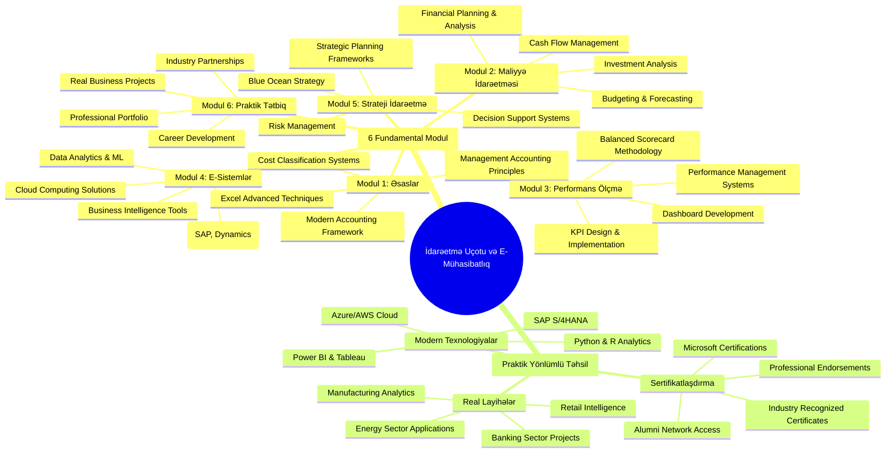
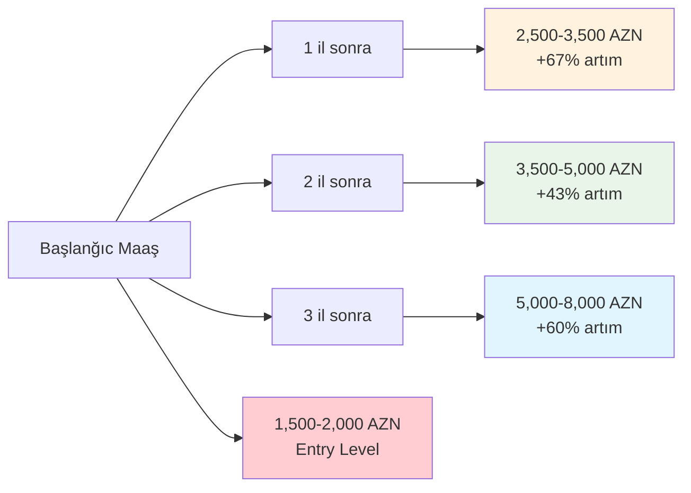

# 🎓 İdarəetmə Uçotu və E-Mühasibatlıq Fənni - Tam Kurs Proqramı

<div align="center">


</div>

## 🎯 Kursun Misyonu

Bu kurs müasir biznes mühitində rəqəmsal transformasiya, məlumat analitikası və strateji idarəetmə bacarıqlarına malik **İdarəetmə Uçotu və E-Mühasibatlıq** mütəxəssislərinin hazırlanmasına yönəlib. Kurs nəzəri biliklərin praktik layihələrlə birləşdirilməsi prinsipinə əsaslanır.



## 📊 Kurs Strukturu və Timeline

```mermaid
gantt
    title 20 Həftəlik İdarəetmə Uçotu və E-Mühasibatlıq Kursu
    dateFormat  X
    axisFormat %w
    
    section Foundation Phase
    Modul 1: Əsaslar                    :1, 3
    
    section Advanced Phase  
    Modul 2: Maliyyə İdarəetməsi         :4, 4
    Modul 3: Performans Ölçmə            :8, 4
    
    section Digital Phase
    Modul 4: E-Sistemlər                 :12, 4
    
    section Strategic Phase
    Modul 5: Strateji İdarəetmə          :16, 3
    
    section Implementation Phase
    Modul 6: Praktik Tətbiq              :19, 2
```

## 🏢 Tərəfdaş Şirkətlər və Real Layihələr

<div align="center">

| Sektor | Tərəfdaş Şirkətlər | Layihə Növü |
|--------|---------------------|--------------|
| 🏦 **Banking** | Kapital Bank, Pasha Bank, Bank Respublika | Executive Dashboards, Risk Analytics |
| 🏭 **Manufacturing** | Gilan Holding, Azərsun Holding | Supply Chain Analytics, Cost Management |
| 🛒 **Retail** | Bravo, 28 Mall, Port Baku | Customer Intelligence, Revenue Optimization |
| ⛽ **Energy** | SOCAR, Azerenerji, TANAP | Project Accounting, Asset Management |
| 📱 **Technology** | Azercell, Bakcell, Nar | Customer Profitability, Network ROI |
| 🏥 **Healthcare** | Yeni Klinika, Central Hospital | Healthcare Analytics, Cost per Patient |

</div>

## 📚 Modul Təfərrüatları

### 🌟 [Modul 1: İdarəetmə Uçotunun Əsasları](idareetme-ucotu/modul1-esaslar/README.md)
- **Müddət:** 3 həftə | **ECTS:** 5 kredit
- Management Accounting fundamentals
- Cost classification və behavior analysis  
- Excel advanced techniques və automation
- Financial modeling basics

### 💰 [Modul 2: Maliyyə İdarəetməsi və Planlaşdırma](idareetme-ucotu/modul2-maliyye/README.md)
- **Müddət:** 4 həftə | **ECTS:** 7 kredit
- Strategic financial planning
- Advanced budgeting və forecasting
- Cash flow management və optimization
- Investment analysis və capital allocation

### 📊 [Modul 3: Performans Ölçmə və KPI Sistemləri](idareetme-ucotu/modul3-performans/README.md)
- **Müddət:** 4 həftə | **ECTS:** 6 kredit
- KPI design və implementation
- Balanced Scorecard methodology
- Dashboard development
- Performance management systems

### 💻 [Modul 4: E-Sistemlər və Rəqəmsal Texnologiyalar](idareetme-ucotu/modul4-e-sistemler/README.md)
- **Müddət:** 4 həftə | **ECTS:** 8 kredit
- ERP systems (SAP S/4HANA, Dynamics 365)
- Business Intelligence və Data Analytics
- Machine Learning applications
- Cloud computing solutions

### 🎯 [Modul 5: Strateji İdarəetmə və Biznes Planlaşdırması](idareetme-ucotu/modul5-strateji/README.md)
- **Müddət:** 3 həftə | **ECTS:** 6 kredit
- Strategic planning frameworks
- Risk management və enterprise governance
- Decision support systems
- Blue Ocean Strategy implementation

### 🏆 [Modul 6: Praktik Tətbiq və Professional Portfolio](idareetme-ucotu/modul6-praktik/README.md)
- **Müddət:** 2 həftə | **ECTS:** 10 kredit
- Real business projects
- Professional portfolio development
- Industry presentations
- Career launch support

## 🛠️ Texnoloji Alətlər və Platformalar

```mermaid
graph TD
    A[Texnoloji Ekosistem] --> B[Microsoft Stack]
    A --> C[Data Analytics]
    A --> D[Cloud Platforms]
    A --> E[Programming Languages]
    
    B --> B1[Excel & Power Query]
    B --> B2[Power BI Desktop/Service]
    B --> B3[Dynamics 365]
    B --> B4[Azure Analysis Services]
    
    C --> C1[Tableau Desktop]
    C --> C2[QlikView/QlikSense]
    C --> C3[Google Analytics]
    C --> C4[Advanced Statistical Tools]
    
    D --> D1[Microsoft Azure]
    D --> D2[Amazon AWS]
    D --> D3[Google Cloud Platform]
    D --> D4[Hybrid Cloud Solutions]
    
    E --> E1[Python (pandas, numpy)]
    E --> E2[R (Statistical Analysis)]
    E --> E3[SQL (Advanced Queries)]
    E --> E4[DAX (Power BI)]
    
    style A fill:#2196f3
    style B fill:#4caf50
    style C fill:#ff9800
    style D fill:#9c27b0
    style E fill:#f44336
```

## 📋 Qəbul Tələbləri və Ön Şərtlər

### ✅ Əsas Tələblər:
- **Təhsil:** Ali təhsil (bakalavr səviyyəsi və ya müadil təcrübə)
- **İş Təcrübəsi:** Minimum 1 il maliyyə, uçot və ya analitika sahəsində
- **Riyaziyyat:** Əsas statistika və riyazi analiz bilikləri
- **Kompüter:** Excel intermediate səviyyəsi, Windows mühiti

### 🎯 İdeal Namizədlər:
- Maliyyə/Uçot mütəxəssisləri
- Business Analyst-lər
- Layihə menecerləri
- İT sahəsində çalışan mütəxəssislər
- MBA proqramı məzunları
- Sahibkar və kiçik biznes sahibləri

### 📚 Hazırlıq Kursları (İsteğe Bağlı):
- Excel Fundamentals (40 saat)
- Basic Statistics (20 saat)  
- Introduction to Business Intelligence (30 saat)
- Financial Accounting Refresher (25 saat)

## 💰 Investisiya və Geri Qaytarım

### 📊 Kurs Dəyəri:
- **Tam Proqram:** 4,500 AZN
- **Erkən qeydiyyat endirimi:** -500 AZN (ilk 20 nəfər)
- **Corporate package** (3+ nəfər): %15 endirim
- **Alumni referral:** %10 endirim

### 💼 Gözlənilən Karyera ROI:


## 🏅 Sertifikatlaşdırma və Tanınma

### 📜 Kurs Sertifikatları:
- **Əsas Sertifikat:** İdarəetmə Uçotu və E-Mühasibatlıq Professional (70%+ qiymət)
- **Merit Sertifikatı:** Outstanding Performance (80%+ qiymət)
- **Distinction Sertifikatı:** Excellence Achievement (85%+ qiymət)

### 🌟 Əlavə Sertifikatlaşdırmalar:
- Microsoft Certified: Power BI Data Analyst Associate
- Tableau Desktop Specialist
- SAP S/4HANA Financial Accounting Associate
- Balanced Scorecard Professional (BSP)
- Certified Management Accountant (CMA) hazırlığı

### 🤝 Sənaye Tanınması:
- Big 4 firms (Deloitte, PwC, EY, KPMG) tərəfindən qəbul edilir
- Azərbaycan Auditorlar Palatası tərəfindən dəstəklənir
- ACCA qualification pathway credits
- International Federation of Accountants (IFAC) alignment

## 👥 Təlimçi Heyəti və Mentorlar

### 🎓 Akademik Heyət:
- **Prof. Dr. Əhməd Məmmədov** - Strateji İdarəetmə (ADA University)
- **Dr. Leyla Həsənova** - Maliyyə Analitikası (UNEC)  
- **MBA Tural Qədirov** - Digital Transformation (ex-McKinsey)
- **Müh. Sevinc Əliyeva** - Business Intelligence (Microsoft Azerbaijan)

### 💼 Sənaye Mütəxəssisləri:
- **Rəşad İbrahimov** - CFO, Kapital Bank
- **Aynur Məmmədova** - Director of Analytics, SOCAR
- **Elşən Quliyev** - SAP Consultant, Azərsun Holding
- **Nigar Əsgərova** - Head of Performance Management, Gilan

## 📞 Əlaqə və Qeydiyyat

<div align="center">

### 🌐 Əlaqə Məlumatları

**📧 Email:** info@idareetme-ucotu.edu.az  
**📱 WhatsApp:** +994 50 123 45 67  
**☎️ Telefon:** +994 12 345 67 89  
**🏢 Ünvan:** 28 May küç. 123, Bakı AZ1000  

**🌍 Website:** www.idareetme-ucotu.edu.az  
**💼 LinkedIn:** /company/idareetme-ucotu  
**📹 YouTube:** /channel/IdareetmeUcotuAZ  

</div>

### 📅 Növbəti Başlanğıc Tarixləri:
- **Yanvar 2025:** 15 Yanvar (Qış qrupu)
- **Aprel 2025:** 1 Aprel (Yaz qrupu)  
- **Sentyabr 2025:** 1 Sentyabr (Payız qrupu)

### 📝 Qeydiyyat Prosesi:
1. **Online müraciət:** [qeydiyyat formu](https://forms.idareetme-ucotu.edu.az)
2. **Sənədlərin təqdimatı:** CV, diplom surəti, motivation letter
3. **Qısa müsahibə:** Zoom vasitəsilə (30 dəqiqə)
4. **Qəbul qərarı:** 3 iş günü ərzində
5. **Ödəniş və başlanğıc:** Kurs başlamazdan 1 həftə əvvəl

---

<div align="center">


**🚀 Gələcəyinizə investisiya edin - İndi qeydiyyatdan keçin!**

*"Müasir biznes dünyasında rəqəmsal bacarıqlar möhtəşəmlik deyil, zərurətdir."*

</div>

---

## 📄 Əlavə Sənədlər

- **[📋 Kurs Sillabusu](Sillabus.md)** - Detallı proqram təfərrüatları
- **[📊 Nümunə Layihələr](examples/)** - Tələbə işlərindən nümunələr  
- **[🎓 Alumni Success Stories](alumni/)** - Məzun uğur hekayələri
- **[❓ FAQ](FAQ.md)** - Ən çox verilən suallar
- **[📜 Terms & Conditions](terms.md)** - Qeydiyyat şərtləri 