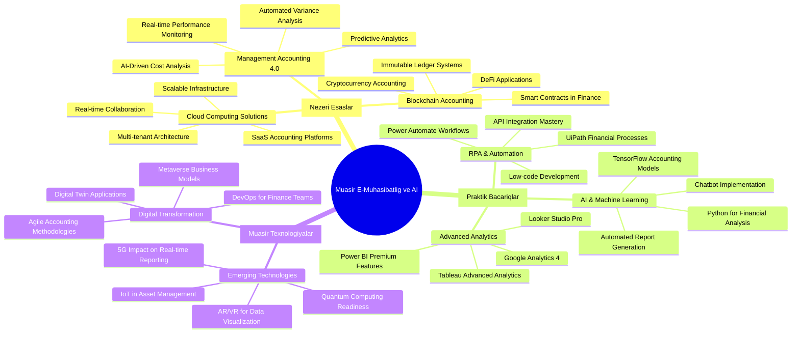
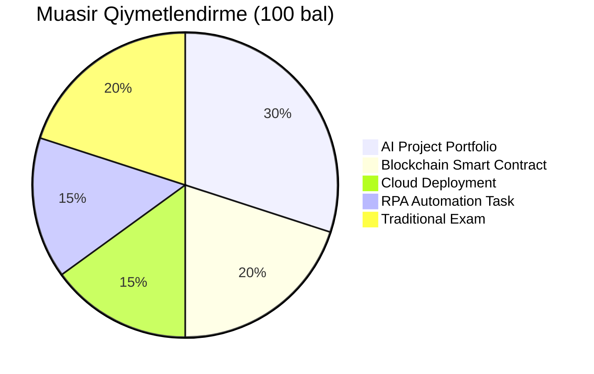

# 📚 İdarəetmə Uçotu və E-Mühasibatlıq Fənni Sillabusu

## 📋 Fənn Məlumatları

| **Parametr** | **Dəyər** |
|--------------|-----------|
| **Fənn adı** | İdarəetmə Uçotu və E-Mühasibatlıq |
| **Fənn kodu** | İUEM-301 |
| **Kredit sayı** | 3 ECTS |
| **Ümumi saatlar** | 45 saat |
| **Həftəlik saatlar** | 3 saat |
| **Semester** | 15 həftə |
| **Önşərt fənlər** | Maliyyə Uçotu, Excel Əsasları |
| **Tədris dili** | Azərbaycan dili |
| **Qiymətləndirmə** | 100 bal sistemi |

## 🎯 Fənnin Məqsədi

Bu fənn tələbələrə müasir biznes mühitində **süni zəka**, **blockchain**, **cloud computing** və **robotik proses avtomatlaşdırması** əsaslı **idarəetmə uçotu** və **elektron mühasibatlıq** sistemlərinin əsas prinsiplərini öyrətmək, praktik bacarıqlar formalaşdırmaq və rəqəmsal transformasiya alətlərindən istifadə qabiliyyətini inkişaf etdirmək məqsədini daşıyır.

## 📖 Fənnin Məzmunu və Həftəlik Proqram

### **1-ci həftə: Giriş və Digital Transformation (3 saat)**
- Müasir e-mühasibatlığın tərifı və əhəmiyyəti
- Industry 4.0 və Accounting 4.0 konsepsiyaları
- Digital transformation roadmap
- **Praktikum:** Microsoft Copilot for Finance ilə tanışlıq

### **2-ci həftə: AI və Machine Learning Mühasibatda (3 saat)**
- Süni zəka əsasları və mühasibatda tətbiqi
- Machine Learning for Predictive Analytics
- Natural Language Processing (NLP) for Financial Reports
- **Praktikum:** Python ilə financial forecasting model

### **3-cü həftə: Blockchain və Cryptocurrency Accounting (3 saat)**
- Blockchain texnologiyasının əsasları
- Smart contracts və mühasibat
- Cryptocurrency və digital assets accounting
- **Praktikum:** Solidity smart contract yazılması

### **4-cü həftə: Cloud Computing və SaaS Platformalar (3 saat)**
- Cloud accounting əsasları
- Microsoft 365 Business Central
- QuickBooks Online və Xero platformaları
- **Praktikum:** Cloud-based accounting system qurulması

```mermaid
gantt
    title 15 Heftelik Muasir E-Muhasibatlig Proqrami
    dateFormat  X
    axisFormat %w
    
    section Foundation 1-5 Hefte
    Digital Transformation         :1, 1
    AI ve ML Muhasibatda          :2, 1
    Blockchain ve Crypto          :3, 1
    Cloud Computing SaaS          :4, 1
    RPA ve Process Automation     :5, 1
    
    section Advanced Tech 6-10 Hefte
    Power BI Premium Features     :6, 1
    IoT ve Asset Management       :7, 1
    API Integration Mastery       :8, 1
    Low-Code Development          :9, 1
    Araliq Imtahan               :10, 1
    
    section Innovation 11-15 Hefte
    AR VR Data Visualization     :11, 1
    Quantum Ready Systems        :12, 1
    Metaverse Business Models    :13, 1
    Final AI Project             :14, 1
    Comprehensive Assessment     :15, 1
```

### **5-ci həftə: RPA və Process Automation (3 saat)**
- Robotic Process Automation əsasları
- UiPath for Financial Processes
- Power Automate workflow design
- **Praktikum:** Invoice processing automation

### **6-cı həftə: Power BI Premium və Advanced Analytics (3 saat)**
- Power BI Premium features
- AI visuals və Auto ML
- Real-time streaming data
- **Praktikum:** AI-powered financial dashboard

### **7-ci həftə: IoT və Asset Management (3 saat)**
- Internet of Things in Finance
- Smart asset tracking
- Predictive maintenance accounting
- **Praktikum:** IoT sensor data analysis

### **8-ci həftə: API Integration və Low-Code Development (3 saat)**
- RESTful API-lər və GraphQL
- Microsoft Power Platform
- Zapier automation workflows
- **Praktikum:** Multi-platform data integration

### **9-cu həftə: Cybersecurity və Data Privacy (3 saat)**
- Financial data security
- GDPR və data protection
- Zero-trust security model
- **Praktikum:** Security audit checklist

### **10-cu həftə: Aralıq Qiymətləndirmə (3 saat)**
- AI-powered assessment tool
- Practical demonstrations
- Peer code review sessions

### **11-ci həftə: AR/VR və Immersive Analytics (3 saat)**
- Virtual Reality for data visualization
- Augmented Reality reporting
- Mixed Reality collaboration
- **Praktikum:** VR financial data exploration

### **12-ci həftə: Quantum Computing Readiness (3 saat)**
- Quantum computing fundamentals
- Quantum algorithms for optimization
- Post-quantum cryptography
- **Praktikum:** Quantum simulation exercises

### **13-cü həftə: Metaverse və Digital Economy (3 saat)**
- Web3 business models
- NFT accounting standards
- Virtual world economies
- **Praktikum:** Metaverse business plan

### **14-cü həftə: Final AI Project (3 saat)**
- Comprehensive AI solution development
- Industry presentation preparation
- Peer review və feedback

### **15-ci həftə: Future-Ready Assessment (3 saat)**
- Advanced scenario-based examination
- Innovation showcase
- Career pathway discussions

## 🛠️ Müasir Texnoloji Alətlər və Platformalar

```mermaid
graph TD
    A[Muasir Texnoloji Ekosistem] --> B[AI & ML Stack]
    A --> C[Blockchain Platforms]
    A --> D[Cloud & Edge Computing]
    A --> E[Automation Tools]
    
    B --> B1[Python TensorFlow PyTorch]
    B --> B2[Azure Cognitive Services]
    B --> B3[OpenAI GPT APIs]
    B --> B4[Google AI Platform]
    
    C --> C1[Ethereum Hyperledger]
    C --> C2[Solana Polygon]
    C --> C3[Smart Contract Development]
    C --> C4[DeFi Protocols]
    
    D --> D1[Azure AWS Google Cloud]
    D --> D2[Kubernetes Docker]
    D --> D3[Edge Computing IoT]
    D --> D4[5G Infrastructure]
    
    E --> E1[UiPath Automation Anywhere]
    E --> E2[Power Platform Low-Code]
    E --> E3[Zapier IFTTT Integration]
    E --> E4[GitHub Copilot AI Coding]
    
    style A fill:#2196f3
    style B fill:#e91e63
    style C fill:#4caf50
    style D fill:#ff9800
    style E fill:#9c27b0
```

## 🚀 Müasir Proqramlaşdırma və Alətlər

### **💻 Programming Languages:**
- **Python:** pandas, numpy, scikit-learn, TensorFlow
- **R:** Financial modeling və statistical analysis
- **JavaScript:** Modern web dashboards
- **SQL:** Advanced database querying
- **Solidity:** Smart contract development

### **🤖 AI/ML Platforms:**
- **Microsoft Azure AI:** Cognitive Services, AutoML
- **Google AI Platform:** Vertex AI, BigQuery ML
- **OpenAI API:** GPT-4, DALL-E integration
- **Hugging Face:** Pre-trained model deployment

### **⛓️ Blockchain Tools:**
- **Ethereum Development:** Remix, Truffle, Hardhat
- **DeFi Protocols:** Uniswap, Compound, AAVE
- **Wallet Integration:** MetaMask, WalletConnect
- **Analytics:** Etherscan, DeFiPulse

### **☁️ Cloud Platforms:**
- **Microsoft Azure:** AI Services, DevOps, Power Platform
- **Amazon AWS:** Lambda, SageMaker, QuickSight
- **Google Cloud:** BigQuery, Data Studio, AI Platform
- **Hybrid Solutions:** Multi-cloud architecture

## 📚 Müasir Ədəbiyyat və Resurslar

### 📖 **Məcburi Kitablar:**
1. **Russell, S. & Norvig, P.** - "Artificial Intelligence: A Modern Approach" (4th Edition, 2024)
2. **Antonopoulos, A. & Wood, G.** - "Mastering Ethereum" (2nd Edition, 2023)
3. **Provost, F. & Fawcett, T.** - "Data Science for Business" (2024)

### 🌐 **Online Platformalar:**
- **Coursera:** AI for Finance Specialization
- **edX:** MIT Blockchain Technologies
- **Udacity:** Machine Learning Engineer Nanodegree
- **Pluralsight:** Power Platform Developer Path

### 📱 **Praktik Resurslar:**
- **GitHub:** Open source financial ML models
- **Kaggle:** Financial datasets və competitions
- **Medium:** Latest fintech articles
- **Stack Overflow:** Developer community support

### 🏆 **Sertifikatlaşdırma Yolları:**
- **Microsoft:** Azure AI Engineer Associate
- **Google:** Professional Machine Learning Engineer
- **Amazon:** AWS Certified Machine Learning
- **Ethereum:** Certified Ethereum Developer

## 🎯 Müasir Öyrənmə Nəticələri

### **AI və Automation Bacarıqları:**
- Süni zəka modellərini maliyyə sahəsində tətbiq etmək
- RPA alətləri ilə mühasibat proseslərini avtomatlaşdırmaq
- Machine learning ilə maliyyə proqnozları hazırlamaq
- Chatbot və virtual assistant tərtib etmək

### **Blockchain və Web3 Bilikləri:**
- Smart contract-lar yazmaq və deploy etmək
- Cryptocurrency və DeFi əməliyyatlarını uçota almaq
- NFT və digital asset-ləri idarə etmək
- Blockchain əsaslı audit sistemləri qurmaq

### **Cloud və DevOps Səriştələri:**
- Multi-cloud architecture dizayn etmək
- Containerization və microservices istifadə etmək
- CI/CD pipeline qurulması
- Cloud security best practices tətbiq etmək

### **Data Science və Analytics:**
- Big Data işləmə və vizuallaşdırma
- Predictive və prescriptive analytics
- Real-time data streaming
- A/B testing və statistical analysis

## 📊 Müasir Qiymətləndirmə Sistemi

### **🎯 Portfolio-əsaslı Qiymətləndirmə:**

| **Komponent** | **Çəki** | **Müasir Tələblər** |
|---------------|-----------|---------------------|
| **AI Project Portfolio** | 30% | Machine learning model + deployment |
| **Blockchain Smart Contract** | 20% | Working DeFi application |
| **Cloud Solution Deployment** | 15% | Scalable cloud architecture |
| **RPA Automation** | 15% | End-to-end process automation |
| **Comprehensive Assessment** | 20% | Scenario-based problem solving |

### **🏅 Müasir Qiymətləndirmə Kriteriyaları:**
- **Innovation Score (25%):** Yaradıcılıq və yenilik səviyyəsi
- **Technical Proficiency (35%):** Kod keyfiyyəti və best practices
- **Business Impact (25%):** Real-world applicability
- **Collaboration (15%):** Teamwork və peer learning

## 🛠️ Hands-on Müasir Praktikumlar

### **🤖 AI Praktikum 1:** Financial Fraud Detection ML Model
- **Texnologiyalar:** Python, TensorFlow, Azure ML
- **Deliverable:** Working fraud detection API
- **Müddət:** 3 həftə

### **⛓️ Blockchain Praktikum 2:** DeFi Lending Protocol
- **Texnologiyalar:** Solidity, Web3.js, MetaMask
- **Deliverable:** Smart contract + frontend
- **Müddət:** 3 həftə

### **☁️ Cloud Praktikum 3:** Real-time Financial Dashboard
- **Texnologiyalar:** Azure Functions, Power BI, SignalR
- **Deliverable:** Live streaming dashboard
- **Müddət:** 2 həftə

### **🔄 RPA Praktikum 4:** Invoice Processing Automation
- **Texnologiyalar:** UiPath, Power Automate, OCR
- **Deliverable:** Complete automation workflow
- **Müddət:** 2 həftə

## 🏢 Sənaye Tərəfdaşlıqları və Real Layihələr

### **🚀 Tech Giants:**
- **Microsoft Azerbaijan:** Power Platform projects
- **Google Cloud:** AI/ML implementations
- **Amazon AWS:** Cloud infrastructure solutions

### **🏦 Fintech Şirkətləri:**
- **Blockchain startups:** Smart contract development
- **Digital banks:** API integration projects
- **Payment systems:** Security və compliance

### **🎓 Research Partnerships:**
- **ADA University:** AI research collaboration
- **UNEC:** Blockchain academic projects
- **BHOS:** IoT industrial applications

---

**🚀 Gələcəyin texnologiyalarını bu gün öyrənin!**

*"Süni zəka və blockchain texnologiyaları mühasibatlığın gələcəyini formalaşdırır."*

---

**Son yeniləmə:** Dekabr 2024  
**Texnoloji versiya:** 2.0 (AI-Enhanced)  
**Təsdiq:** Rəqəmsal Transformasiya Komitəsi