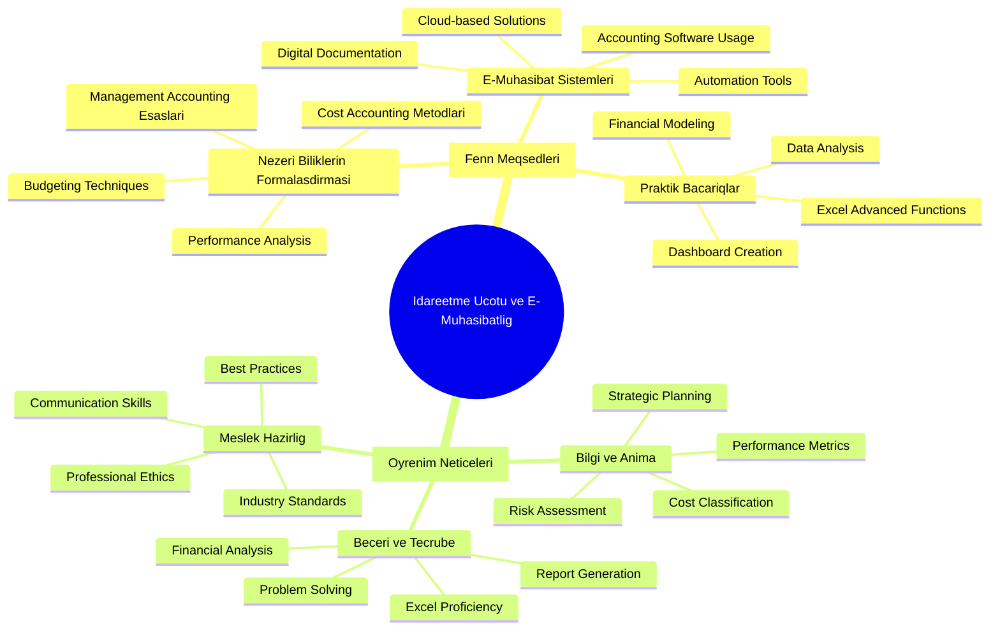
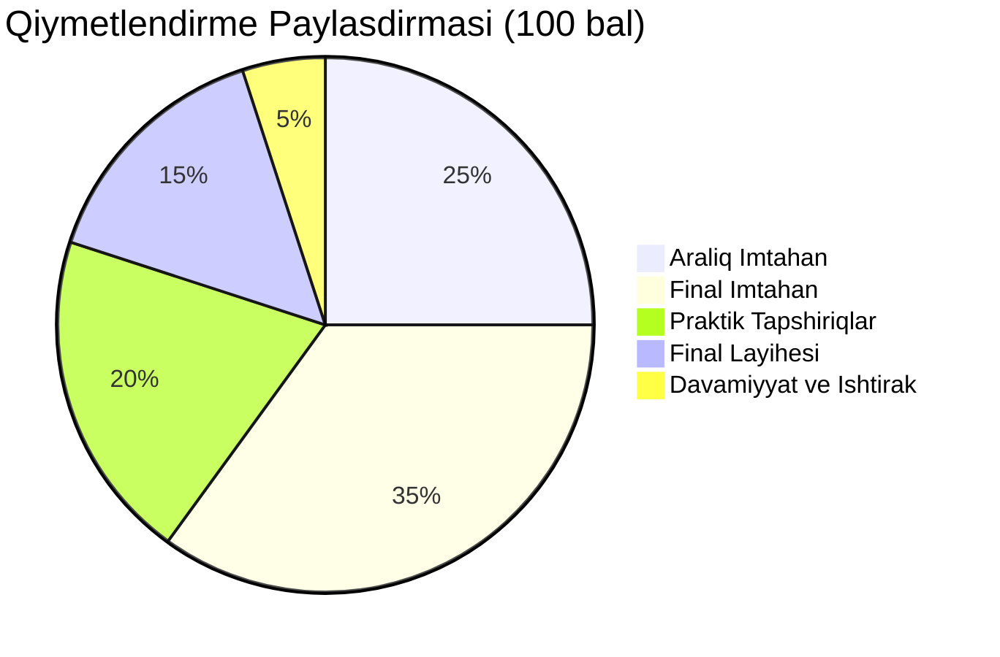

# 📚 İdarəetmə Uçotu və E-Mühasibatlıq Fənni Sillabusu

## 📋 Fənn Məlumatları

| **Parametr** | **Dəyər** |
|--------------|-----------|
| **Fənn adı** | İdarəetmə Uçotu və E-Mühasibatlıq |
| **Fənn kodu** | İUEM-301 |
| **Kredit sayı** | 3 ECTS |
| **Ümumi saatlar** | 45 saat |
| **Həftəlik saatlar** | 3 saat |
| **Semester** | 15 həftə |
| **Önşərt fənlər** | Maliyyə Uçotu, Excel Əsasları |
| **Tədris dili** | Azərbaycan dili |
| **Qiymətləndirmə** | 100 bal sistemi |

## 🎯 Fənnin Məqsədi

Bu fənn tələbələrə müasir biznes mühitində **idarəetmə uçotu** və **elektron mühasibatlıq** sistemlərinin əsas prinsiplərini öyrətmək, praktik bacarıqlar formalaşdırmaq və rəqəmsal alətlərdən istifadə qabiliyyətini inkişaf etdirmək məqsədini daşıyır.

## 📖 Fənnin Məzmunu və Həftəlik Proqram

### **1-ci həftə: Giriş və Əsas Anlayışlar (3 saat)**
- İdarəetmə uçotunun tərifı və əhəmiyyəti
- Maliyyə uçotu ilə idarəetmə uçotu arasındakı fərqlər
- E-mühasibatlığın müasir biznes mühitindəki rolu
- Azerbaycanda mühasibat standartları və qanunvericilik

### **2-ci həftə: Xərclərin Təsnifatı və Davranışı (3 saat)**
- Xərclərin təsnifat metodları
- Sabit və dəyişkən xərclər
- Birbaşa və dolayı xərclər
- **Praktikum:** Excel-də xərc analizi modelinin yaradılması

### **3-cü həftə: Məhsul Maya Dəyərinin Hesablanması (3 saat)**
- Ənənəvi maya dəyəri metodları
- Activity-Based Costing (ABC) sistemi
- Job Costing və Process Costing
- **Praktikum:** Maya dəyəri kalkulyatorunun hazırlanması

### **4-cü həftə: Budgetləşdirmə və Planlaşdırma (3 saat)**
- Budget növləri və hazırlanma prosesi
- Master budget komponentiləri
- Çevik budgetləşdirmə (Flexible Budgeting)
- **Praktikum:** Excel-də 12 aylıq budget modelinin yaradılması

```mermaid
gantt
    title 15 Heftelik Ders Programi
    dateFormat  X
    axisFormat %w
    
    section Esaslar 1-5 Hefte
    Giris ve Esaslar               :1, 1
    Xerclerin Tesnifati            :2, 1
    Maya Deyerinin Hesablanmasi    :3, 1
    Budgetlesdirme                 :4, 1
    Performans Analizi             :5, 1
    
    section E-Sistemler 6-10 Hefte
    Excel Advanced                 :6, 1
    Muhasibat Proqramlari         :7, 1
    Dashboard Yaradilmasi         :8, 1
    Data Analysis                 :9, 1
    Araliq Imtahan                :10, 1
    
    section Tetbiq 11-15 Hefte
    Case Study 1                  :11, 1
    Case Study 2                  :12, 1
    Layihe Hazirlanmasi          :13, 1
    Layihe Teqdimati             :14, 1
    Final Imtahan                 :15, 1
```

### **5-ci həftə: Performans Ölçmə və KPI-lar (3 saat)**
- Əsas performans göstəriciləri (KPI)
- Balanced Scorecard metodologiyası
- Variance Analysis
- **Praktikum:** KPI dashboard yaradılması

### **6-cı həftə: Excel İnkişaf etmiş Funksiyalar (3 saat)**
- VLOOKUP, INDEX-MATCH funksiyaları
- Pivot Tables və Pivot Charts
- Conditional Formatting
- **Praktikum:** Maliyyə analizi üçün Excel şablonları

### **7-ci həftə: Mühasibat Proqramları və Avtomatlaşdırma (3 saat)**
- Azerbaycanda istifadə olunan mühasibat proqramları
- Cloud-based mühasibat həlləri
- API inteqrasiyası və avtomatlaşdırma
- **Praktikum:** Kiçik biznes üçün mühasibat sisteminin seçimi

### **8-ci həftə: Dashboard və Vizuallaşdırma (3 saat)**
- Dashboard dizayn prinsipləri
- Power BI əsasları
- İnteraktiv hesabatların yaradılması
- **Praktikum:** İdarəedici dashboard yaradılması

### **9-cu həftə: Data Analizi və Proqnozlaşdırma (3 saat)**
- Trend analizi metodları
- Regression analizi
- Monte Carlo simulyasiyası
- **Praktikum:** Satış proqnozlaşdırma modeli

### **10-cu həftə: Aralıq Qiymətləndirmə (3 saat)**
- Aralıq imtahan (90 dəqiqə)
- Praktik tapşırıqların təqdimatı
- Qrup müzakirələri

### **11-ci həftə: Case Study - Bank Sektoru (3 saat)**
- Bank məhsullarının gəlirlilik analizi
- Müştəri segment analizi
- Risk idarəetməsi göstəriciləri
- **Praktikum:** Bank filialının performans analizi

### **12-ci həftə: Case Study - İstehsal Müəssisəsi (3 saat)**
- İstehsal xərclərinin optimallaşdırılması
- Supply chain cost analysis
- Quality cost management
- **Praktikum:** İstehsal şirkətinin cost center analizi

### **13-cü həftə: Final Layihə Hazırlama (3 saat)**
- Layihə mövzularının seçimi
- Metodologiya və yanaşmanın müəyyənləşdirilməsi
- Data toplama və təhlil
- **Praktikum:** Fərdi layihə üzərində işləmə

### **14-cü həftə: Layihə Təqdimatları (3 saat)**
- Tələbə təqdimatları (hər tələbə 10 dəqiqə)
- Peer review və qiymətləndirmə
- Best practice paylaşımı
- **Praktikum:** Professional portfolio hazırlama

### **15-ci həftə: Final İmtahan və Nəticələr (3 saat)**
- Final imtahan (120 dəqiqə)
- Fənn nəticələrinin müzakirəsi
- Karyera məsləhətləri və tövsiyələr

## 📚 Əsas Ədəbiyyat

### 📖 **Məcburi Kitablar:**
1. **Drury, C.** - "Management and Cost Accounting" (10th Edition, 2018)
2. **Horngren, C.T.** - "Cost Accounting: A Managerial Emphasis" (16th Edition, 2019)
3. **Kaplan, R.S. & Norton, D.P.** - "Balanced Scorecard" (2019)

### 📱 **Elektron Resurslar:**
- Microsoft Excel 365 Online Training
- Power BI Learning Path (Microsoft Learn)
- Azerbaijan Tax Code və Mühasibat Standartları
- International Financial Reporting Standards (IFRS)

### 🌐 **Əlavə Mənbələr:**
- Harvard Business Review Articles
- Management Accounting Research Journal
- Institute of Management Accountants (IMA) Resources

## 🎯 Öyrənmə Nəticələri

Bu fənni uğurla başa çatdıran tələbələr aşağıdakı bilik və bacarıqlara sahib olacaqlar:

### **Bilik və Anlama (Knowledge & Understanding):**
- İdarəetmə uçotunun əsas konsepsiyalarını başa düşmək
- Xərc davranışı və maya dəyəri metodlarını analiz etmək
- Budgetləşdirmə və performans ölçmə prinsiplərini tətbiq etmək
- E-mühasibatlıq sistemlərinin üstünlüklərini qiymətləndirmək

### **Praktik Bacarıqlar (Skills & Application):**
- Excel-də mürəkkəb maliyyə modellərini hazırlamaq
- Professional dashboard və hesabatlar yaratmaq
- Mühasibat proqramlarından səmərəli istifadə etmək
- Data analizi və vizuallaşdırma texnikalarını tətbiq etmək

### **Peşəkar Kompetensiyalar (Professional Competencies):**
- Biznes qərarlarında dəstək olmaq üçün maliyyə məlumatlarını təhlil etmək
- Müxtəlif maraqda olan tərəflərə hesabat hazırlamaq
- Texnoloji həlləri biznes ehtiyacları ilə uyğunlaşdırmaq
- Etik və professional standartları gözləmək

## 📊 Qiymətləndirmə Sistemi

### **Detallı Qiymətləndirmə Komponentiləri:**

| **Komponent** | **Çəki** | **Təfərrüat** |
|---------------|-----------|---------------|
| **Aralıq İmtahan** | 25% | Nəzəri biliklər və hesablama məsələləri |
| **Final İmtahan** | 35% | Comprehensive exam + case study analysis |
| **Həftəlik Praktikumlar** | 20% | 8 praktik tapşırıq (hər biri 2.5 bal) |
| **Final Layihəsi** | 15% | Real şirkət məlumatları ilə analiz |
| **Davamiyyat/İştirak** | 5% | Dərs fəallığı və vaxtında tapşırıq təslimi |

### **Qiymətləndirmə Şkalası:**
- **A (90-100 bal):** Əla - Bütün materialları mükəmməl mənimsəmə
- **B (80-89 bal):** Yaxşı - Materialları yaxşı mənimsəmə, kiçik çatışmazlıqlar
- **C (70-79 bal):** Orta - Əsas materialları mənimsəmə, bəzi problemlər
- **D (60-69 bal):** Zəif - Minimum tələblərə cavab vermə
- **F (0-59 bal):** Kəsilmə - Tələblərə cavab verməmə

## 🛠️ Praktikum Tapşırıqları

### **Tapşırıq 1:** Excel Maya Dəyəri Kalkulyatoru
- **Məqsəd:** Əsas maya dəyəri hesablamaları
- **Alətlər:** Excel, VLOOKUP, SUM functions
- **Müddət:** 1 həftə

### **Tapşırıq 2:** Budget vs Actual Variance Analysis
- **Məqsəd:** Budget performansının analizi
- **Alətlər:** Excel, Conditional Formatting, Charts
- **Müddət:** 1 həftə

### **Tapşırıq 3:** KPI Dashboard Power BI
- **Məqsəd:** İnteraktiv performans dashboard
- **Alətlər:** Power BI Desktop, DAX functions
- **Müddət:** 2 həftə

### **Tapşırıq 4:** E-commerce Company Financial Analysis
- **Məqsəd:** Real data ilə comprehensive analysis
- **Alətlər:** Excel, Power BI, Statistical functions
- **Müddət:** 2 həftə

## 👨‍🏫 Tədris Heyəti

### **Əsas Müəllim:**
**Prof. Dr. [Müəllim Adı]**
- Ph.D. in Accounting, [Universitet]
- 15+ il təcrübə idarəetmə uçotu sahəsində
- CMA (Certified Management Accountant)
- Müəllif 25+ məqalə və 3 kitab

### **Laboratoriya Assistenti:**
**MSc. [Assistant Adı]**
- Master's in Business Analytics
- Microsoft Power BI Certified
- 5+ il praktik təcrübə

## 📞 Əlaqə Məlumatları

### **Dərs Vaxtı və Yeri:**
- **Gün:** Çərşənbə axşamı, Cümə
- **Vaxt:** 14:00-15:30 (Çərşənbə), 10:00-11:30 (Cümə)
- **Otaq:** B-204, İqtisadiyyat Fakültəsi
- **Lab:** Kompüter Lab C-105

### **Müəllim İlə Əlaqə:**
- **Email:** [muellim.email]@univ.edu.az
- **Telefon:** +994 12 xxx xx xx
- **Ofis Saatları:** Çərşənbə axşamı 16:00-17:00, Cümə 12:00-13:00
- **Ofis:** B-308, İqtisadiyyat Fakültəsi

### **Online Platform:**
- **LMS:** university.blackboard.com
- **Zoom:** Virtual Office Hours (Şənbə 10:00-11:00)
- **Teams:** Class discussion və group work

## 📝 Fənn Qaydaları və Tələbləri

### **Davamiyyat:**
- Minimum 80% davamiyyat tələb olunur
- 3+ buraxılan dərs automatic F qiyməti
- Gecikməyə icazə verilmir (15 dəqiqədən çox)

### **Tapşırıq Təslimi:**
- Bütün tapşırıqlar müəyyən tarixədək təslim edilməlidir
- Gecikən tapşırıqlar gündəlik 10% bal itirir
- Plagiarism sıfır tolerans siyasəti

### **Texniki Tələblər:**
- Laptop/desktop kompüter (Windows 10+)
- Microsoft Excel 2019+ və ya Office 365
- Power BI Desktop (pulsuz yükləmə)
- İnternet əlaqəsi (online sessions üçün)

### **Academic Integrity:**
- Fərdi işlər fərdi olmalıdır
- Qrup işlərində hər üzvün töhfəsi qeyd edilməlidir
- Bütün mənbələr düzgün sitat edilməlidir
- AI tools istifadəsi qeyd edilməlidir

---

**📧 Hər hansı sual üçün müəllim ilə əlaqə saxlayın**

*"Uğur ancaq həqiqi biliklər və praktik bacarıqlarla əldə edilir."*

---

**Son yeniləmə:** Dekabr 2024  
**Səhifə versiyası:** 1.0  
**Təsdiq:** Fakültə Şurası 