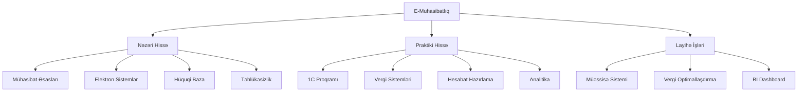
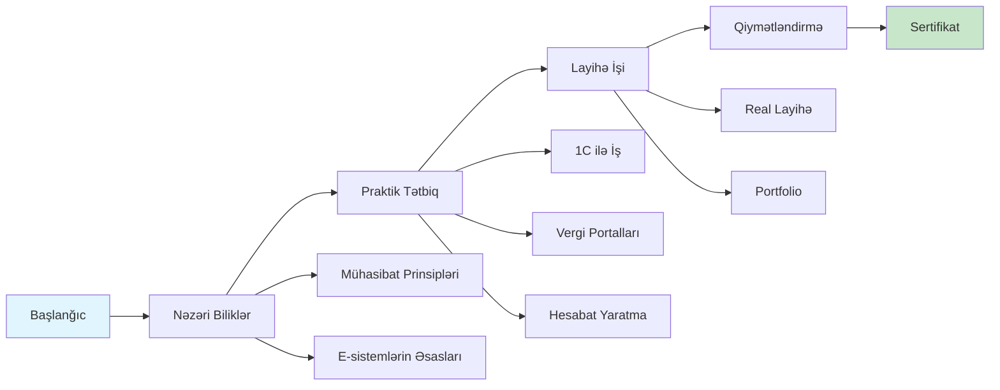
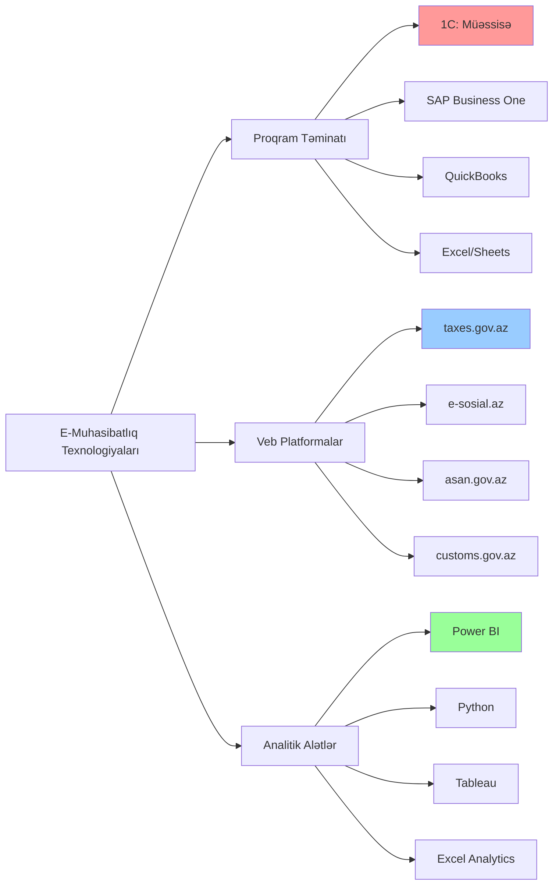
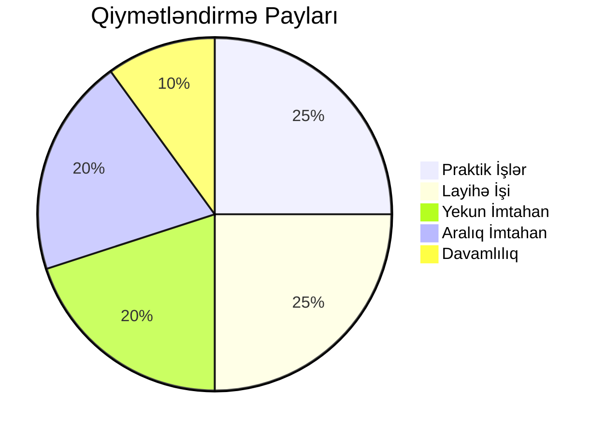
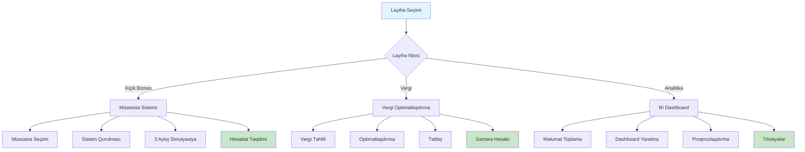
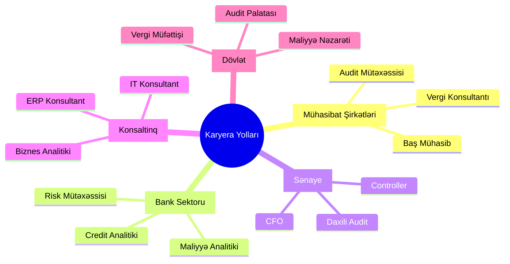
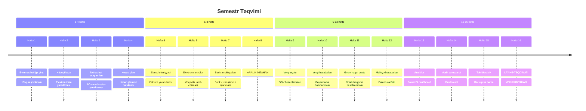

# E-Muhasibatlıq

## Fənnin Təsviri

E-muhasibatlıq (Elektron Muhasibatlıq) müasir informasiya texnologiyaları və kompüter proqramları vasitəsilə mühasibat uçotu proseslərinin aparılması sahəsidir. Bu fənn ənənəvi muhasibat prinsipləri ilə müasir rəqəmsal texnologiyaları birləşdirərək effektiv maliyyə idarəetməsi təmin edir.

## 📊 Fənnin Strukturu



## 🎯 Öyrənmə Prosesu



## 📚 Fənnin Məqsədləri

### Əsas Məqsədlər:
- Mühasibat uçotunun rəqəmsal texnologiyalar vasitəsilə aparılması
- Maliyyə hesabatlarının avtomatik formalaşdırılması
- İqtisadi əməliyyatların elektron mühitdə qeydiyyatı
- Vergi uçotunun səmərəli aparılması
- Mühasibat məlumatlarının təhlili və təqdimatı

## 🎯 Öyrənmə Nəticələri

Bu fənni tamamladıqdan sonra tələbələr aşağıdakı bacarıqlara sahib olacaqlar:

### Nəzəri Bilik:
- ✅ E-muhasibatlığın əsas prinsipləri
- ✅ Mühasibat proqramlarının strukturu və funksionallığı
- ✅ Rəqəmsal muhasibat standartları
- ✅ Elektron sənədləşmə qaydaları
- ✅ Kibertəhlükəsizlik prinsipləri

### Praktiki Bacarıqlar:
- 🔧 Mühasibat proqramları ilə işləmə
- 🔧 Elektron hesabatların hazırlanması
- 🔧 Vergi bəyannamələrinin elektron formada təqdim edilməsi
- 🔧 Mühasibat məlumatlarının analizi
- 🔧 Avtomatlaşdırılmış uçot sistemlərinin qurulması

## 📖 Kurs Proqramı

```mermaid
gantt
    title E-Muhasibatlıq Kurs Təqvimi
    dateFormat  X
    axisFormat %w
    
    section Modul 1: Giriş
    E-muhasibatlıq tarixi    :1, 2
    Hüquqi baza             :2, 2
    
    section Modul 2: Proqramlar
    Mühasibat proqramları   :3, 3
    1C sistemi             :4, 2
    
    section Modul 3: Sənədləşmə
    Elektron sənədlər      :6, 3
    ASAN İmza              :7, 2
    
    section Modul 4: Vergi
    Vergi uçotu            :9, 3
    Elektron bəyannamə     :10, 2
    
    section Modul 5: Analiz
    BI alətləri            :12, 3
    Dashboard              :13, 2
    
    section Modul 6: Təhlükəsizlik
    Kibertəhlükəsizlik     :15, 2
    Audit metodları        :16, 1
```



### Modul 1: E-Muhasibatlığa Giriş
**Həftə 1-2**
- E-muhasibatlığın tarixi və inkişafı
- Ənənəvi muhasibatlıqla müqayisə
- Azərbaycanda e-muhasibatlığın hüquqi bazası
- Beynəlxalq standartlar və təcrübə

### Modul 2: Mühasibat Proqramları
**Həftə 3-5**
- Mühasibat proqramlarının növləri
- "1C: Müəssisə" proqramı
- SAP və Oracle sistemləri
- Lokal və bulud həlləri

### Modul 3: Elektron Sənədləşmə
**Həftə 6-8**
- Elektron sənədlərin hüquqi statusu
- Elektron imza texnologiyası
- Sənədlərin rəqəmsal arxivləşdirilməsi
- ASAN İmza sistemi

### Modul 4: Vergi Uçotu və Hesabatlar
**Həftə 9-11**
- Elektron vergi bəyannamələri
- VOEN sistemi ilə işləmə
- Vergi hesabatlarının avtomatlaşdırılması
- Real vaxt rejimində vergi uçotu

### Modul 5: Maliyyə Analizi və Hesabatlar
**Həftə 12-14**
- Avtomatik hesabat generasiyası
- BI (Business Intelligence) alətləri
- Maliyyə göstəricilərinin analizi
- Dashboard və vizuallaşdırma

### Modul 6: Təhlükəsizlik və Audit
**Həftə 15-16**
- Kibertəhlükəsizlik prinsipləri
- Məlumatların qorunması
- Elektron audit metodları
- Risk idarəetməsi

## 🛠️ İstifadə Olunan Texnologiyalar



### Proqram Təminatı:
| Proqram | Təyinatı | Səviyyə |
|---------|----------|---------|
| 1C: Müəssisə | Mühasibat uçotu | Əsas |
| Excel/Google Sheets | Hesablamalar və analiz | Əsas |
| SAP Business One | ERP sistemi | Qabaqcıl |
| QuickBooks | Kiçik biznes üçün muhasibat | Orta |
| Power BI | Məlumatların vizuallaşdırılması | Qabaqcıl |

### Veb Platformalar:
- 🌐 **taxes.gov.az** - Vergi xidmətinin portalı
- 🌐 **e-sosial.az** - Sosial sığorta sistemi
- 🌐 **customs.gov.az** - Gömrük xidmətinin sistemi
- 🌐 **asan.gov.az** - ASAN xidmət portalı

## 📝 Qiymətləndirmə Sistemi



### Qiymətləndirmə Komponentləri:

| Komponent | Çəki | Təsvir |
|-----------|------|--------|
| Davamlılıq | 10% | Mühazirələrdə iştirak |
| Praktik İşlər | 25% | Həftəlik tapşırıqlar |
| Layihə İşi | 25% | Semestr layihəsi |
| Aralıq İmtahan | 20% | Nəzəri və praktik |
| Yekun İmtahan | 20% | Ümumi qiymətləndirmə |

### Praktik Tapşırıqlar:
1. **Müəssisə yaradılması** - 1C-də yeni müəssisə bazasının qurulması
2. **Sənəd dövriyyəsi** - Elektron faktura və müqavilələrin tərtib edilməsi
3. **Hesabat hazırlanması** - Aylıq maliyyə hesabatlarının formalaşdırılması
4. **Vergi bəyannaməsi** - Elektron vergi bəyannaməsinin hazırlanması və təqdimi
5. **Analitik hesabat** - Power BI-da dashboard yaradılması

## 🔬 Layihə İşləri



### Tələb olunan layihələr:

#### 1. Kiçik Müəssisə üçün E-Muhasibat Sistemi
- Müəssisənin seçilməsi və təhlili
- Mühasibat siyasətinin hazırlanması
- 1C-də tam uçot sisteminin qurulması
- 3 aylıq fəaliyyətin simulyasiyası

#### 2. Vergi Optimallaşdırma Layihəsi
- Mövcud vergi yükünün təhlili
- Qanuni vergi optimallaşdırma yollarının tapılması
- Elektron sistemlərdə tətbiq edilməsi
- İqtisadi səmərənin hesablanması

#### 3. Maliyyə Analizi Dashboard-u
- Şirkətin maliyyə məlumatlarının toplanması
- Power BI-da interaktiv dashboard yaradılması
- Proqnozlaşdırma modellərinin qurulması
- İdarəetmə qərarları üçün tövsiyələr

## 📚 Zəruri Ədəbiyyat

### Əsas Ədəbiyyat:
1. **Rəhimov R.A.** - "Azərbaycanda Mühasibat Uçotu və Audit" (2023)
2. **Məmmədov F.T.** - "E-Muhasibatlığın Əsasları" (2022)
3. **Qəribov S.M.** - "Rəqəmsal İqtisadiyyatda Mühasibat" (2023)

### Əlavə Ədəbiyyat:
- "International Financial Reporting Standards (IFRS)" - Beynəlxalq standartlar
- "Azərbaycan Respublikasının Mühasibat Uçotu Haqqında Qanunu"
- "Vergi Məcəlləsi" - AR Vergi Nazirliyi

### Onlayn Resurslar:
- 📖 [taxes.gov.az](https://taxes.gov.az) - Rəsmi vergi məlumatları
- 📖 [1c.az](https://1c.az) - 1C proqramı üzrə təlimlər
- 📖 [audit.gov.az](https://audit.gov.az) - Audit standartları
- 📖 [cbar.az](https://cbar.az) - Mərkəzi Bank tənzimləmələri

## 💻 Texniki Tələblər

### Kompüter Spesifikasiyaları:
- **OS:** Windows 10/11, macOS 10.15+, Linux Ubuntu 18.04+
- **RAM:** Minimum 8GB, tövsiyə olunan 16GB
- **HDD:** Minimum 50GB boş yer
- **Internet:** Sabit internet bağlantısı (minimum 10 Mbps)

### Zəruri Proqramlar:
```bash
# Əsas proqramlar
- Microsoft Office 2019+ və ya LibreOffice
- 1C: Müəssisə 8.3 (educational license)
- Adobe Acrobat Reader
- Google Chrome və ya Firefox

# Qabaqcıl alətlər
- Power BI Desktop
- SAP Business One (demo versiya)
- Python 3.8+ (pandas, matplotlib)
- Git versiya nəzarəti
```

## 🎓 Karyera Imkanları



### İş Sahələri:
- 🏢 **Mühasibat şirkətləri** - Baş mühasib, audit mütəxəssisi
- 🏦 **Bank sektoru** - Maliyyə analitiki, risk mütəxəssisi  
- 🏭 **Sənaye müəssisələri** - Daxili audit, controller
- 💼 **Konsaltinq şirkətləri** - ERP konsultantı, biznes analitiki
- 🏛️ **Dövlət sektoru** - Vergi müfəttişi, maliyyə nəzarəti

### Orta Maaş Səviyyələri (2024):
| Vəzifə | Təcrübəsiz | 2-5 il təcrübə | 5+ il təcrübə |
|--------|------------|---------------|---------------|
| Junior Mühasib | 800-1200 AZN | 1200-1800 AZN | 1800-2500 AZN |
| ERP Konsultant | 1500-2000 AZN | 2000-3500 AZN | 3500-5000 AZN |
| Maliyyə Analitiki | 1200-1800 AZN | 1800-3000 AZN | 3000-4500 AZN |

## 📞 Əlaqə və Dəstək

### Müəllim Əlaqə Məlumatları:
- 📧 **Email:** emuhasibat@univ.edu.az
- 📞 **Telefon:** (+994) 12 XXX-XX-XX
- 🏢 **Ofis:** İqtisadiyyat fakültəsi, 3-cü mərtəbə, 305 otaq
- ⏰ **Qəbul saatları:** Çərşənbə axşamı və Cümə günü 14:00-16:00

### Texniki Dəstək:
- 💻 **IT Dəstək:** it-support@univ.edu.az
- 📚 **Kitabxana:** library@univ.edu.az
- 🔧 **1C Dəstək:** 1c-help@univ.edu.az

### Faydalı Linklər:
- [Kurs Materialları](https://elearn.univ.edu.az/emuhasibat)
- [Video Dərslər](https://youtube.com/emuhasibat-az)
- [Tələbə Forumu](https://forum.univ.edu.az/emuhasibat)
- [Praktika Təlimatları](https://docs.univ.edu.az/emuhasibat-praktika)

---

## 📋 Təqvim və Vaxtcədvəl



### Semestr Təqvimi:

| Həftə | Mövzu | Praktik İş | Tapşırıq |
|-------|-------|------------|----------|
| 1 | E-muhasibatlığa giriş | 1C quraşdırılması | - |
| 2 | Hüquqi baza | Elektron imza yaradılması | Tədqiqat işi |
| 3 | Mühasibat proqramları | 1C-də müəssisə yaradılması | Praktik 1 |
| 4 | Hesab planı | Hesab planının qurulması | - |
| 5 | Sənəd dövriyyəsi | Faktura yaradılması | Praktik 2 |
| 6 | Elektron sənədlər | Müqavilə tərtib edilməsi | - |
| 7 | Bank əməliyyatları | Bank çıxarışlarının işlənməsi | Praktik 3 |
| 8 | **ARALIK İMTAHAN** | - | - |
| 9 | Vergi uçotu | ƏDV hesablamaları | Praktik 4 |
| 10 | Vergi hesabatları | Bəyannamə hazırlanması | - |
| 11 | Əmək haqqı uçotu | Əmək haqqının hesablanması | Praktik 5 |
| 12 | Maliyyə hesabatları | Balans və P&L | Layihə başlanğıcı |
| 13 | Analitika | Power BI dashboard | - |
| 14 | Audit və nəzarət | Daxili audit | Praktik 6 |
| 15 | Təhlükəsizlik | Backup və bərpa | - |
| 16 | **LAYIHƏ TƏQDİMATI** | **YEKUN İMTAHAN** | Layihə təslimi |

---

## 🔗 Əlavə Resurslar

### Sertifikatlaşdırma Proqramları:
- 🏆 **1C Professional** - 1C sistemləri üzrə peşəkar sertifikat
- 🏆 **SAP Certified** - SAP ERP sistemləri sertifikatı  
- 🏆 **Microsoft Power BI** - Məlumat analizi sertifikatı
- 🏆 **ACCA DipIFR** - Beynəlxalq maliyyə hesabatları

### Tədqiqat Sahələri:
- 🔬 **Blockchain Muhasibatlığı** - Kriptovalyuta və DLT
- 🔬 **Süni İntellekt** - AI-powered accounting
- 🔬 **IoT Muhasibatlığı** - Əşyaların interneti ilə inteqrasiya
- 🔬 **Real-time Reporting** - Real vaxt hesabatları

---

**Son yenilənmə:** Dekabr 2024  
**Versiya:** 2.1  
**Hazırlayan:** E-Muhasibatlıq Kafedrasının müəllim heyəti

---

> 📌 **Qeyd:** Bu README sənədi davamlı olaraq yenilənir. Yeniliklərdən xəbərdar olmaq üçün universitet portalını izləyin.

---

**© 2024 - E-Muhasibatlıq Fənni. Bütün hüquqlar qorunur.** 