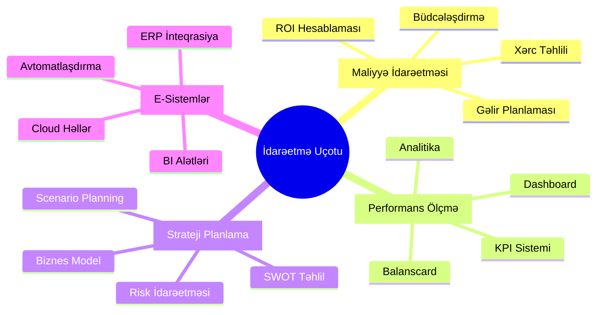
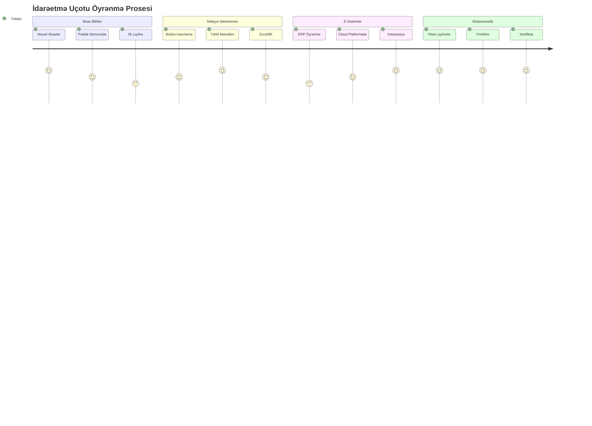
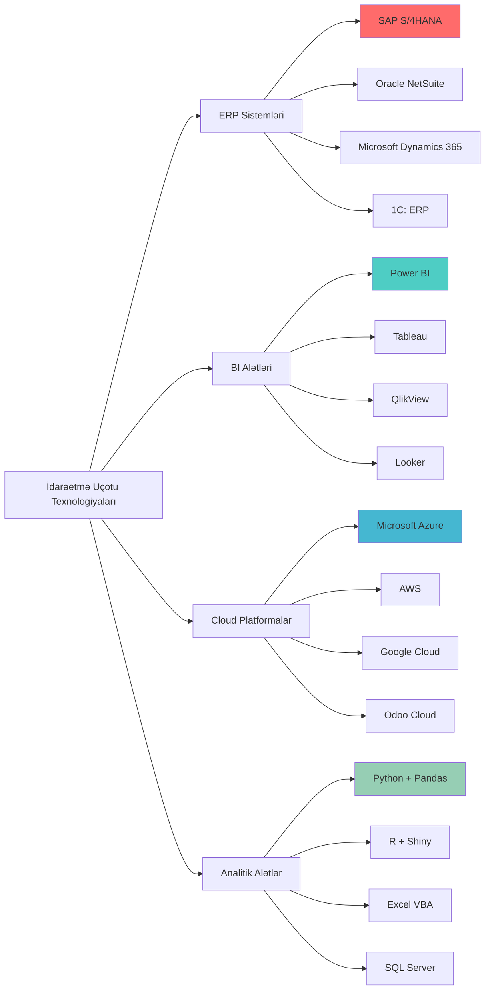
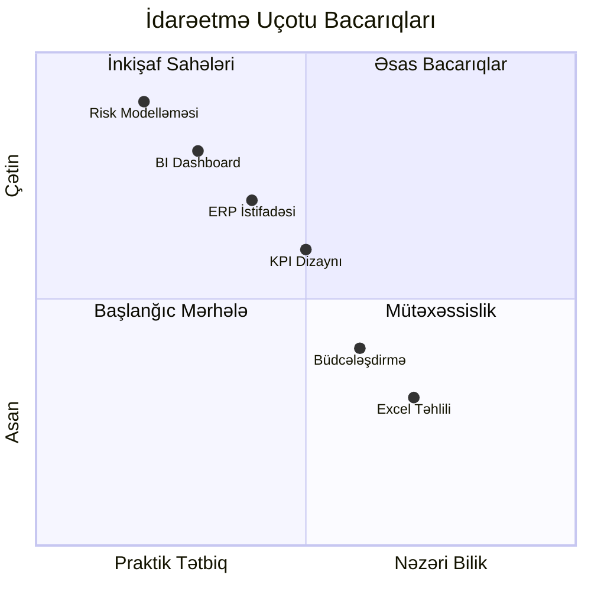
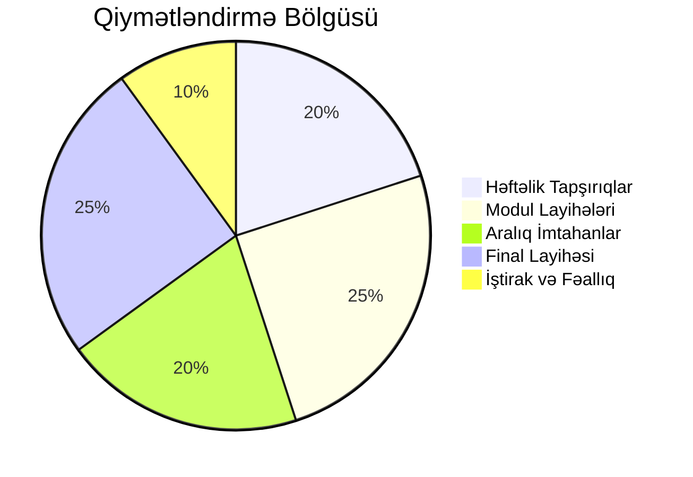
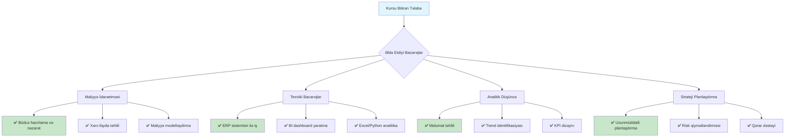
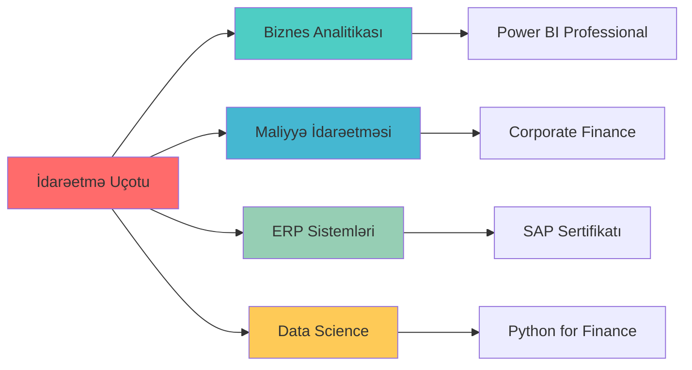

# 📊 İdarəetmə Uçotu və E-Mühasibat

<div align="center">


</div>

## 🎯 Dərs Proqramının Əsas Məqsədləri



## 📚 Kurs Strukturu

```mermaid
graph TD
    A[İdarəetmə Uçotu və E-Mühasibat] --> B[Modul 1: Əsaslar]
    A --> C[Modul 2: Maliyyə İdarəetməsi]
    A --> D[Modul 3: Performans Ölçmə]
    A --> E[Modul 4: E-Sistemlər]
    A --> F[Modul 5: Strateji İdarəetmə]
    A --> G[Modul 6: Praktik Tətbiq]
    
    B --> B1[İdarəetmə Uçotu Prinsipləri]
    B --> B2[Maliyyə Uçotu vs İdarəetmə Uçotu]
    B --> B3[E-mühasibatın Əsasları]
    
    C --> C1[Büdcələşdirmə]
    C --> C2[Xərc Mərkəzləri]
    C --> C3[Cash Flow İdarəetməsi]
    
    D --> D1[KPI Sistemləri]
    D --> D2[Balanced Scorecard]
    D --> D3[Performans Dashboard]
    
    E --> E1[ERP Sistemləri]
    E --> E2[BI Alətləri]
    E --> E3[Cloud Mühasibat]
    
    F --> F1[Strateji Planlaşdırma]
    F --> F2[Risk İdarəetməsi]
    F --> F3[Qərar Dəstəyi]
    
    G --> G1[Real Layihələr]
    G --> G2[Case Study]
    G --> G3[Portfolio]
    
    style A fill:#e1f5fe
    style B fill:#f3e5f5
    style C fill:#e8f5e8
    style D fill:#fff3e0
    style E fill:#fce4ec
    style F fill:#e0f2f1
    style G fill:#f1f8e9
```



## 🚀 Öyrənmə Yolculuğu



## 📊 Dərslər və Vaxtcədvəl

```mermaid
gantt
    title İdarəetmə Uçotu Kurs Təqvimi (18 Həftə)
    dateFormat  X
    axisFormat %w
    
    section Modul 1: Əsaslar
    İdarəetmə uçotu prinsipləri    :1, 3
    E-mühasibat əsasları          :2, 2
    
    section Modul 2: Maliyyə İdarəetməsi
    Büdcələşdirmə                 :4, 3
    Xərc təhlili                  :5, 2
    Cash flow idarəetməsi         :6, 2
    
    section Modul 3: Performans
    KPI sistemləri                :7, 2
    Balanced Scorecard            :8, 2
    Dashboard yaradılması         :9, 2
    
    section Modul 4: E-Sistemlər
    ERP sistemləri                :10, 3
    BI alətləri                   :11, 2
    Cloud həllər                  :12, 2
    
    section Modul 5: Strateji
    Strateji planlaşdırma         :13, 2
    Risk idarəetməsi              :14, 2
    Qərar dəstəyi                 :15, 2
    
    section Modul 6: Praktik
    Real layihələr                :16, 3
    Portfolio hazırlama           :17, 2
    Təqdimat                      :18, 1
```



## 🛠️ İstifadə Olunan Texnologiyalar



## 📈 Performans İzləmə



## 🎓 Modullara Baxış

### 📚 [Modul 1: Əsaslar](./modul1-esaslar/)
- İdarəetmə uçotunun əsas prinsipləri
- E-mühasibatın tarixi və inkişafı
- Müasir idarəetmə tələbləri

### 💰 [Modul 2: Maliyyə İdarəetməsi](./modul2-maliyye/)
- Büdcə hazırlama və idarəetmə
- Xərc mərkəzləri və profit mərkəzləri
- Cash flow təhlili və proqnozlaşdırma

### 📊 [Modul 3: Performans Ölçmə](./modul3-performans/)
- KPI sistemlərinin qurulması
- Balanced Scorecard metodologiyası
- Dashboard və hesabat dizaynı

### 💻 [Modul 4: E-Sistemlər](./modul4-e-sistemler/)
- ERP sistemləri və inteqrasiya
- Business Intelligence alətləri
- Cloud-based həllər

### 🎯 [Modul 5: Strateji İdarəetmə](./modul5-strateji/)
- Strateji planlaşdırma metodları
- Risk idarəetməsi və internal audit
- Qərar dəstəyi sistemləri

### 🛠️ [Modul 6: Praktik Tətbiq](./modul6-praktik/)
- Real şirkət layihələri
- Case study həlləri
- Professional portfolio

## 📝 Qiymətləndirmə Sistemi



| Komponent | Çəki | Təfərrüat |
|-----------|------|-----------|
| 📝 Həftəlik Tapşırıqlar | 20% | Excel, BI dashboard, təhlil hesabatları |
| 🎯 Modul Layihələri | 25% | Hər modulun sonunda praktik layihə |
| 📋 Aralıq İmtahanlar | 20% | 9-cu və 15-ci həftələrdə |
| 🚀 Final Layihəsi | 25% | Real şirkət üçün tam idarəetmə sistemi |
| 💬 İştirak və Fəallıq | 10% | Dərsdə iştirak, sual-cavab, müzakirə |

## 🎯 Öyrənmə Nəticələri



## 💼 Karyera Perspektivləri

```mermaid
sankey-beta
    source,target,value
    Kurs Məzunu,Maliyyə Analitiki,25
    Kurs Məzunu,İdarəetmə Mühasibi,20
    Kurs Məzunu,BI Mütəxəssisi,15
    Kurs Məzunu,ERP Konsultantı,15
    Kurs Məzunu,Strateji Planlaşdırma,10
    Kurs Məzunu,Risk Mütəxəssisi,10
    Kurs Məzunu,CFO/Mali İşlər Direktoru,5
    
    Maliyyə Analitiki,Böyük Şirkətlər,15
    Maliyyə Analitiki,Bank Sektoru,10
    İdarəetmə Mühasibi,Mühasibat Şirkətləri,12
    İdarəetmə Mühasibi,Sənaye Müəssisələri,8
    BI Mütəxəssisi,IT Şirkətləri,10
    BI Mütəxəssisi,Konsaltinq,5
```

### Orta Maaş Səviyyələri (2024):

| Vəzifə | Başlanğıc | 3-5 il təcrübə | 5+ il təcrübə |
|--------|-----------|---------------|---------------|
| 📊 Maliyyə Analitiki | 1200-1800 AZN | 2000-3500 AZN | 3500-5500 AZN |
| 📈 İdarəetmə Mühasibi | 1000-1500 AZN | 1800-3000 AZN | 3000-4500 AZN |
| 💻 BI Mütəxəssisi | 1500-2200 AZN | 2500-4000 AZN | 4000-6500 AZN |
| 🎯 ERP Konsultantı | 1800-2500 AZN | 3000-5000 AZN | 5000-8000 AZN |
| 🏆 Mali İşlər Direktoru | - | 4000-7000 AZN | 7000-12000 AZN |

## 📚 Tövsiyə Olunan Ədəbiyyat

### 📖 Əsas Kitablar:
1. **Horngren, Charles T.** - "Cost Accounting: A Managerial Emphasis" (2023)
2. **Kaplan, Robert S.** - "Balanced Scorecard" (2022)
3. **Əliyev, R.Ş.** - "İdarəetmə Uçotu və Təhlili" (2023)
4. **Atkinson, Anthony A.** - "Management Accounting" (2023)

### 🌐 Onlayn Resurslar:
- [IMA - Institute of Management Accountants](https://imanet.org)
- [CIMA - Chartered Institute of Management Accountants](https://cimaglobal.com)
- [Coursera Business Analytics](https://coursera.org/business-analytics)
- [edX MIT Financial Management](https://edx.org/course/financial-management)

## 🔗 Əlaqədar Kurslar



## 📞 Əlaqə və Dəstək

### 👨‍🏫 Müəllim Heyəti:
- **📧 Email:** idareetme-ucotu@univ.edu.az
- **📞 Telefon:** (+994) 12 XXX-XX-XX
- **🏢 Ofis:** İqtisadiyyat fakültəsi, 2-ci mərtəbə
- **⏰ Qəbul:** Bazar ertəsi və Çərşənbə 14:00-17:00

### 💻 Texniki Dəstək:
- **ERP Sistemləri:** erp-support@univ.edu.az
- **BI Alətləri:** bi-help@univ.edu.az
- **Cloud Platformalar:** cloud-support@univ.edu.az

---

<div align="center">


**© 2024 - İdarəetmə Uçotu və E-Mühasibat Kursu**

*Rəqəmsal gələcəyə hazırlaşın! 🚀*

</div> 