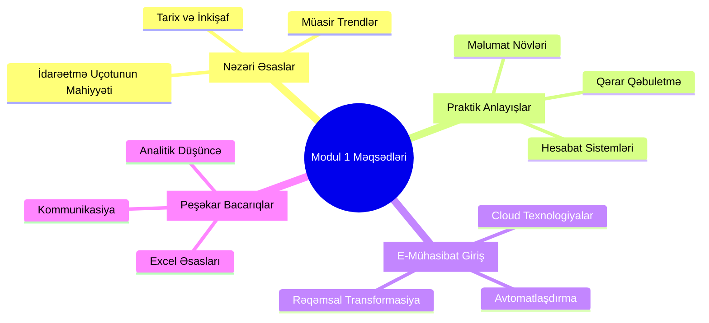
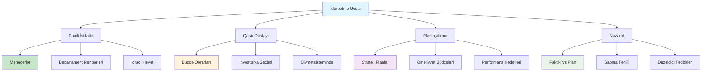
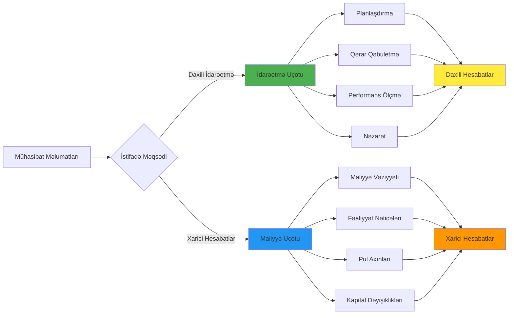
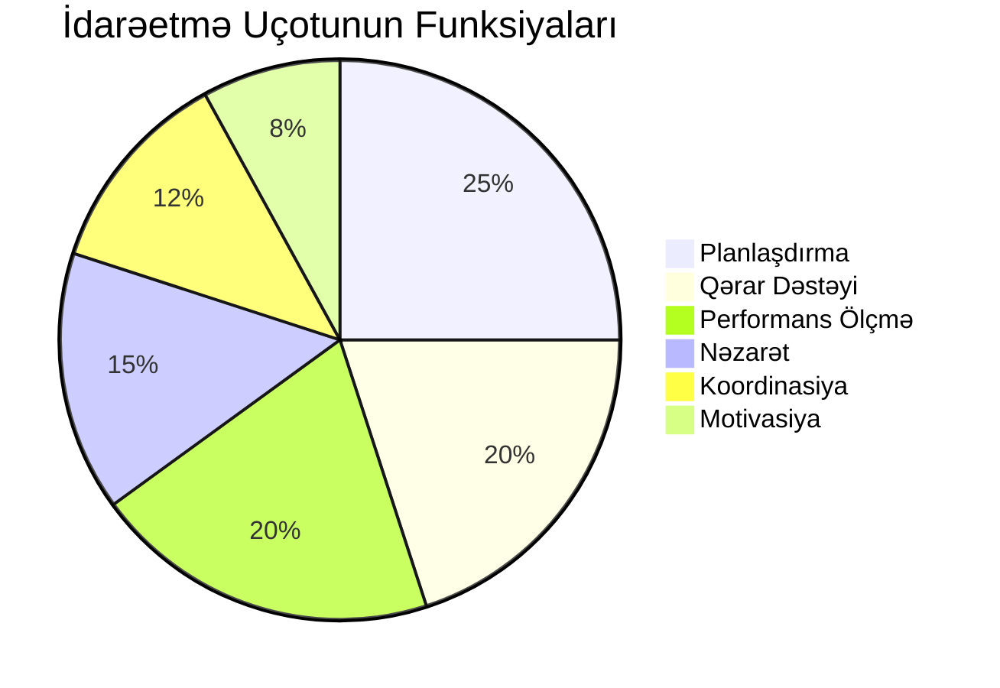
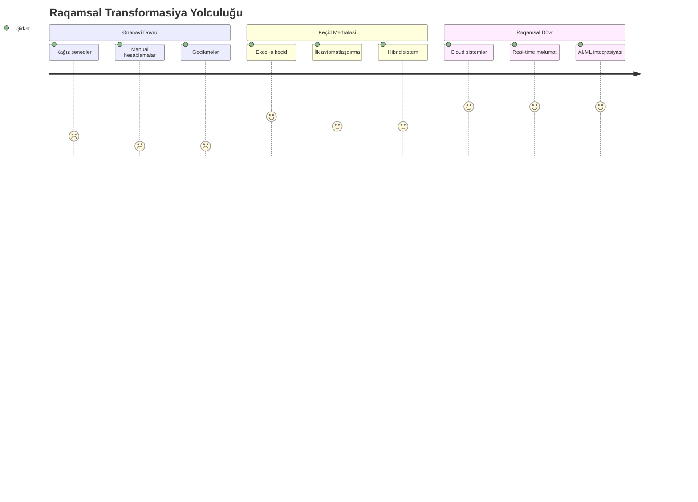
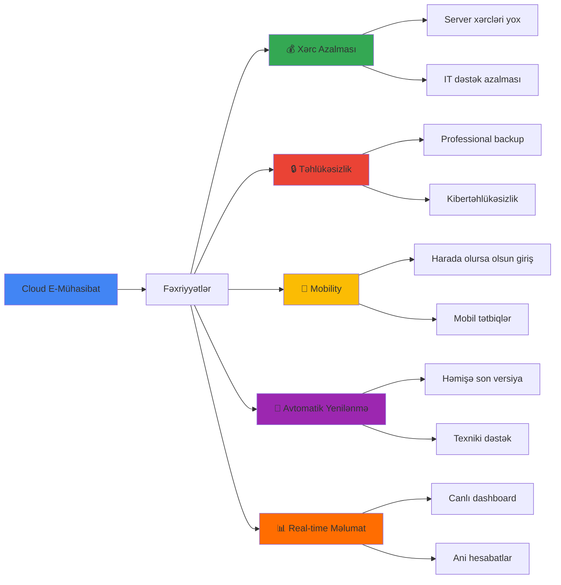
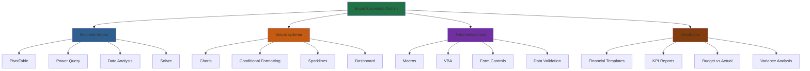
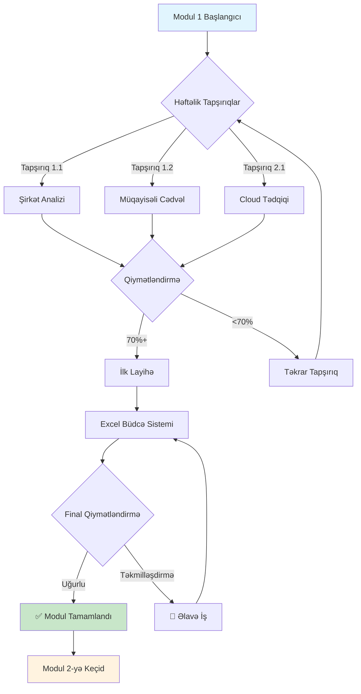

# 📚 Modul 1: İdarəetmə Uçotunun Əsasları

<div align="center">


</div>

## 🎯 Modulun Məqsədləri



## 📊 Həftəlik Proqram

```mermaid
gantt
    title Modul 1 - Detallı Təqvim
    dateFormat  X
    axisFormat %w
    
    section Həftə 1: Giriş
    İdarəetmə uçotunun mahiyyəti     :1, 2
    Maliyyə vs İdarəetmə uçotu       :2, 1
    Praktik nümunələr               :2, 1
    
    section Həftə 2: E-Mühasibat
    Rəqəmsal transformasiya         :3, 2
    Cloud platformaları             :4, 1
    Avtomatlaşdırma faydaları       :4, 1
    
    section Həftə 3: Praktik
    Excel əsasları                  :5, 2
    İlk layihə                      :6, 1
    Qiymətləndirmə                  :6, 1
```



## 🧠 Əsas Anlayışlar



## 📈 İdarəetmə Uçotu vs Maliyyə Uçotu



## 🎯 Həftə 1: İdarəetmə Uçotunun Mahiyyəti

### 📚 Nəzəri Hissə

**İdarəetmə Uçotunun Tərifі:**
> İdarəetmə uçotu - təşkilatın daxili idarəetmə ehtiyacları üçün məlumat toplama, emal etmə və təqdim etmə prosesidir.



### 🛠️ Praktik Tapşırıqlar

**Tapşırıq 1.1: Şirkət Analizi**
```
📋 Kiçik bir şirkət seçin və analiz edin:
   ✅ Şirkətin əsas fəaliyyəti
   ✅ İdarəetmə strukturu
   ✅ Mövcud hesabat sistemləri
   ✅ İdarəetmə uçotunun tətbiq sahələri
```

**Tapşırıq 1.2: Müqayisəli Cədvəl**
```
📊 İdarəetmə vs Maliyyə Uçotu cədvəli hazırlayın:
   📈 İstifadəçilər
   📈 Məqsədlər  
   📈 Hesabat tezliyi
   📈 Məlumat növləri
```

## 💻 Həftə 2: E-Mühasibat və Rəqəmsal Transformasiya

### 🌟 Rəqəmsal Transformasiyanın Mərhələləri



### ☁️ Cloud Texnologiyalarının Faydaları



### 🛠️ Praktik Tapşırıqlar

**Tapşırıq 2.1: Cloud Platformaları Tədqiqi**
```
🔍 Aşağıdakı platformaları araşdırın:
   ☁️ Google Workspace
   ☁️ Microsoft 365
   ☁️ Xero (mühasibat)
   ☁️ QuickBooks Online
   
📝 Hər birinin xüsusiyyətlərini müqayisə edin
```

## 📊 Həftə 3: Excel Əsasları və İlk Layihə

### 📈 Excel-də İdarəetmə Uçotu Alətləri



### 🎯 İlk Layihə: Sadə Büdcə Sistemi

**Layihə Təsviri:**
```
🏢 Kiçik kafeya üçün aylıq büdcə sistemi yaradın:
   
   📊 Gəlir Hissəsi:
   - Məhsul satışları
   - İçki satışları  
   - Əlavə xidmətlər
   
   💰 Xərc Hissəsi:
   - Xammal
   - Əmək haqqı
   - İcarə
   - Utilities
   - Marketing
   
   📈 Təhlil:
   - Profit/Loss hesablaması
   - Break-even nöqtəsi
   - Variance analysis
```

## ✅ Modulu Bitirmə Tələbləri



## 📚 Oxu Materialları

### 📖 Məcburi Ədəbiyyat:
1. **Rayburn, L.G.** - "Principles of Cost Accounting" - Chapter 1-2
2. **Əhmədov, N.** - "İdarəetmə Uçotunun Əsasları" - Bölmə 1
3. **Garrison, R.** - "Managerial Accounting" - Chapter 1

### 🌐 Onlayn Mənbələr:
- [Khan Academy - Accounting Basics](https://khanacademy.org/accounting)
- [Coursera - Introduction to Management Accounting](https://coursera.org)
- [Excel Campus - Management Reporting](https://excelcampus.com)

### 📹 Video Dərslər:
- "İdarəetmə Uçotuna Giriş" - YouTube playlist
- "Excel for Management Accounting" - Udemy kursu
- "Cloud Accounting Basics" - LinkedIn Learning

## 🎯 Növbəti Addımlar

```mermaid
roadmap
    title Moduldən Sonrakı Yol
    section Bilik Təsdiqi
        Əsas anlayışları: done
        Excel bacarıqları: done
        Cloud awareness: done
    section Praktik Tətbiq
        İlk layihə: done
        Portfolio başlanğıcı: active
    section Hazırlıq
        Modul 2 üçün: active
        Maliyyə bilgiləri: milestone
```

---

<div align="center">


**🎉 Modul 1-i uğurla tamamladınız!**

*Modul 2: Maliyyə İdarəetməsinə hazır olun! 🚀*

</div> 