# 💰 Modul 2: Maliyyə İdarəetməsi

<div align="center">


</div>

## 🎯 Modulun Məqsədləri

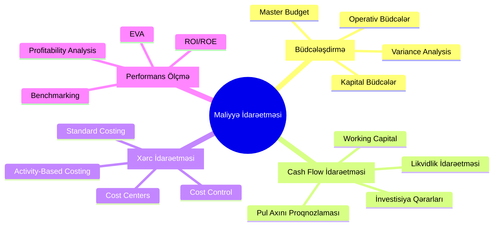

## 📊 Həftəlik Proqram

```mermaid
gantt
    title Modul 2 - Maliyyə İdarəetməsi Təqvimi
    dateFormat  X
    axisFormat %w
    
    section Həftə 4: Büdcələşdirmə
    Büdcələşdirmə prosesi        :4, 2
    Operativ büdcələr           :5, 1
    Master budget yaradılması    :5, 1
    
    section Həftə 5: Xərc İdarəetməsi
    Xərc mərkəzləri             :6, 2
    Standard vs Actual          :7, 1
    ABC Costing                 :7, 1
    
    section Həftə 6: Cash Flow
    Pul axını proqnozlaması     :8, 2
    Working capital idarəetməsi  :9, 1
    İnvestisiya qərarları       :9, 1
    
    section Həftə 7: Performans
    ROI/ROE hesablamaları       :10, 2
    EVA metodologiyası          :11, 1
    Layihə təslimi              :11, 1
```

## 💡 Büdcələşdirmə Prosesi

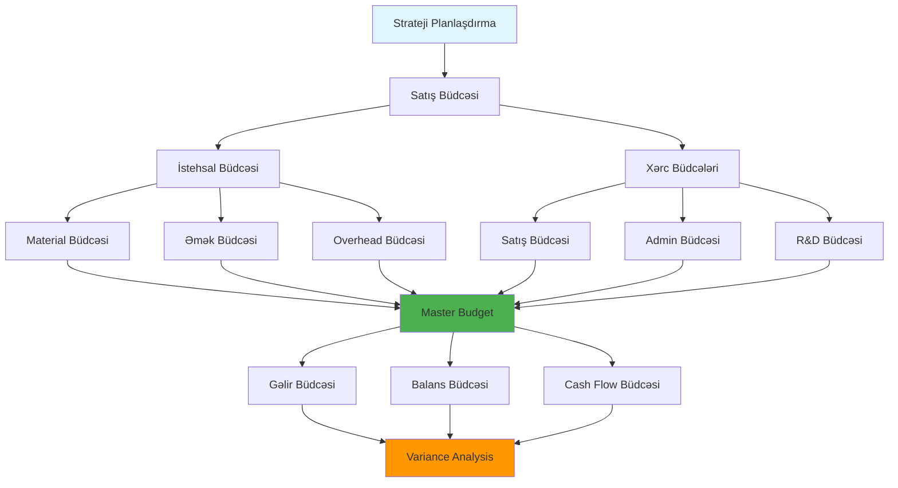

## 📈 SVG Animasiya: Cash Flow Tsikli

```svg
<svg width="600" height="400" viewBox="0 0 600 400">
  <style>
    .flow-text { font-family: Arial, sans-serif; font-size: 14px; fill: #333; }
    .flow-arrow { stroke: #2196f3; stroke-width: 3; fill: none; }
    .flow-circle { fill: #4caf50; stroke: #2e7d32; stroke-width: 2; }
    .flow-rect { fill: #ff9800; stroke: #f57c00; stroke-width: 2; }
    
    @keyframes rotate {
      from { transform: rotate(0deg); }
      to { transform: rotate(360deg); }
    }
    
    .rotating {
      animation: rotate 10s linear infinite;
      transform-origin: 300px 200px;
    }
  </style>
  
  <!-- Mərkəzi dairə -->
  <circle cx="300" cy="200" r="50" class="flow-circle"/>
  <text x="300" y="205" text-anchor="middle" class="flow-text">Cash Flow</text>
  
  <!-- Dönən elementlər -->
  <g class="rotating">
    <!-- Satış -->
    <rect x="200" y="80" width="80" height="40" class="flow-rect"/>
    <text x="240" y="105" text-anchor="middle" class="flow-text">Satış</text>
    
    <!-- Debitor -->
    <rect x="400" y="120" width="80" height="40" class="flow-rect"/>
    <text x="440" y="145" text-anchor="middle" class="flow-text">Debitor</text>
    
    <!-- İnkasso -->
    <rect x="480" y="280" width="80" height="40" class="flow-rect"/>
    <text x="520" y="305" text-anchor="middle" class="flow-text">İnkasso</text>
    
    <!-- Xərclər -->
    <rect x="200" y="320" width="80" height="40" class="flow-rect"/>
    <text x="240" y="345" text-anchor="middle" class="flow-text">Xərclər</text>
    
    <!-- Kreditor -->
    <rect x="40" y="280" width="80" height="40" class="flow-rect"/>
    <text x="80" y="305" text-anchor="middle" class="flow-text">Kreditor</text>
    
    <!-- Ödəniş -->
    <rect x="40" y="120" width="80" height="40" class="flow-rect"/>
    <text x="80" y="145" text-anchor="middle" class="flow-text">Ödəniş</text>
  </g>
  
  <!-- Oxlar -->
  <defs>
    <marker id="arrowhead" markerWidth="10" markerHeight="7" 
     refX="0" refY="3.5" orient="auto">
      <polygon points="0 0, 10 3.5, 0 7" fill="#2196f3" />
    </marker>
  </defs>
  
  <path d="M 240 120 Q 270 150 270 180" class="flow-arrow" marker-end="url(#arrowhead)"/>
  <path d="M 330 180 Q 370 150 400 140" class="flow-arrow" marker-end="url(#arrowhead)"/>
  <path d="M 480 280 Q 400 250 330 220" class="flow-arrow" marker-end="url(#arrowhead)"/>
  <path d="M 270 220 Q 240 250 240 280" class="flow-arrow" marker-end="url(#arrowhead)"/>
  <path d="M 200 320 Q 150 290 120 280" class="flow-arrow" marker-end="url(#arrowhead)"/>
  <path d="M 80 280 Q 50 200 80 160" class="flow-arrow" marker-end="url(#arrowhead)"/>
  <path d="M 120 140 Q 200 170 250 180" class="flow-arrow" marker-end="url(#arrowhead)"/>
</svg>
```

## 🏢 Həftə 4: Büdcələşdirmə Sistemləri

### 📊 Büdcə Növləri

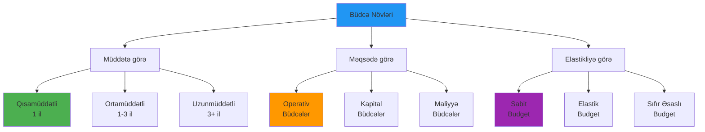

### 🎯 Praktik Tapşırıq 4.1: Master Budget Yaradılması

**Şərait:**
```
🏭 Kiçik istehsal müəssisəsi üçün 2024-cü il büdcəsi:

📊 Gəlir Proqnozu:
- Q1: 150,000 AZN
- Q2: 180,000 AZN  
- Q3: 200,000 AZN
- Q4: 220,000 AZN

💰 Xərc Strukturu:
- Material: 40% gəlirdən
- Əmək: 25% gəlirdən
- Overhead: 15% gəlirdən
- Admin: 8% gəlirdən
```

## 📊 Həftə 5: Xərc İdarəetməsi

### 🔄 Activity-Based Costing (ABC)

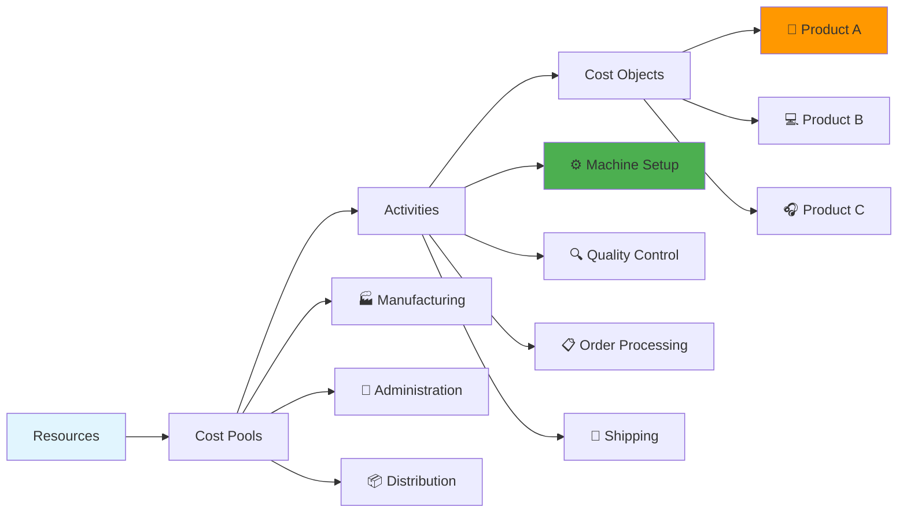

### 📈 Standard vs Actual Təhlili

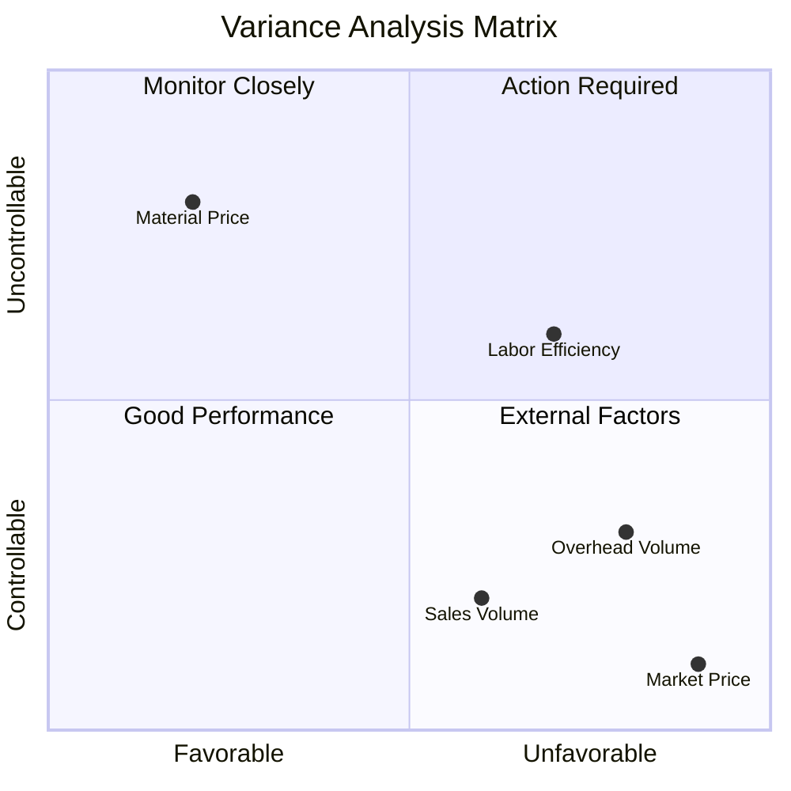

## 💰 Həftə 6: Cash Flow İdarəetməsi

### 🔄 Working Capital Dövriyyəsi

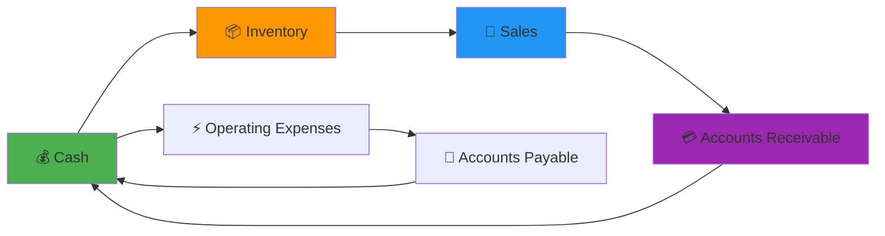

### 📊 Cash Flow Proqnozlaşdırma

```mermaid
gantt
    title 12 Aylıq Cash Flow Proqnozu
    dateFormat  X
    axisFormat %s
    
    section Gəlirlər
    Satış gəlirləri      :1, 12
    Digər gəlirlər       :3, 10
    
    section Xərclər
    Əməliyyat xərcləri   :1, 12
    Kapital xərcləri     :2, 8
    Vergi ödənişləri     :4, 1
    Vergi ödənişləri     :7, 1
    Vergi ödənişləri     :10, 1
    
    section Net Position
    Pozitiv cash flow    :done, 1, 3
    Kritik dövr          :crit, 4, 6
    Bərpa dövrü          :7, 12
```

## 📈 Həftə 7: Performans Ölçmə

### 🎯 Maliyyə Performans Göstəriciləri

```mermaid
graph TD
    A[Maliyyə Performansı] --> B[Rentabellik]
    A --> C[Səmərəlilik]
    A --> D[Likvidlik]
    A --> E[Leverage]
    
    B --> B1[ROA = Net Income / Total Assets]
    B --> B2[ROE = Net Income / Shareholders Equity]
    B --> B3[Gross Margin = Gross Profit / Revenue]
    
    C --> C1[Asset Turnover = Revenue / Average Assets]
    C --> C2[Inventory Turnover = COGS / Average Inventory]
    C --> C3[Receivables Turnover = Revenue / Average AR]
    
    D --> D1[Current Ratio = Current Assets / Current Liabilities]
    D --> D2[Quick Ratio = Quick Assets / Current Liabilities]
    D --> D3[Cash Ratio = Cash / Current Liabilities]
    
    E --> E1[Debt Ratio = Total Debt / Total Assets]
    E --> E2[Interest Coverage = EBIT / Interest Expense]
    
    style A fill:#2196f3
    style B fill:#4caf50
    style C fill:#ff9800
    style D fill:#9c27b0
    style E fill:#f44336
```

### 💎 Economic Value Added (EVA)

```mermaid
flowchart TD
    A[EVA Hesablaması] --> B[NOPAT]
    A --> C[Invested Capital]
    A --> D[WACC]
    
    B --> B1[Net Operating Profit After Tax]
    
    C --> C1[Total Assets - Non-interest Liabilities]
    
    D --> D1[Weighted Average Cost of Capital]
    
    B1 --> E[EVA = NOPAT - (IC × WACC)]
    C1 --> E
    D1 --> E
    
    E --> F{EVA Result}
    
    F -->|Positive| G[💚 Value Creation]
    F -->|Negative| H[🔴 Value Destruction]
    
    style A fill:#2196f3
    style E fill:#ff9800
    style G fill:#4caf50
    style H fill:#f44336
```

## 🛠️ Excel Template: Büdcə vs Faktiki Təhlil

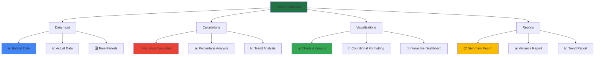

## 🎯 Layihə: Tam Maliyyə İdarəetmə Sistemi

### 📋 Layihə Tələbləri

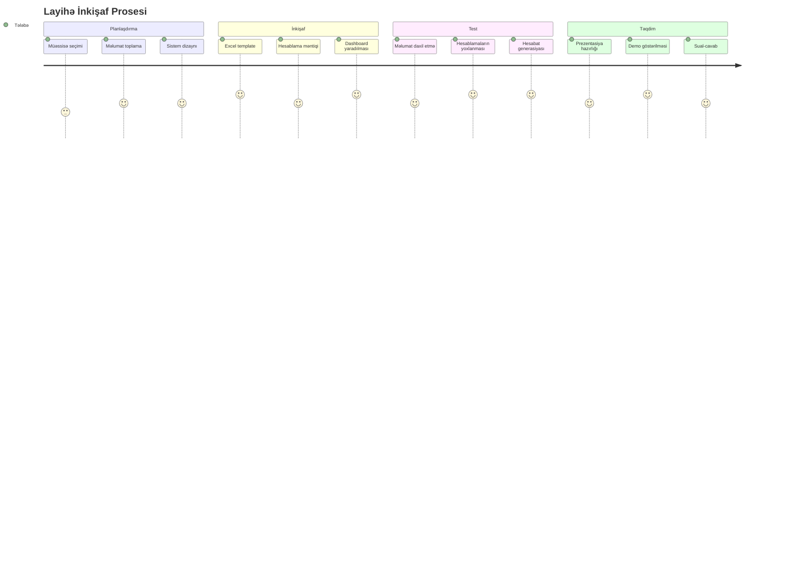

**Layihə Komponentləri:**
1. **📊 Master Budget Template**
   - 12 aylıq proqnozlaşdırma
   - Dinamik variance analysis
   - Avtomatik hesablamalar

2. **💰 Cash Flow Model**
   - Həftəlik/aylıq cash flow
   - Working capital analizi
   - Likvidlik proqnozlaması

3. **📈 Performance Dashboard**
   - Real-time KPI tracking
   - Interactive charts
   - Trend analysis

4. **📋 Management Reports**
   - Executive summary
   - Detailed variance reports
   - Action recommendations

## ✅ Qiymətləndirmə Rubrikası

| Kriteriya | Excellent (90-100) | Good (80-89) | Satisfactory (70-79) | Needs Work (<70) |
|-----------|-------------------|--------------|---------------------|-------------------|
| **Excel Məharəti** | Advanced formulas, VBA | Complex formulas | Basic formulas | Simple calculations |
| **Analitik Düşüncə** | Deep insights | Good analysis | Basic analysis | Limited analysis |
| **Vizual Dizayn** | Professional dashboard | Good presentation | Basic charts | Poor visualization |
| **Accuracy** | 100% doğru | 90-99% doğru | 80-89% doğru | <80% doğru |
| **Prezentasiya** | Excellent delivery | Good presentation | Basic presentation | Poor delivery |

## 📚 Əlavə Oxu Materialları

### 📖 Təvsiyə olunan kitablar:
1. **Brigham, E.F.** - "Financial Management: Theory & Practice"
2. **Ross, S.A.** - "Corporate Finance" 
3. **Məmmədov, F.** - "Maliyyə İdarəetməsi" (AZ)

### 🌐 Faydalı linklər:
- [CFI - Corporate Finance Institute](https://corporatefinanceinstitute.com)
- [Investopedia Financial Ratios](https://investopedia.com/financial-ratios)
- [Excel Financial Templates](https://templates.office.com/financial)

---

<div align="center">


**💰 Maliyyə İdarəetməsi məharətlərinizi inkişaf etdirdiniz!**

*Modul 3: Performans Ölçməyə hazır olun! 📊*

</div> 