# 📊 Modul 3: Performans Ölçmə və KPI Sistemləri

<div align="center">


</div>

## 🎯 Modulun Əsas Məqsədləri

Performans ölçmə modulu təşkilatların strategik məqsədlərini operativ fəaliyyətə çevirməyə, effektiv KPI sistemləri qurmağa və rəqəmsal dashboard-lar vasitəsilə real vaxt monitorinqi təmin etməyə yönəlib.

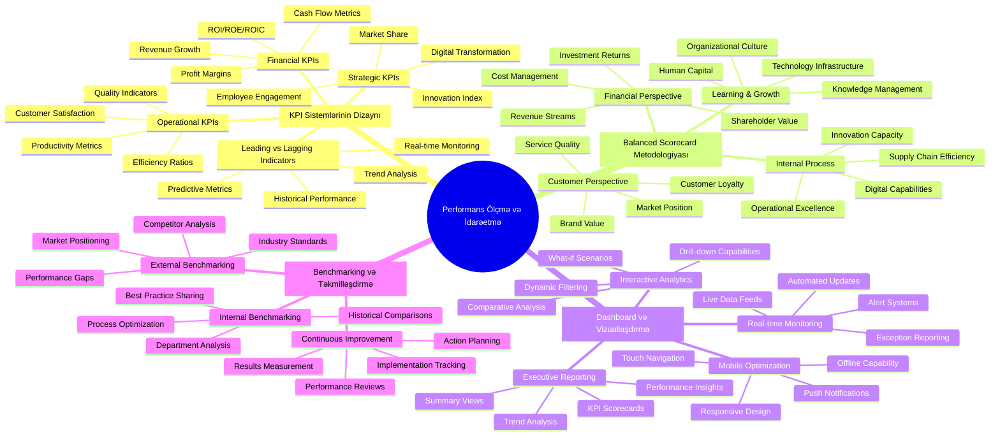

## 📊 Həftəlik Detallı Proqram

```mermaid
gantt
    title Modul 3 - Performans Ölçmə (4 Həftə) Detallı Təqvim
    dateFormat  X
    axisFormat %w
    
    section Həftə 8: KPI Fundamentals
    KPI Nəzəriyyəsi və Növləri        :8, 2
    Financial vs Non-Financial KPIs   :9, 1
    Leading vs Lagging Indicators     :9, 1
    KPI Design Workshop              :9, 1
    
    section Həftə 9: Balanced Scorecard
    BSC Methodology                  :10, 2
    4 Perspektiv Detallı             :11, 1
    Strategy Map Creation            :11, 1
    Practical BSC Design             :11, 1
    
    section Həftə 10: Dashboard Development
    Dashboard Design Principles      :12, 2
    Excel Dashboard Creation         :13, 1
    Power BI Advanced Features       :13, 1
    Interactive Elements             :13, 1
    
    section Həftə 11: Implementation
    Performance Management System    :14, 2
    Benchmarking Techniques          :15, 1
    Continuous Improvement          :15, 1
    Final Project Presentation       :15, 1
```

## 🎯 Həftə 8: KPI Sistemlərinin Əsasları

### 📚 KPI Nəzəriyyəsi və Təsnifatı

**Key Performance Indicator (KPI) Tərifi:**
> KPI - təşkilatın strateji məqsədlərinə nail olmaq istiqamətində irəliləyişi ölçən kvantifikasiya edilmiş metriklərdir.

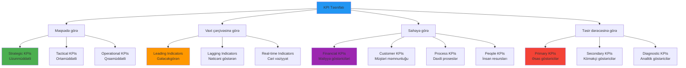

### 🏢 Maliyyə KPI-ları və Hesablama Metodları

```mermaid
graph LR
    A[Maliyyə KPI-ları] --> B[Rentabellik]
    A --> C[Likvidlik]
    A --> D[Səmərəlilik]
    A --> E[Böyümə]
    
    B --> B1[ROE = Net Income / Shareholders' Equity]
    B --> B2[ROA = Net Income / Total Assets]
    B --> B3[ROIC = NOPAT / Invested Capital]
    B --> B4[Gross Margin = Gross Profit / Revenue]
    B --> B5[EBITDA Margin = EBITDA / Revenue]
    
    C --> C1[Current Ratio = Current Assets / Current Liabilities]
    C --> C2[Quick Ratio = Quick Assets / Current Liabilities]
    C --> C3[Cash Ratio = Cash & Equivalents / Current Liabilities]
    C --> C4[Operating Cash Flow Ratio]
    
    D --> D1[Asset Turnover = Revenue / Average Total Assets]
    D --> D2[Inventory Turnover = COGS / Average Inventory]
    D --> D3[Receivables Turnover = Revenue / Average AR]
    D --> D4[Working Capital Turnover]
    
    E --> E1[Revenue Growth = (Rev₁ - Rev₀) / Rev₀]
    E --> E2[CAGR - Compound Annual Growth Rate]
    E --> E3[Market Share Growth]
    E --> E4[Customer Acquisition Rate]
    
    style A fill:#2196f3
    style B fill:#4caf50
    style C fill:#ff9800
    style D fill:#9c27b0
    style E fill:#f44336
```

### 🛠️ Praktik Tapşırıq 8.1: "Azərbaycan Hava Yolları" KPI Sistemi

**Case Study: AZAL Performance Dashboard**

```
🛩️ Təşkilat: Azerbaijan Airlines (AZAL)
📊 Məqsəd: Comprehensive KPI system design
⏱️ Timeline: 1 həftə
🎯 Scope: Financial və Operational metrics

📈 Primary KPIs:
✈️ Operational Excellence:
- On-time Performance (OTP): Target >85%
- Load Factor: Target >75%
- Aircraft Utilization: Target >10 hours/day
- Customer Satisfaction Score: Target >4.2/5

💰 Financial Performance:
- Revenue per Available Seat Mile (RASM)
- Cost per Available Seat Mile (CASM)
- Operating Margin: Target >8%
- Revenue Growth: Target >12% annually

🔧 Efficiency Metrics:
- Fuel Efficiency: Liters per 100 passenger-km
- Maintenance Cost per Flight Hour
- Employee Productivity: Revenue per employee
- Digital Channel Adoption: Target >60%

📊 Dashboard Design:
1. Executive Summary (CEO/Board level)
2. Operations Center (Real-time monitoring)
3. Financial Performance (CFO dashboard)
4. Customer Experience (Marketing dashboard)
5. Route Performance (Network planning)

💡 Implementation Strategy:
Week 1: Data source identification
Week 2: KPI calculation methodology
Week 3: Dashboard development
Week 4: User training və rollout

## 🎯 Həftə 9: Balanced Scorecard Metodologiyası

### 📊 BSC - Strateji İdarəetmənin Əsası

**Balanced Scorecard Nədir?**
> Balanced Scorecard - təşkilatın strategiyasını əməliyyat fəaliyyətinə çevirən, dörd perspektivdən performansı ölçən strateji idarəetmə sistemidir.

```mermaid
graph TD
    A[Balanced Scorecard<br/>4 Perspektiv] --> B[Financial Perspective<br/>💰 Maliyyə Nəticələri]
    A --> C[Customer Perspective<br/>👥 Müştəri Dəyəri]
    A --> D[Internal Process<br/>⚙️ Daxili Proseslər]
    A --> E[Learning & Growth<br/>📚 Öyrənmə və İnkişaf]
    
    B --> B1[Revenue Growth<br/>Gəlir Artımı]
    B --> B2[Profitability<br/>Rentabellik]
    B --> B3[Cost Management<br/>Xərc İdarəetməsi]
    B --> B4[Asset Utilization<br/>Aktiv Səmərəliliği]
    
    C --> C1[Customer Satisfaction<br/>Müştəri Məmnunluğu]
    C --> C2[Customer Retention<br/>Müştəri Saxlanması]
    C --> C3[Market Share<br/>Bazar Payı]
    C --> C4[Customer Acquisition<br/>Yeni Müştərilər]
    
    D --> D1[Process Quality<br/>Proses Keyfiyyəti]
    D --> D2[Innovation<br/>İnnovasiya]
    D --> D3[Operational Excellence<br/>Əməliyyat Mükəmməlliyi]
    D --> D4[Supply Chain<br/>Təchizat Zənciri]
    
    E --> E1[Employee Skills<br/>İşçi Bacarıqları]
    E --> E2[Information Systems<br/>İnformasiya Sistemləri]
    E --> E3[Organizational Culture<br/>Təşkilati Mədəniyyət]
    E --> E4[Leadership<br/>Liderlik]
    
    style A fill:#2196f3
    style B fill:#4caf50
    style C fill:#ff9800
    style D fill:#9c27b0
    style E fill:#f44336
```

### 🎨 Strategy Map - Strateji Xəritələmə

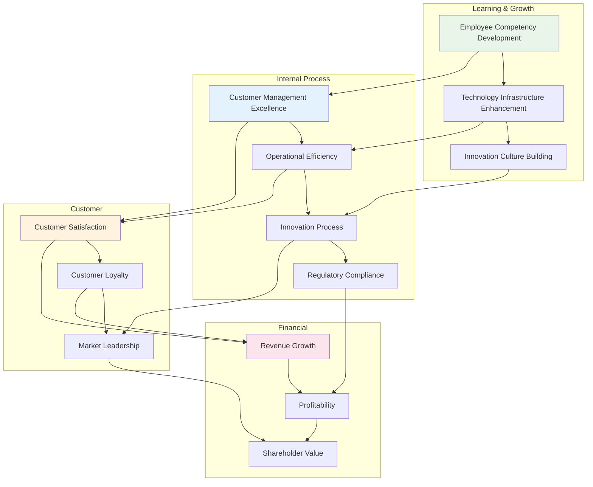

### 🛠️ BSC İmplementasiya Prosesi

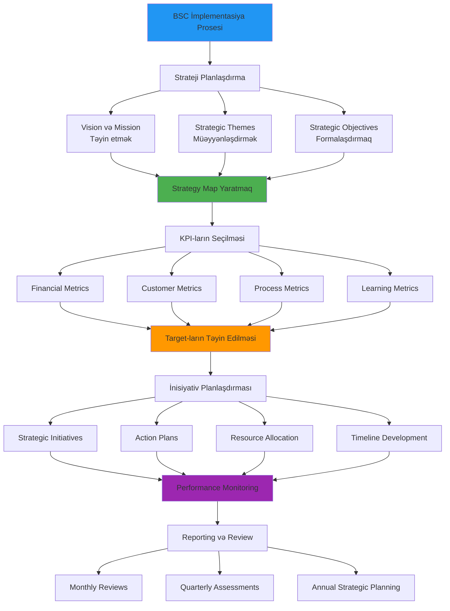

### 🏢 Real Case Study: "Gilan Holding" BSC Implementation

**Layihə Təfərrüatları:**

```
🏭 Company: Gilan Holding
🎯 Industry: Food & Beverage Manufacturing
👥 Employees: 2,500+
🌍 Operations: 8 facilities across Azerbaijan
💰 Annual Revenue: ~400M AZN

📊 BSC Implementation Timeline:

🔍 Phase 1: Strategic Foundation (4 həftə)
✅ Strategic Vision Refinement:
"To become the leading food & beverage company in the Caucasus region while promoting healthy living and sustainable agriculture"

✅ Strategic Themes Identification:
1. Market Leadership və Growth
2. Operational Excellence və Innovation
3. Sustainability və Social Responsibility
4. Digital Transformation və Efficiency

📈 Phase 2: Strategy Map Development (3 həftə)

Financial Perspective Strategic Objectives:
- Increase revenue by 15% annually
- Improve EBITDA margin to 18%
- Enhance return on invested capital (ROIC) to 12%
- Optimize working capital efficiency

Customer Perspective Strategic Objectives:
- Achieve 95% customer satisfaction rating
- Increase market share in key categories by 25%
- Launch 5 new products annually
- Strengthen brand recognition və loyalty

Internal Process Strategic Objectives:
- Achieve 99% on-time delivery performance
- Reduce production waste by 20%
- Implement fully integrated ERP system
- Achieve ISO 22000 certification

Learning & Growth Strategic Objectives:
- Increase employee engagement score to 4.5/5
- Provide 40 hours annual training per employee
- Develop digital capabilities across organization
- Build innovation culture və R&D capabilities

🎯 Phase 3: KPI Selection və Target Setting (2 həftə)

📊 Financial KPIs:
- Revenue Growth Rate: Target 15% YoY
- EBITDA Margin: Target 18%
- ROIC: Target 12%
- Working Capital Days: Target <45 days
- Free Cash Flow: Target >50M AZN

👥 Customer KPIs:
- Net Promoter Score (NPS): Target >50
- Customer Retention Rate: Target >90%
- Market Share (key categories): Target 25%
- New Product Revenue %: Target 15%
- Brand Awareness Index: Target >80%

⚙️ Internal Process KPIs:
- On-time Delivery Performance: Target 99%
- Overall Equipment Effectiveness (OEE): Target >85%
- Waste Reduction %: Target 20% decrease
- Quality First Pass Rate: Target >98%
- Supplier Quality Rating: Target >95%

📚 Learning & Growth KPIs:
- Employee Engagement Score: Target 4.5/5
- Training Hours per Employee: Target 40/year
- Internal Promotion Rate: Target >70%
- Digital Literacy Score: Target >80%
- Innovation Pipeline Value: Target 100M AZN

🚀 Phase 4: Dashboard Creation (3 həftə)

💻 Technology Stack:
- Microsoft Power BI for visualization
- SQL Server for data warehousing
- SAP S/4HANA for ERP integration
- Tableau for advanced analytics
- Mobile apps for field access

📱 Dashboard Hierarchy:
1. Executive Dashboard (Board/CEO level)
2. Functional Dashboards (Department heads)
3. Operational Dashboards (Plant managers)
4. Team Dashboards (Supervisors)
5. Individual Scorecards (All employees)

🎯 Expected Outcomes:
- 25% improvement in strategic alignment
- 30% faster decision-making process
- 20% increase in operational efficiency
- 40% better cross-functional collaboration
- 15% improvement in employee engagement

## 🖥️ Həftə 10: Dashboard Development və Vizuallaşdırma

### 📊 Dashboard Design Prinsipləri

**Stephen Few-nin Dashboard Dizayn Prinsipləri:**

```mermaid
graph TD
    A[Effective Dashboard Design] --> B[Information Design]
    A --> C[Visual Design]
    A --> D[Interaction Design]
    A --> E[User Experience]
    
    B --> B1[Data Accuracy]
    B --> B2[Relevant Information]
    B --> B3[Contextual Data]
    B --> B4[Exception Highlighting]
    
    C --> C1[Clean Layout]
    C --> C2[Appropriate Charts]
    C --> C3[Color Coding]
    C --> C4[Typography]
    
    D --> D1[Intuitive Navigation]
    D --> D2[Drill-down Capability]
    D --> D3[Filtering Options]
    D --> D4[Real-time Updates]
    
    E --> E1[User-Centric Design]
    E --> E2[Mobile Responsive]
    E --> E3[Performance Optimization]
    E --> E4[Accessibility]
    
    style A fill:#2196f3
    style B1 fill:#4caf50
    style C1 fill:#ff9800
    style D1 fill:#9c27b0
    style E1 fill:#f44336
```

### 🎨 Rəng Palitrasının Strategik İstifadəsi

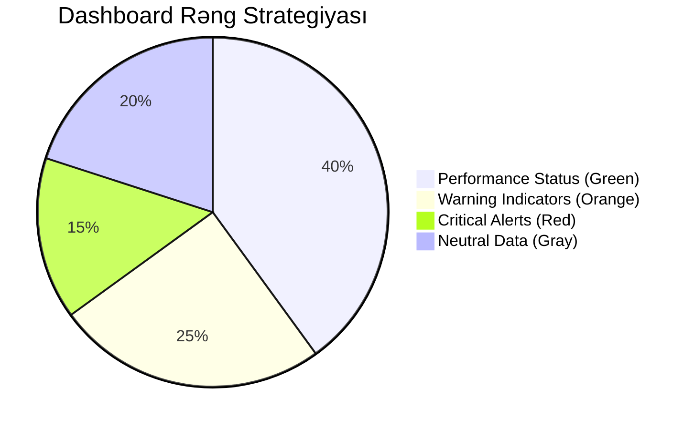

### 🛠️ Power BI Dashboard Development

**DAX Formulaları və Advanced Features:**

```dax
// KPI Calculation
Revenue Growth % = 
VAR CurrentRevenue = SUM(Sales[Revenue])
VAR PreviousRevenue = CALCULATE(SUM(Sales[Revenue]), PREVIOUSYEAR(Date[Date]))
RETURN DIVIDE(CurrentRevenue - PreviousRevenue, PreviousRevenue, 0)

// Performance Rating
Performance Rating = 
SWITCH(
    TRUE(),
    [Revenue Growth %] >= 0.15, "Excellent",
    [Revenue Growth %] >= 0.10, "Good", 
    [Revenue Growth %] >= 0.05, "Average",
    "Below Target"
)

// YTD Calculations
YTD Revenue = TOTALYTD(SUM(Sales[Revenue]), Date[Date])

// Moving Average
3-Month Moving Avg = 
AVERAGEX(
    DATESINPERIOD(Date[Date], LASTDATE(Date[Date]), -3, MONTH),
    [Monthly Revenue]
)
```

### 📱 Responsive Design Patterns

```css
/* Mobile Dashboard Optimizations */
@media (max-width: 768px) {
    .dashboard-container {
        grid-template-columns: 1fr;
        gap: 10px;
    }
    
    .kpi-card {
        min-height: 100px;
        padding: 15px;
    }
    
    .chart-container {
        height: 200px;
        overflow-x: auto;
    }
}

/* Tablet Optimizations */
@media (min-width: 769px) and (max-width: 1024px) {
    .dashboard-container {
        grid-template-columns: repeat(2, 1fr);
        gap: 15px;
    }
}
```

### 🎯 Praktik Tapşırıq 10.1: Executive Dashboard

**Layihə: CEO üçün Real-time Executive Dashboard**

```
📊 Dashboard Requirements:

🔝 Top Level KPIs (Hero Section):
- Revenue: 2.4M AZN (↑12% vs last month)
- Profit Margin: 18.5% (↓2.1% vs target)
- Customer Satisfaction: 4.3/5 (↑0.2 vs last quarter)
- Market Share: 15.2% (↑1.8% vs competitors)

📈 Performance Trends (Time Series):
- 12-month revenue trend with forecasting
- Quarterly profit margin analysis
- Monthly customer acquisition/churn
- Weekly operational efficiency metrics

🎯 Strategic Initiatives Progress:
- Digital Transformation: 67% complete
- Market Expansion: 45% complete  
- Cost Optimization: 89% complete
- Innovation Program: 34% complete

🚨 Exception Reporting:
- Late payments: 12 customers (>30 days)
- Quality issues: 3 products (below threshold)
- Staff turnover: 8% (above industry avg)
- IT downtime: 2.3 hours (weekly target: <1h)

📱 Technical Requirements:
✅ Auto-refresh every 5 minutes
✅ Mobile responsive design
✅ Drill-down capabilities
✅ Export to PDF functionality
✅ Email alerts for critical metrics
✅ Multi-language support (AZ/EN)
```

## 🎯 Həftə 11: Performance Management System Implementation

### 🔄 Continuous Performance Management Cycle

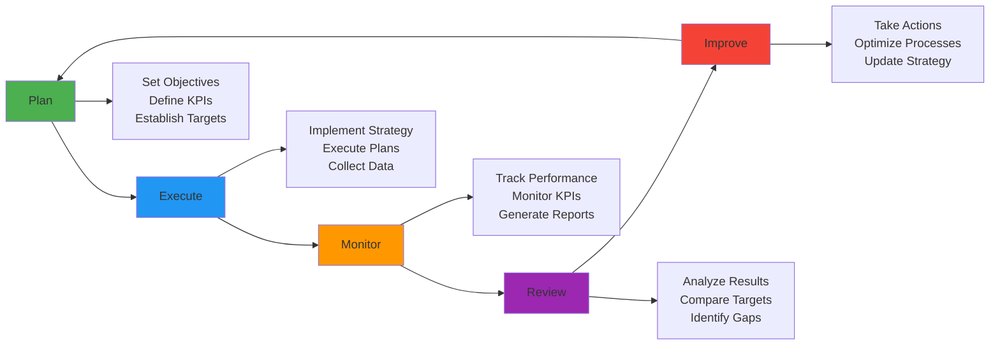

### 📊 Benchmarking Metodologiyası

```mermaid
flowchart TD
    A[Benchmarking Process] --> B[Planning Phase]
    A --> C[Analysis Phase]
    A --> D[Integration Phase]
    A --> E[Action Phase]
    
    B --> B1[Identify benchmark subjects]
    B --> B2[Define performance metrics]
    B --> B3[Select benchmark partners]
    B --> B4[Develop data collection plan]
    
    C --> C1[Collect internal data]
    C --> C2[Collect external data]
    C --> C3[Determine performance gaps]
    C --> C4[Identify best practices]
    
    D --> D1[Communicate findings]
    D --> D2[Establish new performance goals]
    D --> D3[Develop action plans]
    D --> D4[Gain stakeholder commitment]
    
    E --> E1[Implement specific actions]
    E --> E2[Monitor progress]
    E --> E3[Recalibrate benchmarks]
    E --> E4[Institutionalize practices]
    
    style A fill:#e1f5fe
    style B fill:#c8e6c9
    style C fill:#fff3e0
    style D fill:#f3e5f5
    style E fill:#e8f5e8
```

### 🏆 Industry Benchmarking: Azərbaycan Banking Sector

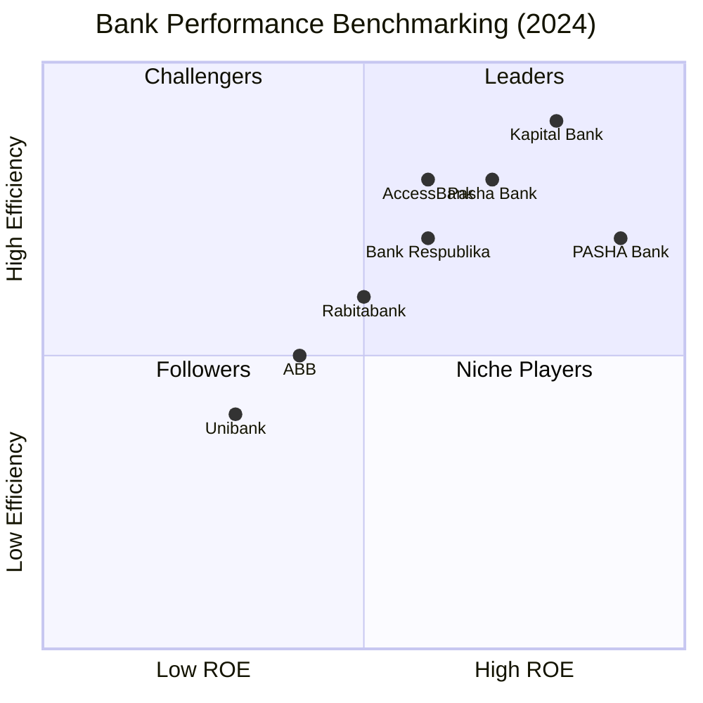

### 🎯 Final Layihə: Integrated Performance Management System

**Layihə Tələbləri: "Müasir Retail Şirkəti üçün 360° Performance Dashboard"**

```
🏢 Şirkət Profili: "TechnoMart" - Elektronika və texnika mağazalar şəbəkəsi
📍 Yerləşmə: Bakı (8 filial), Gəncə (2 filial), Sumqayıt (1 filial)
👥 İşçi sayı: 245 nəfər
💰 İllik dövriyyə: 15.8 mln AZN

📊 1. Strategic Dashboard (CEO Level):
   🎯 Company Overview:
   - Revenue: Real-time və forecast
   - Profit margins by product category
   - Market share evolution
   - Customer lifetime value

   📈 Financial Performance:
   - Monthly P&L statement
   - Cash flow analysis
   - ROI by store location
   - Budget vs actual variance

   🗺️ Geographic Analysis:
   - Sales heatmap by region
   - Store performance comparison
   - Customer demographics
   - Market penetration rates

📊 2. Operational Dashboard (COO Level):
   ⚙️ Store Operations:
   - Inventory turnover by category
   - Staff productivity metrics
   - Customer wait times
   - Energy consumption per store

   📦 Supply Chain:
   - Supplier performance scores
   - Delivery time tracking
   - Stock-out incidents
   - Warehouse efficiency

   👥 Customer Experience:
   - Net Promoter Score (NPS)
   - Customer complaint resolution
   - Average transaction value
   - Return/exchange rates

📊 3. Tactical Dashboard (Department Heads):
   💼 Sales Performance:
   - Daily sales targets vs actual
   - Product category performance
   - Sales team individual metrics
   - Promotion effectiveness

   🛒 Inventory Management:
   - Stock levels by SKU
   - Slow-moving inventory
   - Reorder point alerts
   - ABC analysis visualization

   💰 Financial Control:
   - Daily cash flow
   - Credit sales monitoring
   - Expense tracking
   - Profit margins by product

📊 4. Operational Dashboard (Store Managers):
   📈 Daily Operations:
   - Hourly sales tracking
   - Staff scheduling efficiency
   - Customer traffic patterns
   - Energy usage monitoring

   🎯 Performance Alerts:
   - Low stock warnings
   - Sales target notifications
   - Staff performance alerts
   - Security incidents

📱 5. Mobile Dashboard (Field Staff):
   📊 Real-time Metrics:
   - Personal sales targets
   - Commission tracking
   - Customer interaction logs
   - Product knowledge updates

🔧 Technical Specifications:
   ✅ Platform: Power BI + Excel integration
   ✅ Data Sources: ERP system, POS terminals, CRM
   ✅ Update Frequency: Real-time for sales, hourly for operations
   ✅ User Access: Role-based permissions
   ✅ Mobile Support: iOS and Android apps
   ✅ Offline Capability: Critical metrics cached
   ✅ Export Features: PDF, Excel, PowerPoint
   ✅ Languages: Azerbaijani, English, Russian

📋 Deliverables:
   1. Strategic analysis and KPI definition document
   2. Dashboard wireframes and design mockups
   3. Data model and integration architecture
   4. Fully functional Power BI dashboard
   5. Mobile app prototype
   6. User training materials
   7. Implementation roadmap
   8. ROI calculation and business case

🏆 Success Criteria:
   - Dashboard load time <3 seconds
   - 95% data accuracy maintained
   - 100% user adoption within 3 months
   - 20% improvement in decision-making speed
   - 15% increase in operational efficiency
   - 25% reduction in manual reporting time
```

## ✅ Modul Qiymətləndirmə Sistemi

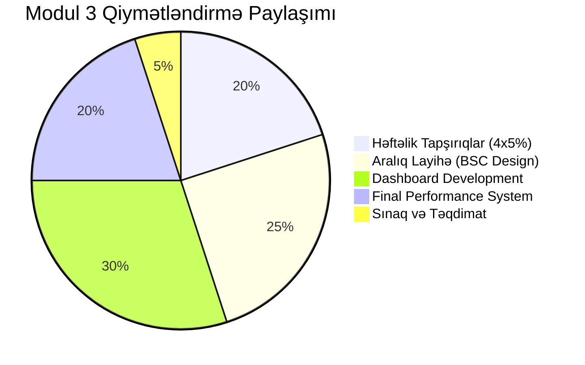

### 📋 Detallı Qiymətləndirmə Rubrikası

| Kriteriya | Mükəmməl (90-100) | Yaxşı (80-89) | Orta (70-79) | Zəif (<70) | Çəki |
|-----------|-------------------|---------------|--------------|------------|------|
| **KPI Design Quality** | Strategik uyğunluq, SMART criteria | Əksər KPI-lər uyğun | Bəzi problemlər var | Zəif dizayn | 25% |
| **Dashboard Functionality** | Tam funksional, interaktiv | Əsas funksiyalar işləyir | Bəzi nasazlıqlar | Çox problem | 30% |
| **Visual Design** | Professional, user-friendly | Yaxşı görünüş | Orta dizayn | Zəif UI/UX | 20% |
| **Technical Implementation** | Advanced features, optimal | Yaxşı texniki həll | Əsas funksiyalar | Texniki problemlər | 15% |
| **Business Impact** | Yüksək value-add | Gözlənilən fayda | Bəzi fayda | Məhdud təsir | 10% |

## 📚 Əlavə Tədris Materialları

### 📖 Məcburi Ədəbiyyat:
1. **Kaplan, R.S. & Norton, D.P.** - "The Balanced Scorecard: Translating Strategy into Action" (2023 Edition)
2. **Eckerson, W.W.** - "Performance Dashboards: Measuring, Monitoring, and Managing Your Business" (2022)
3. **Few, S.** - "Information Dashboard Design: The Effective Visual Communication of Data" (2021)
4. **Marr, B.** - "Key Performance Indicators: The 75 Measures Every Manager Needs to Know" (2023)

### 🌐 Onlayn Platformalar və Alətlər:
- **Power BI Learning Path** - Microsoft Learn
- **Tableau Public** - Pulsuz dashboard alətləri  
- **Google Analytics Academy** - Veb analitika
- **Coursera: Data Visualization** - Specializasiya kursları
- **KPI.org** - KPI templates və best practices

### 📹 Video Dərslər və Webinarlar:
- "Building Executive Dashboards in Power BI" - Microsoft Official
- "BSC Implementation Best Practices" - Kaplan & Norton Institute
- "Advanced KPI Design Workshop" - Performance Management Institute
- "Dashboard Design Psychology" - Stephen Few Masterclass

### 🛠️ Praktik Alətlər və Templateslər:
- **Excel KPI Dashboard Templates** - 20+ ready-to-use templates
- **Power BI Sample Reports** - Industry-specific examples
- **BSC Strategy Map Templates** - Visio və PowerPoint formats
- **Benchmarking Calculators** - Industry comparison tools

## 🎓 Sertifikatlaşdırma İmkanları

```mermaid
graph LR
    A[Modul 3 Completion] --> B[Industry Certifications]
    
    B --> B1[Microsoft Certified:<br/>Power BI Data Analyst Associate]
    B --> B2[Tableau Desktop<br/>Specialist Certification]
    B --> B3[Balanced Scorecard<br/>Professional (BSP)]
    B --> B4[Certified Performance<br/>Management Professional]
    
    B1 --> C1[Advanced Analytics<br/>Specialization]
    B2 --> C2[Data Visualization<br/>Expert Track]
    B3 --> C3[Strategic Management<br/>Consultant Path]
    B4 --> C4[Executive Performance<br/>Management Role]
    
    style A fill:#4caf50
    style B1 fill:#2196f3
    style B2 fill:#ff9800
    style B3 fill:#9c27b0
    style B4 fill:#f44336
```

## 🚀 Növbəti Addımlar və Karyera Yolları

### 💼 Peşəkar İnkişaf Imkanları:

**1. 📊 Business Intelligence Analyst**
- Orta maaş: 2000-3500 AZN
- Tələb olunan bacarıqlar: Power BI, SQL, Statistical Analysis
- Karyera inkişafı: Senior BI Developer → BI Manager

**2. 📈 Performance Management Specialist**  
- Orta maaş: 1800-3200 AZN
- Tələb olunan bacarıqlar: KPI Design, Process Optimization
- Karyera inkişafı: Performance Manager → Chief Performance Officer

**3. 🎯 Strategic Planning Analyst**
- Orta maaş: 2200-4000 AZN  
- Tələb olunan bacarıqlar: BSC, Strategic Analysis, Forecasting
- Karyera inkişafı: Senior Strategist → Strategy Director

**4. 💻 Data Visualization Consultant**
- Orta maaş: 2500-5000 AZN (freelance/consultant)
- Tələb olunan bacarıqlar: Dashboard Design, UX/UI, Client Management
- Karyera inkişafı: Independent Consultant → Analytics Firm Owner

---

<div align="center">


**🎉 Performans İdarəetməsi mütəxəssisi oldunuz!**

*Modul 4: E-Sistemlər və Texnologiyalar - Rəqəmsal gələcəyə hazır olun! 💻*

</div> 