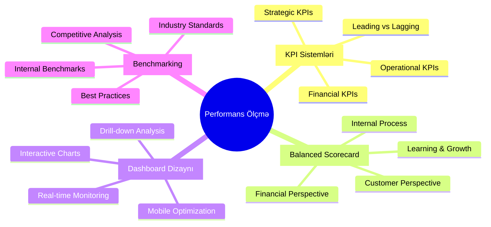
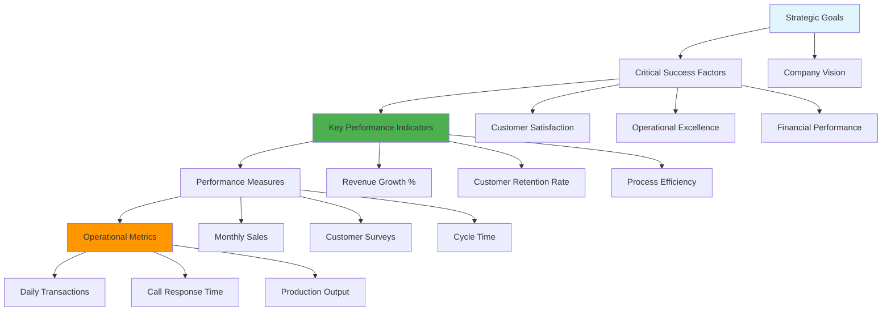

# 📊 Modul 3: Performans Ölçmə və KPI Sistemləri

## 🎯 Modulun Məqsədləri

## 📊 Həftə 8-10: KPI və Dashboard

### 🎯 KPI Pyramid

Bu modulda tələbələr performans idarəetməsi, KPI sistemləri və Balanced Scorecard metodologiyasını öyrənəcəklər.

---

**📊 Performans ölçmə bacarıqlarınızı inkişaf etdirin!**

 