# 💻 Modul 4: E-Sistemlər və Rəqəmsal Texnologiyalar

<div align="center">


</div>

## 🎯 Modulun Strateji Məqsədləri

Bu modul müasir idarəetmə uçotunda istifadə olunan rəqəmsal texnologiyalar, ERP sistemləri, Business Intelligence alətləri və cloud-based həllərin dərin öyrənilməsinə həsr olunub. Tələbələr praktik layihələr vasitəsilə real dünya tətbiqlərini mənimsəyəcəklər.

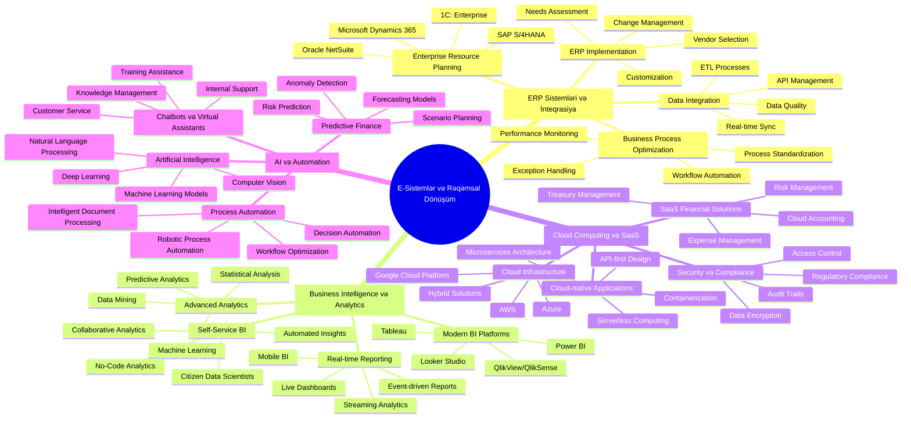

## 📊 Həftəlik Detallı Proqram

```mermaid
gantt
    title Modul 4 - E-Sistemlər və Texnologiyalar (4 Həftə)
    dateFormat  X
    axisFormat %w
    
    section Həftə 12: ERP Sistemləri
    ERP Architecture və Components    :12, 2
    SAP S/4HANA Hands-on            :13, 1
    Microsoft Dynamics 365 Workshop :13, 1
    ERP Implementation Planning      :13, 1
    
    section Həftə 13: Business Intelligence
    Modern BI Platforms Comparison   :14, 2
    Power BI Advanced Development    :15, 1
    Tableau Desktop Mastery         :15, 1
    BI Strategy və Governance       :15, 1
    
    section Həftə 14: Cloud Technologies
    Cloud Computing Fundamentals     :16, 2
    Azure/AWS Financial Services     :17, 1
    SaaS Implementation Strategy     :17, 1
    Security və Compliance          :17, 1
    
    section Həftə 15: AI və Future Tech
    AI in Finance Applications       :18, 2
    RPA Implementation              :19, 1
    Future Technologies Exploration  :19, 1
    Capstone Project Presentation    :19, 1
```

## 🏢 Həftə 12: ERP Sistemləri və Enterprise Integration

### 🔧 ERP Systemlərinin Arxitekturası

Modern ERP sistemləri müəssisənin bütün biznes proseslərini vahid platformada birləşdirən mürəkkəb texnoloji həllərdır.

```mermaid
graph TD
    A[ERP Core Platform] --> B[Financial Management]
    A --> C[Supply Chain Management]
    A --> D[Human Capital Management]
    A --> E[Customer Relationship Management]
    
    B --> B1[General Ledger]
    B --> B2[Accounts Payable/Receivable]
    B --> B3[Fixed Assets]
    B --> B4[Cash Management]
    B --> B5[Financial Reporting]
    
    C --> C1[Procurement]
    C --> C2[Inventory Management]
    C --> C3[Production Planning]
    C --> C4[Warehouse Management]
    C --> C5[Logistics]
    
    D --> D1[Payroll]
    D --> D2[Time & Attendance]
    D --> D3[Performance Management]
    D --> D4[Learning Management]
    D --> D5[Recruitment]
    
    E --> E1[Sales Management]
    E --> E2[Marketing Campaigns]
    E --> E3[Customer Service]
    E --> E4[Contact Management]
    E --> E5[Opportunity Tracking]
    
    style A fill:#2196f3
    style B fill:#4caf50
    style C fill:#ff9800
    style D fill:#9c27b0
    style E fill:#f44336
```

### 🌐 SAP S/4HANA Digital Core

SAP S/4HANA müasir dövrün ən güclü ERP platformalarından biridir və in-memory database texnologiyası əsasında qurulub.

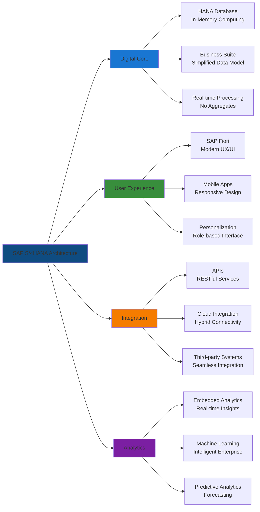

### 💼 Microsoft Dynamics 365 Finance & Operations

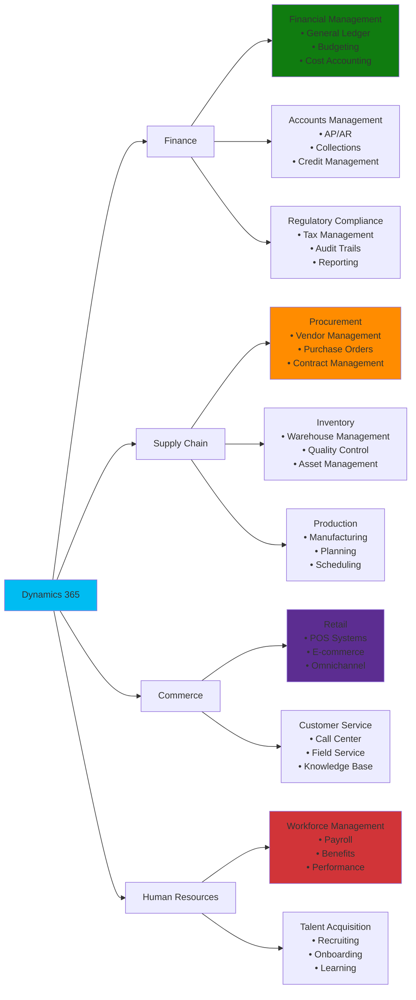

### 🛠️ Praktik Tapşırıq 12.1: ERP Vendor Selection Matrix

**Şərait: Orta ölçülü istehsal müəssisəsi üçün ERP seçimi**

```
🏭 Şirkət Profili: "AzərMetal" LLC
📍 Sənaye: Metal emalı və məmulatların istehsalı
👥 İşçi sayı: 150 nəfər
💰 İllik dövriyyə: 8.5 mln AZN
🌍 Bazarlar: Azərbaycan, Gürcüstan, Türkiyə

📊 ERP Tələbləri:
✅ Financial Management:
- Multi-currency support (AZN, USD, EUR, GEL)
- Cost center accounting
- Project-based costing
- Real-time financial reporting

✅ Manufacturing:
- Production planning & scheduling
- Quality control management
- Equipment maintenance tracking
- Inventory optimization

✅ Supply Chain:
- Vendor management & procurement
- Warehouse management system
- Logistics & shipping
- Demand forecasting

✅ Technical Requirements:
- Cloud-based deployment
- Mobile accessibility
- Integration with existing systems
- Multi-language support (AZ, EN, RU)

📋 Vendor Comparison Matrix:

| Criteria | Weight | SAP S/4HANA | Dynamics 365 | Oracle NetSuite | 1C:Enterprise |
|----------|--------|-------------|---------------|-----------------|---------------|
| **Functionality** | 30% | 9.5 | 8.5 | 8.0 | 7.5 |
| **Cost** | 25% | 6.0 | 7.5 | 8.0 | 9.0 |
| **Implementation** | 20% | 7.0 | 8.0 | 7.5 | 8.5 |
| **Support** | 15% | 9.0 | 8.5 | 7.5 | 8.0 |
| **Scalability** | 10% | 9.5 | 8.0 | 7.0 | 6.5 |

🎯 Scoring Methodology:
- 10: Excellent - Exceeds requirements
- 8: Good - Meets most requirements  
- 6: Average - Meets basic requirements
- 4: Poor - Below requirements
- 2: Unacceptable - Does not meet requirements
```

## 📊 Həftə 13: Business Intelligence və Advanced Analytics

### 🧠 Modern BI Architecture

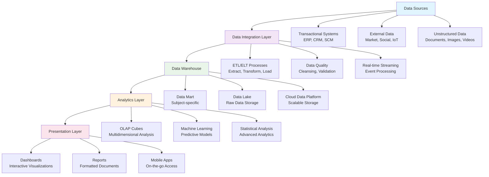

### 🔄 Self-Service BI Revolution

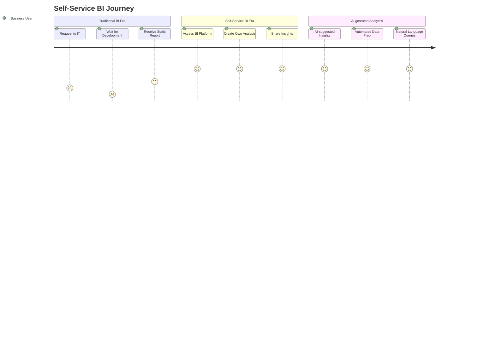

### 📊 Power BI Advanced Development

**DAX (Data Analysis Expressions) Advanced Patterns:**

```dax
// Advanced Time Intelligence
Sales YTD = 
CALCULATE(
    [Total Sales],
    DATESYTD('Date'[Date])
)

// Complex Measure with Multiple Conditions
Profitable Customers = 
CALCULATE(
    DISTINCTCOUNT(Sales[CustomerID]),
    FILTER(
        SUMMARIZE(
            Sales,
            Sales[CustomerID],
            "Customer Profit", [Total Profit]
        ),
        [Customer Profit] > 1000
    )
)

// Moving Average with Variable Period
Moving Average Sales = 
VAR PeriodLength = 3
VAR CurrentDate = MAX('Date'[Date])
VAR PeriodStart = CurrentDate - PeriodLength + 1
RETURN
CALCULATE(
    AVERAGE([Daily Sales]),
    DATESBETWEEN('Date'[Date], PeriodStart, CurrentDate)
)

// Pareto Analysis (80/20 Rule)
Cumulative Percentage = 
VAR CurrentProduct = MAX(Products[ProductName])
VAR CurrentSales = [Total Sales]
VAR TotalSales = CALCULATE([Total Sales], ALL(Products))
VAR ProductsWithSales = 
    ADDCOLUMNS(
        ALL(Products),
        "Product Sales", [Total Sales]
    )
VAR RankedProducts = 
    FILTER(
        ProductsWithSales,
        [Product Sales] >= CurrentSales
    )
VAR CumulativeSales = SUMX(RankedProducts, [Product Sales])
RETURN
DIVIDE(CumulativeSales, TotalSales)
```

### 🎨 Advanced Visualization Techniques

```mermaid
graph TD
    A[Visualization Best Practices] --> B[Choose Right Chart]
    A --> C[Color Psychology]
    A --> D[Interaction Design]
    A --> E[Storytelling]
    
    B --> B1[Comparison: Bar/Column Charts]
    B --> B2[Trends: Line Charts]
    B --> B3[Parts of Whole: Pie/Donut]
    B --> B4[Correlation: Scatter Plots]
    B --> B5[Geographic: Maps]
    
    C --> C1[Red: Urgency, Alerts]
    C --> C2[Green: Success, Positive]
    C --> C3[Blue: Trust, Stability]
    C --> C4[Orange: Warning, Attention]
    C --> C5[Gray: Neutral, Context]
    
    D --> D1[Drill-down Capabilities]
    D --> D2[Cross-filtering]
    D --> D3[Tooltip Enhancements]
    D --> D4[Conditional Formatting]
    
    E --> E1[Progressive Disclosure]
    E --> E2[Context and Annotations]
    E --> E3[Guided Analysis]
    E --> E4[Call-to-Action]
    
    style A fill:#2196f3
    style B fill:#4caf50
    style C fill:#ff9800
    style D fill:#9c27b0
    style E fill:#f44336
```

### 🛠️ Praktik Tapşırıq 13.1: Advanced Analytics Dashboard

**Layihə: Retail Analytics Command Center**

```
🛒 Biznes Konteksti: "SuperMart" mağazalar şəbəkəsi
📊 Analytics Requirements:

🎯 1. Customer Analytics:
   📈 Customer Segmentation (RFM Analysis):
   - Recency: Son alış-veriş tarixi
   - Frequency: Alış-veriş tezliyi  
   - Monetary: Xərclədiyi məbləğ
   
   👥 Customer Journey Analysis:
   - Acquisition channels effectiveness
   - Customer lifetime value prediction
   - Churn probability scoring
   - Cross-sell/up-sell opportunities

🎯 2. Product Performance Analytics:
   📦 ABC Analysis:
   - A: High value items (70% revenue)
   - B: Medium value items (20% revenue)
   - C: Low value items (10% revenue)
   
   🔄 Inventory Optimization:
   - Stock turnover rates
   - Dead stock identification
   - Seasonal demand patterns
   - Reorder point optimization

🎯 3. Financial Performance:
   💰 Profitability Analysis:
   - Gross margin by category
   - Operating profit trends
   - Cost center performance
   - Budget variance analysis
   
   💳 Payment Analytics:
   - Payment method preferences
   - Transaction value distribution
   - Credit vs cash patterns
   - Regional payment trends

🎯 4. Operational Excellence:
   ⏰ Efficiency Metrics:
   - Average transaction time
   - Queue wait times
   - Staff productivity indicators
   - Energy consumption patterns
   
   🏪 Store Performance:
   - Sales per square meter
   - Footfall vs conversion rates
   - Peak hours optimization
   - Staff scheduling efficiency

📱 Technical Implementation:
   ✅ Data Sources Integration:
   - POS system data (real-time)
   - ERP financial data (daily)
   - CRM customer data (real-time)
   - External market data (weekly)
   
   ✅ Advanced Analytics:
   - Machine learning models
   - Predictive forecasting
   - Anomaly detection
   - Statistical analysis
   
   ✅ Visualization Features:
   - Executive summary dashboard
   - Drill-down capabilities
   - Mobile responsive design
   - Automated report generation
```

## ☁️ Həftə 14: Cloud Computing və SaaS Solutions

### 🌐 Cloud Service Models

```mermaid
graph TD
    A[Cloud Computing Models] --> B[Infrastructure as a Service]
    A --> C[Platform as a Service]
    A --> D[Software as a Service]
    
    B --> B1[IaaS Examples]
    B --> B2[Use Cases]
    B --> B3[Benefits]
    
    B1 --> B11[Amazon EC2]
    B1 --> B12[Microsoft Azure VMs]
    B1 --> B13[Google Compute Engine]
    
    B2 --> B21[Custom Applications]
    B2 --> B22[Development Environments]
    B2 --> B23[Big Data Processing]
    
    B3 --> B31[Scalability]
    B3 --> B32[Cost Efficiency]
    B3 --> B33[Flexibility]
    
    C --> C1[PaaS Examples]
    C --> C2[Use Cases]
    C --> C3[Benefits]
    
    C1 --> C11[Azure App Service]
    C1 --> C12[Google App Engine]
    C1 --> C13[Heroku]
    
    C2 --> C21[Web Applications]
    C2 --> C22[API Development]
    C2 --> C23[Microservices]
    
    C3 --> C31[Faster Development]
    C3 --> C32[Automatic Scaling]
    C3 --> C33[Built-in Services]
    
    D --> D1[SaaS Examples]
    D --> D2[Use Cases]
    D --> D3[Benefits]
    
    D1 --> D11[Microsoft 365]
    D1 --> D12[Salesforce]
    D1 --> D13[QuickBooks Online]
    
    D2 --> D21[Business Applications]
    D2 --> D22[Collaboration Tools]
    D2 --> D23[Financial Management]
    
    D3 --> D31[No Infrastructure Management]
    D3 --> D32[Automatic Updates]
    D3 --> D33[Subscription Model]
    
    style A fill:#e1f5fe
    style B fill:#c8e6c9
    style C fill:#fff3e0
    style D fill:#f3e5f5
```

### 💰 Cloud Financial Management Platforms

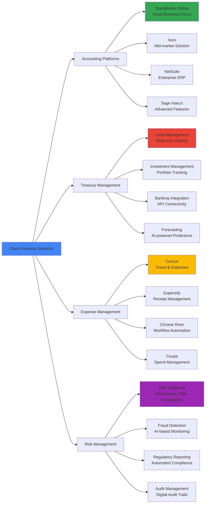

### 🔐 Cloud Security və Compliance Framework

```mermaid
graph TD
    A[Cloud Security Framework] --> B[Identity & Access Management]
    A --> C[Data Protection]
    A --> D[Network Security]
    A --> E[Compliance & Governance]
    
    B --> B1[Multi-Factor Authentication]
    B --> B2[Single Sign-On SSO]
    B --> B3[Role-Based Access Control]
    B --> B4[Privileged Access Management]
    
    C --> C1[Data Encryption at Rest]
    C --> C2[Data Encryption in Transit]
    C --> C3[Data Loss Prevention]
    C --> C4[Backup & Recovery]
    
    D --> D1[Virtual Private Networks]
    D --> D2[Firewalls & Security Groups]
    D --> D3[Intrusion Detection]
    D --> D4[DDoS Protection]
    
    E --> E1[GDPR Compliance]
    E --> E2[SOX Compliance]
    E --> E3[ISO 27001 Certification]
    E --> E4[Audit Trails & Logging]
    
    style A fill:#f44336
    style B fill:#4caf50
    style C fill:#2196f3
    style D fill:#ff9800
    style E fill:#9c27b0
```

### 🛠️ Praktik Tapşırıq 14.1: Cloud Migration Strategy

**Şərait: "AzFinance" consulting şirkətinin cloud migration planı**

```
🏢 Current State Assessment:
📊 IT Infrastructure:
- On-premises servers: 15 units
- Physical storage: 50TB
- Network bandwidth: 100Mbps
- Security systems: Traditional firewalls

💼 Business Applications:
- ERP: 1C:Enterprise (on-premises)
- CRM: Custom solution
- Email: Exchange Server
- File sharing: Windows File Server
- Backup: Tape-based system

👥 User Base:
- Employees: 85 people
- Remote workers: 25 people
- Office locations: 3 (Baku, Ganja, Lankaran)
- Client access requirements: 24/7

🎯 Migration Strategy Design:

📋 Phase 1: Infrastructure Assessment (2 weeks)
✅ Current system inventory
✅ Application dependencies mapping
✅ Data classification and sensitivity analysis
✅ Bandwidth and latency requirements
✅ Security and compliance requirements

📋 Phase 2: Cloud Architecture Design (3 weeks)
✅ Azure/AWS service selection
✅ Network architecture design
✅ Security framework implementation
✅ Disaster recovery planning
✅ Cost optimization strategies

📋 Phase 3: Pilot Migration (4 weeks)
✅ Non-critical applications migration
✅ User training and change management
✅ Performance monitoring and optimization
✅ Security testing and validation
✅ Backup and recovery testing

📋 Phase 4: Full Migration (8 weeks)
✅ Critical applications migration
✅ Data synchronization and validation
✅ User acceptance testing
✅ Go-live support and monitoring
✅ Post-migration optimization

💰 Cost-Benefit Analysis:
Current Annual Costs:
- Hardware maintenance: $25,000
- Software licenses: $40,000
- IT staff costs: $60,000
- Utilities and space: $15,000
- Total: $140,000

Projected Cloud Costs (Annual):
- Cloud services: $55,000
- Software licenses (cloud): $35,000
- Managed services: $25,000
- Training and support: $10,000
- Total: $125,000

💡 Expected Benefits:
- Cost savings: $15,000 annually
- Improved reliability: 99.9% uptime
- Enhanced security: Enterprise-grade protection
- Scalability: On-demand resource scaling
- Remote work enablement: Full mobility
- Faster innovation: Rapid deployment capabilities
```

## 🤖 Həftə 15: AI və Process Automation

### 🧠 AI in Financial Management

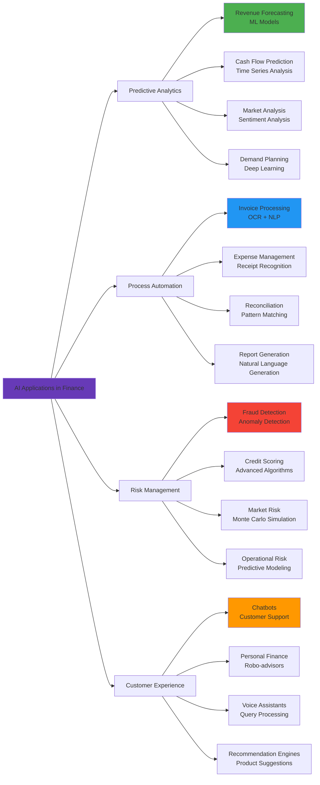

### 🔄 Robotic Process Automation (RPA) Implementation

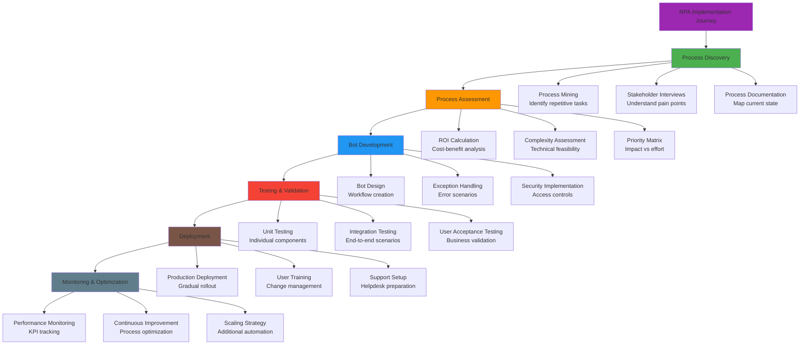

### 💡 Machine Learning for Financial Forecasting

**Python Implementation Example:**

```python
# Advanced Financial Forecasting with ML
import pandas as pd
import numpy as np
from sklearn.ensemble import RandomForestRegressor, GradientBoostingRegressor
from sklearn.metrics import mean_absolute_error, mean_squared_error
from sklearn.model_selection import TimeSeriesSplit
import warnings
warnings.filterwarnings('ignore')

class FinancialForecaster:
    def __init__(self, data):
        self.data = data
        self.models = {}
        self.predictions = {}
    
    def feature_engineering(self):
        """Create advanced features for financial forecasting"""
        df = self.data.copy()
        
        # Time-based features
        df['month'] = df.index.month
        df['quarter'] = df.index.quarter
        df['year'] = df.index.year
        df['day_of_year'] = df.index.dayofyear
        
        # Lag features
        for lag in [1, 3, 6, 12]:
            df[f'revenue_lag_{lag}'] = df['revenue'].shift(lag)
        
        # Rolling statistics
        for window in [3, 6, 12]:
            df[f'revenue_ma_{window}'] = df['revenue'].rolling(window).mean()
            df[f'revenue_std_{window}'] = df['revenue'].rolling(window).std()
        
        # Growth rates
        df['revenue_growth'] = df['revenue'].pct_change()
        df['revenue_growth_3m'] = df['revenue'].pct_change(periods=3)
        
        # Seasonal decomposition features
        from statsmodels.tsa.seasonal import seasonal_decompose
        decomp = seasonal_decompose(df['revenue'].dropna(), model='additive', period=12)
        df['trend'] = decomp.trend
        df['seasonal'] = decomp.seasonal
        df['residual'] = decomp.resid
        
        return df.dropna()
    
    def train_ensemble_model(self, features, target):
        """Train ensemble of ML models"""
        
        # Random Forest
        rf_model = RandomForestRegressor(
            n_estimators=100,
            max_depth=10,
            random_state=42
        )
        
        # Gradient Boosting
        gb_model = GradientBoostingRegressor(
            n_estimators=100,
            learning_rate=0.1,
            max_depth=6,
            random_state=42
        )
        
        # Time series cross-validation
        tscv = TimeSeriesSplit(n_splits=5)
        
        models = {'RandomForest': rf_model, 'GradientBoosting': gb_model}
        results = {}
        
        for name, model in models.items():
            cv_scores = []
            for train_idx, val_idx in tscv.split(features):
                X_train, X_val = features.iloc[train_idx], features.iloc[val_idx]
                y_train, y_val = target.iloc[train_idx], target.iloc[val_idx]
                
                model.fit(X_train, y_train)
                y_pred = model.predict(X_val)
                cv_scores.append(mean_absolute_error(y_val, y_pred))
            
            results[name] = np.mean(cv_scores)
            self.models[name] = model
        
        return results
    
    def generate_forecast(self, periods=12):
        """Generate multi-step ahead forecasts"""
        # Implementation for recursive forecasting
        pass
    
    def calculate_forecast_accuracy(self, actual, predicted):
        """Calculate comprehensive accuracy metrics"""
        mae = mean_absolute_error(actual, predicted)
        mse = mean_squared_error(actual, predicted)
        rmse = np.sqrt(mse)
        mape = np.mean(np.abs((actual - predicted) / actual)) * 100
        
        return {
            'MAE': mae,
            'MSE': mse, 
            'RMSE': rmse,
            'MAPE': mape
        }
```

### 🛠️ Final Capstone Project: Intelligent Finance Assistant

**Layihə Təsviri: "FinanceGPT" - AI-powered Financial Assistant**

```
🤖 Project Overview:
Müasir süni intellekt texnologiyalarından istifadə edərək, kiçik və orta biznes üçün ağıllı maliyyə köməkçisi yaratmaq.

🎯 Core Functionalities:

1. 💬 Natural Language Interface:
   ✅ Azerbaijani dilində sorğular
   ✅ Financial data queries
   ✅ Report generation requests
   ✅ Business insights explanations

2. 📊 Automated Reporting:
   ✅ Monthly financial summaries
   ✅ KPI performance alerts
   ✅ Variance analysis reports
   ✅ Cash flow forecasts

3. 🔍 Intelligent Analytics:
   ✅ Anomaly detection in transactions
   ✅ Trend identification and explanations
   ✅ Budget variance root cause analysis
   ✅ Revenue opportunity identification

4. 📈 Predictive Capabilities:
   ✅ 12-month revenue forecasting
   ✅ Cash flow predictions
   ✅ Customer churn probability
   ✅ Market trend analysis

🛠️ Technical Architecture:

📱 Frontend:
- React.js web application
- Voice recognition integration
- Mobile-responsive design
- Real-time chat interface

🧠 AI/ML Backend:
- OpenAI GPT integration
- Custom ML models (Python/scikit-learn)
- Natural Language Processing
- Time series forecasting models

☁️ Cloud Infrastructure:
- Azure App Service hosting
- Azure Cognitive Services
- SQL Database for data storage
- Power BI embedded analytics

🔗 Integrations:
- QuickBooks Online API
- Bank transaction APIs
- Email automation (SendGrid)
- SMS notifications (Twilio)

📋 Implementation Phases:

Phase 1: MVP Development (4 weeks)
✅ Basic chatbot functionality
✅ Financial data connection
✅ Simple query processing
✅ Report generation

Phase 2: AI Enhancement (3 weeks)
✅ Advanced NLP capabilities
✅ Predictive modeling
✅ Anomaly detection
✅ Voice recognition

Phase 3: Production Ready (2 weeks)
✅ Security implementation
✅ Performance optimization
✅ User testing and feedback
✅ Documentation and training

🎓 Learning Outcomes:
- AI/ML implementation in finance
- Cloud architecture design
- API integration and development
- User experience design
- Project management skills

💼 Business Value:
- 60% reduction in manual reporting time
- 40% improvement in forecast accuracy
- 24/7 financial insights availability
- Enhanced decision-making speed
- Reduced dependency on finance experts
```

## 📊 Final Assessment və Portfolio

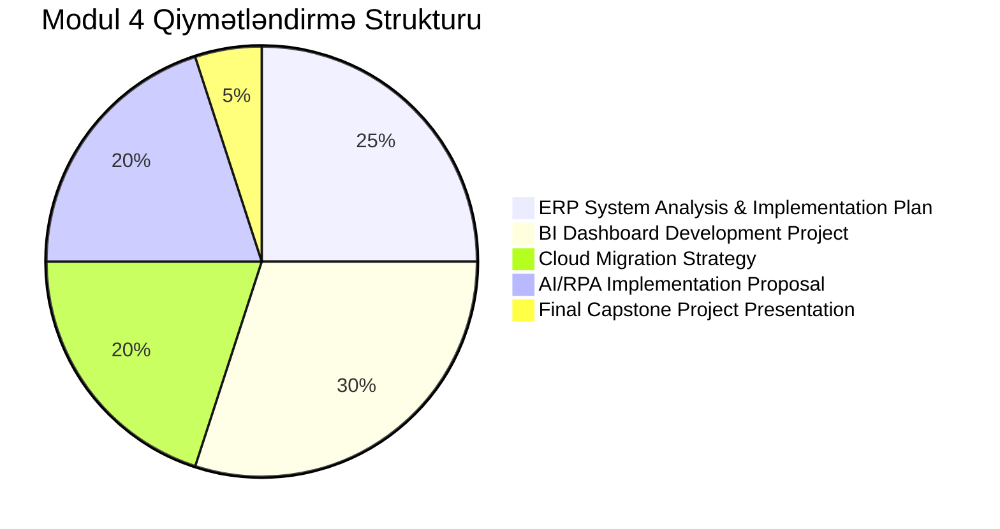

### 🏆 Certification Path

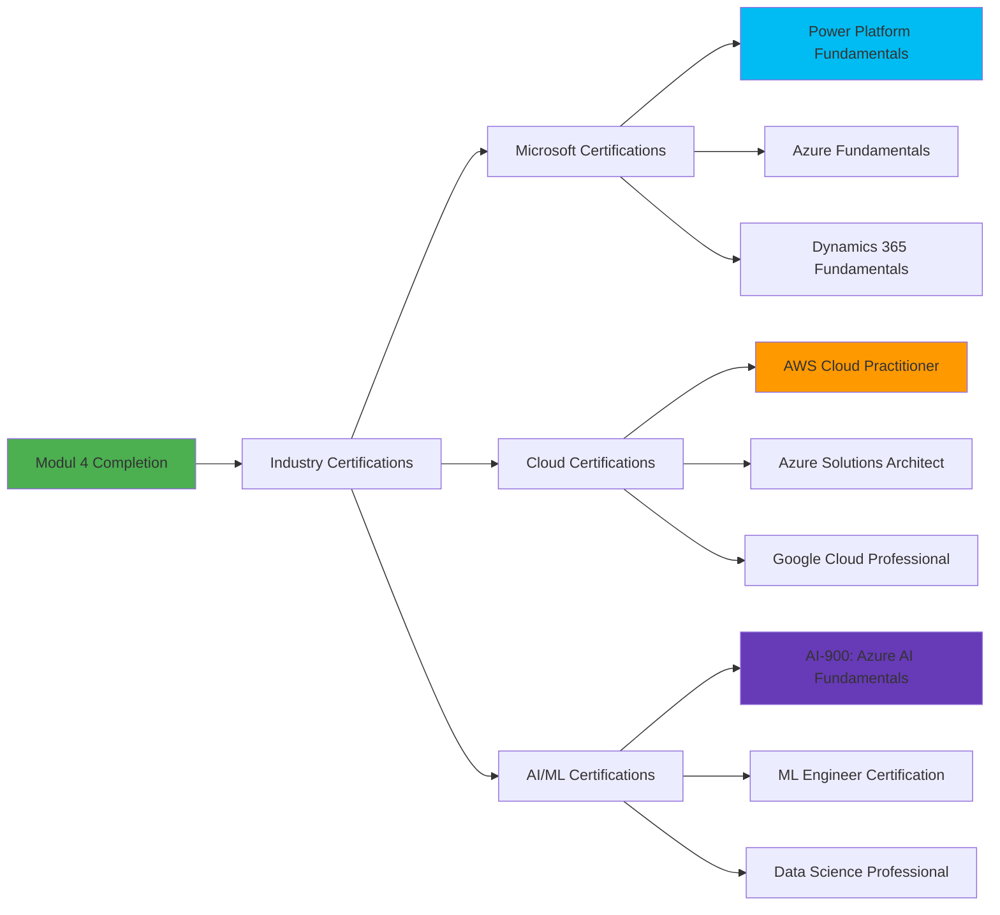

---

<div align="center">


**🚀 Rəqəmsal Transformasiya Lideri Oldunuz!**

*Modul 5: Strateji İdarəetmə - Biznes strategiyası və uzunmüddətli planlaşdırma! 🎯*

</div> 