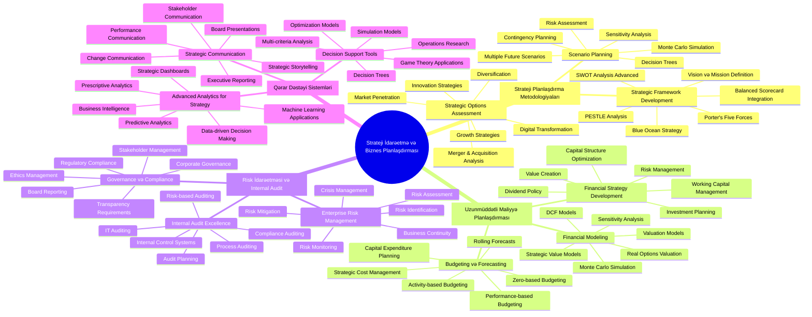
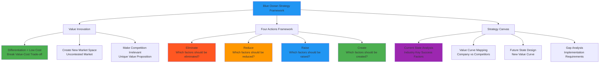
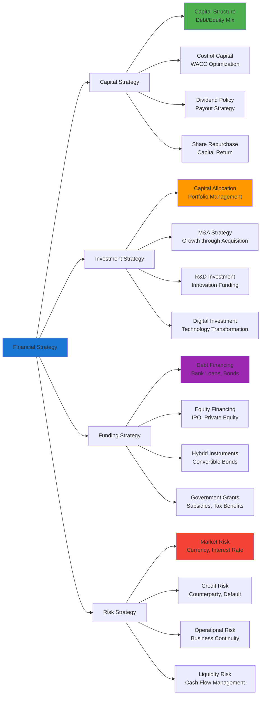
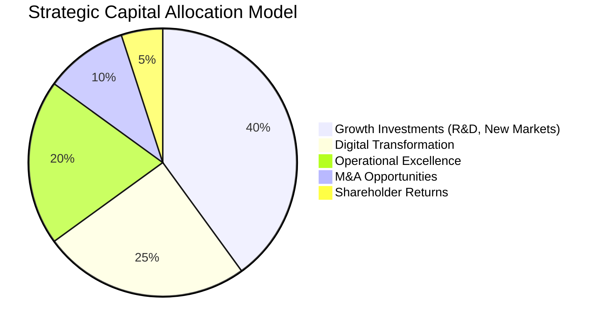
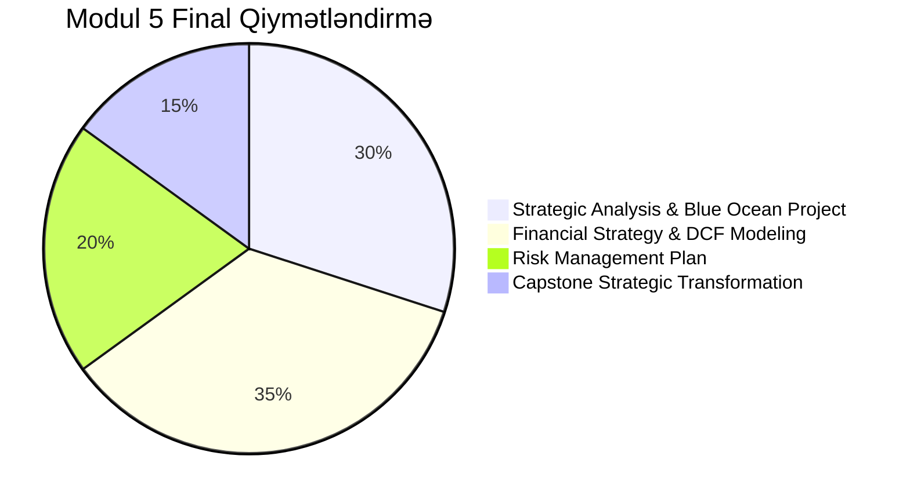
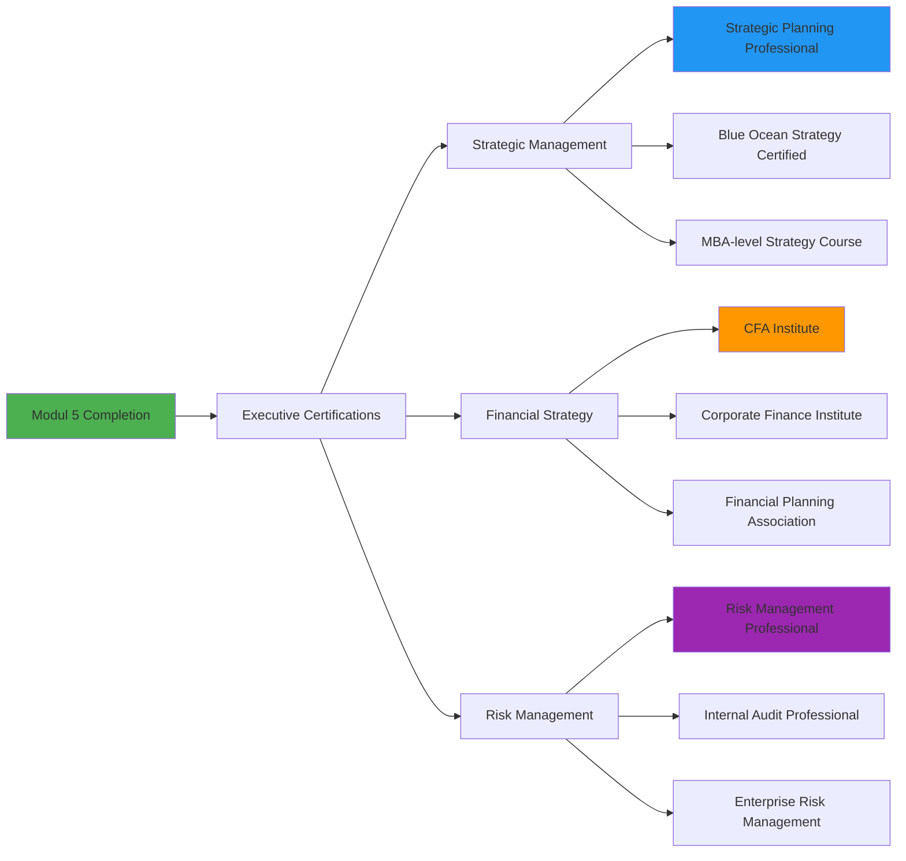

# 🎯 Modul 5: Strateji İdarəetmə və Biznes Planlaşdırması

<div align="center">


</div>

## 🎯 Modulun Strategik Viziyası

Bu modul ali səviyyəli idarəetmə strategiyalarının formalaşdırılması, uzunmüddətli planlaşdırma metodologiyaları və biznes strategiyası ilə idarəetmə uçotunun inteqrasiyasına həsr olunub. Tələbələr real şirkət nümunələri və case study-lər vasitəsilə strategik düşüncə bacarıqlarını inkişaf etdirəcəklər.



## 📊 Həftəlik Strategik Proqram

```mermaid
gantt
    title Modul 5 - Strateji İdarəetmə (3 Həftə) Executive Level
    dateFormat  X
    axisFormat %w
    
    section Həftə 16: Strateji Planlaşdırma
    Strategic Framework Development    :16, 2
    Scenario Planning Workshop        :17, 1
    Blue Ocean Strategy Case Study    :17, 1
    Strategic Options Assessment      :17, 1
    
    section Həftə 17: Maliyyə Strategiyası
    Long-term Financial Planning      :18, 2
    Advanced Financial Modeling       :19, 1
    Capital Structure Optimization    :19, 1
    Value Creation Strategies         :19, 1
    
    section Həftə 18: Risk və Audit
    Enterprise Risk Management        :20, 2
    Internal Audit Excellence         :21, 1
    Decision Support Systems          :21, 1
    Strategic Capstone Project        :21, 1
```



## 🎯 Həftə 16: Strateji Planlaşdırma və Strategik Framework

### 📋 Strategik Planlaşdırmanın Təməl Komponentləri

```mermaid
graph TD
    A[Strategik Planlaşdırma Prosesi] --> B[Ətraf Mühit Analizi]
    A --> C[Daxili Analiz]
    A --> D[Strategik Seçimlər]
    A --> E[İmplementasiya]
    A --> F[Nəzarət və Tənzimləmə]
    
    B --> B1[PESTLE Analysis<br/>Political, Economic, Social, Technological, Legal, Environmental]
    B --> B2[Industry Analysis<br/>Porter's Five Forces]
    B --> B3[Competitor Analysis<br/>Competitive Intelligence]
    B --> B4[Market Trends<br/>Future Scenarios]
    
    C --> C1[Resource Audit<br/>Tangible & Intangible Assets]
    C --> C2[Capability Analysis<br/>Core Competencies]
    C --> C3[Value Chain Analysis<br/>Primary & Support Activities]
    C --> C4[Financial Analysis<br/>Strengths & Weaknesses]
    
    D --> D1[Strategic Options<br/>Growth, Stability, Retrenchment]
    D --> D2[Generic Strategies<br/>Cost Leadership, Differentiation]
    D --> D3[Innovation Strategy<br/>Blue Ocean vs Red Ocean]
    D --> D4[Digital Strategy<br/>Technology Integration]
    
    E --> E1[Action Plans<br/>Detailed Implementation]
    E --> E2[Resource Allocation<br/>Budget & Human Resources]
    E --> E3[Timeline Management<br/>Milestones & Deadlines]
    E --> E4[Change Management<br/>Organizational Transformation]
    
    F --> F1[Performance Monitoring<br/>KPI Tracking]
    F --> F2[Strategic Review<br/>Regular Assessment]
    F --> F3[Adaptive Management<br/>Flexibility & Agility]
    F --> F4[Continuous Improvement<br/>Learning Organization]
    
    style A fill:#2196f3
    style B fill:#4caf50
    style C fill:#ff9800
    style D fill:#9c27b0
    style E fill:#f44336
    style F fill:#795548
```



### 🌊 Blue Ocean Strategy Implementation



### 🛠️ Praktik Tapşırıq 16.1: Azərbaycan Şirkəti üçün Blue Ocean Strategy

**Case Study: "AzərTech" - Local IT Company Transformation**

```
🏢 Company Profile:
📍 Company: AzərTech Solutions LLC
🎯 Current Business: Traditional IT Services (hardware, maintenance)
👥 Employees: 45 people
💰 Annual Revenue: 2.8 mln AZN
🌍 Market: Baku-based, mainly corporate clients

📊 Current Industry Analysis (Red Ocean):
⚔️ High Competition:
- 50+ similar companies in Baku
- Price-based competition
- Commoditized services
- Low profit margins (8-12%)

📈 Blue Ocean Opportunity Identification:

🔍 Eliminate:
- Traditional hardware sales model
- On-site maintenance contracts
- Reactive problem-solving approach
- Technology vendor dependency

📉 Reduce:
- Physical office space requirements
- Hardware inventory costs
- Manual technical support
- Paper-based documentation

📈 Raise:
- Cloud solution expertise
- Cybersecurity services
- Data analytics capabilities
- Customer success focus

✨ Create:
- AI-powered predictive maintenance
- Industry-specific solutions (oil & gas, banking)
- Digital transformation consulting
- Innovation lab services

🎯 Strategic Transformation Plan:

Phase 1: Foundation (Months 1-6)
✅ Team upskilling in cloud technologies
✅ Partnership with Microsoft Azure, AWS
✅ Development of AI-based monitoring tools
✅ Creation of industry expertise centers

Phase 2: Market Entry (Months 7-12)
✅ Launch of predictive maintenance SaaS
✅ Industry-specific solution pilots
✅ Digital transformation consulting services
✅ Innovation lab establishment

Phase 3: Scale & Expand (Months 13-24)
✅ Regional expansion (Ganja, Sumqayıt)
✅ International partnerships
✅ R&D investment increase
✅ IPO preparation

💰 Financial Projections:
Year 1: 4.2 mln AZN revenue (+50%)
Year 2: 7.1 mln AZN revenue (+254%)
Year 3: 12.5 mln AZN revenue (+446%)
Profit Margin Target: 25-30%

🎨 New Value Curve Elements:
- Predictive Analytics Score: 9/10 (vs industry 2/10)
- Industry Expertise: 8/10 (vs industry 3/10)
- Innovation Capability: 9/10 (vs industry 2/10)
- Customer Success: 8/10 (vs industry 4/10)
- Cost Effectiveness: 7/10 (vs industry 5/10)
```

### 📊 Advanced SWOT Analysis with Strategic Implications

```mermaid
quadrantChart
    title Strategic SWOT Analysis Matrix
    x-axis Negative Impact --> Positive Impact
    y-axis External Environment --> Internal Environment
    
    quadrant-1 Strengths (Leverage)
    quadrant-2 Opportunities (Capture)
    quadrant-3 Weaknesses (Eliminate)
    quadrant-4 Threats (Defend)
    
    Strong Brand: [0.8, 0.8]
    Skilled Workforce: [0.7, 0.7]
    Financial Resources: [0.6, 0.6]
    Technology Infrastructure: [0.5, 0.5]
    
    Digital Transformation: [0.9, 0.1]
    Emerging Markets: [0.8, 0.2]
    Regulatory Changes: [0.7, 0.1]
    Partnership Opportunities: [0.6, 0.2]
    
    Limited Innovation: [0.2, 0.7]
    High Costs: [0.3, 0.6]
    Skills Gap: [0.1, 0.5]
    Outdated Processes: [0.2, 0.4]
    
    Economic Uncertainty: [0.1, 0.1]
    Cyber Threats: [0.2, 0.2]
    Competition: [0.3, 0.1]
    Regulatory Compliance: [0.1, 0.3]
```

## 💰 Həftə 17: Uzunmüddətli Maliyyə Strategiyası

### 📈 Financial Strategy Framework



### 🔮 Advanced Financial Modeling və DCF Analysis

**Excel/Python-based DCF Model Components:**

```python
# Advanced DCF Model for Strategic Planning
import pandas as pd
import numpy as np

class StrategicDCFModel:
    def __init__(self, projection_years=10):
        self.years = projection_years
        self.assumptions = {}
        self.financial_statements = {}
        
    def set_assumptions(self, revenue_growth, margin_improvement, 
                       capex_percentage, tax_rate, terminal_growth, wacc):
        """Set key modeling assumptions"""
        self.assumptions = {
            'revenue_growth': revenue_growth,
            'margin_improvement': margin_improvement,
            'capex_percentage': capex_percentage,
            'tax_rate': tax_rate,
            'terminal_growth': terminal_growth,
            'wacc': wacc
        }
    
    def project_income_statement(self, base_revenue, base_margin):
        """Project future income statements"""
        years = range(1, self.years + 1)
        revenue = []
        ebitda = []
        
        for year in years:
            # Revenue projection with declining growth
            if isinstance(self.assumptions['revenue_growth'], list):
                growth = self.assumptions['revenue_growth'][year-1]
            else:
                growth = self.assumptions['revenue_growth'] * (0.95 ** year)
            
            year_revenue = base_revenue * ((1 + growth) ** year)
            revenue.append(year_revenue)
            
            # EBITDA with margin improvement
            margin = base_margin + (self.assumptions['margin_improvement'] * year)
            year_ebitda = year_revenue * margin
            ebitda.append(year_ebitda)
        
        return pd.DataFrame({
            'Year': years,
            'Revenue': revenue,
            'EBITDA': ebitda
        })
    
    def calculate_free_cash_flow(self, income_statement):
        """Calculate free cash flow"""
        fcf = []
        
        for _, row in income_statement.iterrows():
            # Simplified FCF calculation
            ebit = row['EBITDA'] * 0.8  # Assume D&A is 20% of EBITDA
            tax = ebit * self.assumptions['tax_rate']
            nopat = ebit - tax
            
            capex = row['Revenue'] * self.assumptions['capex_percentage']
            working_capital_change = row['Revenue'] * 0.02  # 2% of revenue
            
            cash_flow = nopat - capex - working_capital_change
            fcf.append(cash_flow)
        
        income_statement['FCF'] = fcf
        return income_statement
    
    def calculate_dcf_valuation(self, fcf_projections):
        """Calculate enterprise and equity value"""
        wacc = self.assumptions['wacc']
        terminal_growth = self.assumptions['terminal_growth']
        
        # Present value of explicit forecast period
        pv_fcf = []
        for year, fcf in enumerate(fcf_projections['FCF'], 1):
            pv = fcf / ((1 + wacc) ** year)
            pv_fcf.append(pv)
        
        # Terminal value calculation
        terminal_fcf = fcf_projections['FCF'].iloc[-1] * (1 + terminal_growth)
        terminal_value = terminal_fcf / (wacc - terminal_growth)
        pv_terminal = terminal_value / ((1 + wacc) ** self.years)
        
        enterprise_value = sum(pv_fcf) + pv_terminal
        
        return {
            'PV_FCF': sum(pv_fcf),
            'PV_Terminal': pv_terminal,
            'Enterprise_Value': enterprise_value,
            'Terminal_Value_Percentage': pv_terminal / enterprise_value * 100
        }
    
    def sensitivity_analysis(self, base_case, sensitivity_range=0.2):
        """Perform sensitivity analysis on key variables"""
        results = {}
        base_ev = base_case['Enterprise_Value']
        
        # WACC sensitivity
        wacc_range = np.linspace(
            self.assumptions['wacc'] * (1 - sensitivity_range),
            self.assumptions['wacc'] * (1 + sensitivity_range),
            5
        )
        
        wacc_sensitivity = []
        for wacc in wacc_range:
            temp_assumptions = self.assumptions.copy()
            temp_assumptions['wacc'] = wacc
            # Recalculate with new WACC
            # ... (implementation details)
            wacc_sensitivity.append({'WACC': wacc, 'EV_Change': 0})  # Placeholder
        
        results['WACC_Sensitivity'] = wacc_sensitivity
        
        return results

# Example usage for strategic planning
model = StrategicDCFModel(projection_years=10)
model.set_assumptions(
    revenue_growth=[0.15, 0.12, 0.10, 0.08, 0.06, 0.05, 0.04, 0.03, 0.03, 0.02],
    margin_improvement=0.01,  # 1% improvement per year
    capex_percentage=0.05,    # 5% of revenue
    tax_rate=0.20,            # 20% tax rate
    terminal_growth=0.025,    # 2.5% perpetual growth
    wacc=0.12                 # 12% cost of capital
)
```

### 🎯 Capital Allocation Strategy



### 🛠️ Praktik Tapşırıq 17.1: "Azərsun Holding" Diversification Strategy

**Strategic Financial Planning Case Study:**

```
🏢 Company Overview: Azərsun Holding
📊 Current Portfolio:
- Food & Beverage (60% revenue)
- Agriculture (25% revenue)  
- Real Estate (15% revenue)
💰 Annual Revenue: ~150 mln AZN
🎯 Strategic Challenge: Diversification into new sectors

📈 Diversification Options Analysis:

Option 1: Technology Sector Entry
💰 Investment Required: 25 mln AZN
⏱️ Payback Period: 5-7 years
📊 Expected IRR: 18-22%
🎯 Market Size: 500 mln AZN by 2030
⚠️ Risks: High technology risk, talent shortage

Option 2: Healthcare Sector Expansion
💰 Investment Required: 40 mln AZN
⏱️ Payback Period: 7-10 years
📊 Expected IRR: 15-18%
🎯 Market Size: 1.2 blrd AZN by 2030
⚠️ Risks: Regulatory complexity, long approval cycles

Option 3: Renewable Energy
💰 Investment Required: 60 mln AZN
⏱️ Payback Period: 8-12 years
📊 Expected IRR: 12-16%
🎯 Market Size: 2 blrd AZN by 2030
⚠️ Risks: Policy changes, technology evolution

🔍 Multi-Criteria Analysis:

| Criteria | Weight | Technology | Healthcare | Renewable Energy |
|----------|--------|------------|------------|------------------|
| **Financial Return** | 30% | 8.5 | 7.0 | 6.5 |
| **Strategic Fit** | 25% | 7.0 | 8.5 | 7.5 |
| **Market Potential** | 20% | 9.0 | 8.0 | 9.5 |
| **Risk Level** | 15% | 6.0 | 7.5 | 8.0 |
| **Implementation Ease** | 10% | 7.5 | 6.0 | 7.0 |

📊 Recommended Portfolio Strategy:
1. Technology (40% of new investment): AI/IoT for agriculture
2. Healthcare (35% of new investment): Digital health platforms  
3. Renewable Energy (25% of new investment): Solar energy projects

💡 Synergy Opportunities:
- Smart agriculture technology
- Food safety and health integration
- Sustainable energy for operations
- Data analytics across all sectors
```

## 🛡️ Həftə 18: Risk İdarəetməsi və Internal Audit

### 🔍 Enterprise Risk Management Framework

```mermaid
graph TD
    A[ERM Framework] --> B[Risk Governance]
    A --> C[Risk Strategy]
    A --> D[Risk Execution]
    A --> E[Risk Communication]
    
    B --> B1[Board Oversight<br/>Risk Committee]
    B --> B2[Risk Management Organization<br/>CRO, Risk Officers]
    B --> B3[Risk Policies<br/>Standards & Procedures]
    B --> B4[Risk Culture<br/>Values & Behaviors]
    
    C --> C1[Risk Appetite<br/>Risk Tolerance Levels]
    C --> C2[Risk Strategy<br/>Alignment with Business]
    C --> C3[Risk Objectives<br/>Measurable Targets]
    C --> C4[Risk Integration<br/>Strategic Planning]
    
    D --> D1[Risk Identification<br/>Top-down & Bottom-up]
    D --> D2[Risk Assessment<br/>Probability & Impact]
    D --> D3[Risk Response<br/>Mitigate, Accept, Transfer]
    D --> D4[Risk Monitoring<br/>KRIs & Dashboards]
    
    E --> E1[Risk Reporting<br/>Management & Board]
    E --> E2[Risk Communication<br/>Stakeholder Engagement]
    E --> E3[Risk Training<br/>Capability Building]
    E --> E4[Risk Disclosure<br/>External Reporting]
    
    style A fill:#2196f3
    style B fill:#4caf50
    style C fill:#ff9800
    style D fill:#9c27b0
    style E fill:#f44336
```



### 📊 Risk Heat Map və Prioritization

```mermaid
quadrantChart
    title Enterprise Risk Heat Map
    x-axis Low Impact --> High Impact
    y-axis Low Probability --> High Probability
    
    quadrant-1 High Priority (Immediate Action)
    quadrant-2 Medium Priority (Monitor & Plan)
    quadrant-3 Low Priority (Accept Risk)
    quadrant-4 Medium Priority (Contingency Plan)
    
    Cyber Security Breach: [0.9, 0.7]
    Economic Recession: [0.8, 0.4]
    Key Talent Loss: [0.6, 0.6]
    Regulatory Changes: [0.7, 0.5]
    Supply Chain Disruption: [0.8, 0.6]
    Technology Obsolescence: [0.7, 0.4]
    Currency Devaluation: [0.6, 0.3]
    Natural Disasters: [0.9, 0.2]
    Competitor Entry: [0.5, 0.7]
    Quality Issues: [0.6, 0.4]
```

### 🔒 Internal Audit Excellence Program

```mermaid
flowchart TD
    A[Internal Audit Excellence] --> B[Risk-based Auditing]
    A --> C[Technology-enabled Auditing]
    A --> D[Continuous Auditing]
    A --> E[Advisory Services]
    
    B --> B1[Risk Assessment<br/>Annual Audit Planning]
    B --> B2[Control Testing<br/>Effectiveness Evaluation]
    B --> B3[Root Cause Analysis<br/>Deep Dive Investigations]
    B --> B4[Management Reporting<br/>Actionable Insights]
    
    C --> C1[Data Analytics<br/>Pattern Recognition]
    C --> C2[Audit Management Systems<br/>Workflow Automation]
    C --> C3[Remote Auditing<br/>Virtual Inspections]
    C --> C4[AI-powered Testing<br/>Anomaly Detection]
    
    D --> D1[Real-time Monitoring<br/>KRI Dashboards]
    D --> D2[Automated Controls Testing<br/>Exception Reporting]
    D --> D3[Continuous Risk Assessment<br/>Dynamic Risk Profiling]
    D --> D4[Predictive Analytics<br/>Early Warning Systems]
    
    E --> E1[Process Improvement<br/>Operational Excellence]
    E --> E2[Strategic Consulting<br/>Business Advisory]
    E --> E3[Training & Development<br/>Capability Building]
    E --> E4[Compliance Support<br/>Regulatory Assistance]
    
    style A fill:#673ab7
    style B1 fill:#4caf50
    style C1 fill:#2196f3
    style D1 fill:#ff9800
    style E1 fill:#f44336
```



### 🛠️ Final Capstone Project: Strategic Transformation Plan

**Layihə: "Azerbaijan Airlines" Digital Transformation Strategy**

```
🛩️ Company Background:
📍 Company: Azerbaijan Airlines (AZAL)
🌍 Operations: 40+ destinations, 30 aircraft fleet
👥 Employees: 3,500+ people
💰 Annual Revenue: ~800 mln USD (2023)
📊 Market Position: National flag carrier

🎯 Strategic Challenge:
Post-pandemic recovery + digital transformation + sustainability goals

📋 Strategic Transformation Framework:

1️⃣ Financial Strategy (2024-2027):
💰 Revenue Diversification:
- Cargo operations expansion (+25%)
- MRO (Maintenance, Repair, Overhaul) services
- Ground handling services
- Loyalty program monetization

📊 Cost Optimization:
- Fuel efficiency improvement (15% reduction)
- Digital operations (20% cost saving)
- Predictive maintenance (30% maintenance cost reduction)
- Automated customer service

💡 Investment Plan:
- Fleet modernization: $200M
- Digital infrastructure: $50M
- Training & development: $15M
- Sustainability initiatives: $30M

2️⃣ Digital Transformation Strategy:

🤖 AI-Powered Operations:
- Predictive maintenance systems
- Dynamic pricing algorithms  
- Customer service chatbots
- Route optimization

📱 Customer Experience:
- Mobile-first booking platform
- Personalized travel recommendations
- Real-time travel assistance
- Seamless loyalty integration

☁️ Cloud Infrastructure:
- Migration to Azure/AWS
- Real-time data analytics
- Cybersecurity enhancement
- Scalable operations

3️⃣ Sustainability & ESG Goals:

🌱 Environmental Impact:
- Carbon neutral by 2030
- Sustainable aviation fuel (SAF) adoption
- Waste reduction programs
- Green ground operations

👥 Social Responsibility:
- Employee well-being programs
- Local community development
- Tourism promotion
- Cultural preservation

🏛️ Governance Excellence:
- Board diversity improvement
- Transparency enhancement
- Risk management strengthening
- Stakeholder engagement

4️⃣ Risk Management Strategy:

⚠️ Strategic Risks:
- Market volatility: Hedging strategies
- Regulatory changes: Compliance monitoring
- Competition: Differentiation focus
- Geopolitical tensions: Route diversification

🛡️ Operational Risks:
- Safety management: SMS enhancement
- Cybersecurity: Multi-layer protection
- Supply chain: Vendor diversification
- Human capital: Talent retention

📊 Implementation Roadmap:

Phase 1: Foundation (2024):
✅ Digital infrastructure setup
✅ Change management program
✅ Strategic partnerships
✅ Pilot project launches

Phase 2: Acceleration (2025-2026):
✅ Full-scale digital rollout
✅ Sustainability program expansion
✅ Market expansion initiatives
✅ Innovation lab establishment

Phase 3: Leadership (2027):
✅ Industry leadership position
✅ Regional expansion
✅ Strategic acquisitions
✅ IPO consideration

💰 Financial Projections:
2024: $850M revenue (+6.3%)
2025: $980M revenue (+15.3%)
2026: $1.15B revenue (+17.3%)
2027: $1.35B revenue (+17.4%)

🎯 Success Metrics:
- Customer satisfaction: >4.5/5
- On-time performance: >85%
- Digital revenue share: >60%
- Carbon intensity reduction: 25%
- Employee engagement: >80%
```

## ✅ Final Assessment və Portfolio Development



### 🏆 Strategic Leadership Certification Path



---

<div align="center">


**🎯 Strateji Lider Oldunuz!**

*Final Modul 6: Praktik Tətbiq və Portfolio - Real dünya layihələri! 🚀*

</div> 