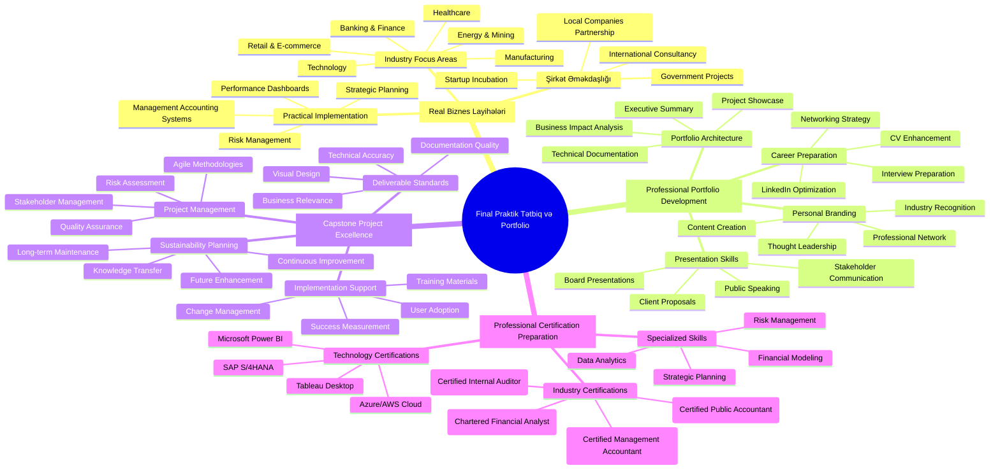
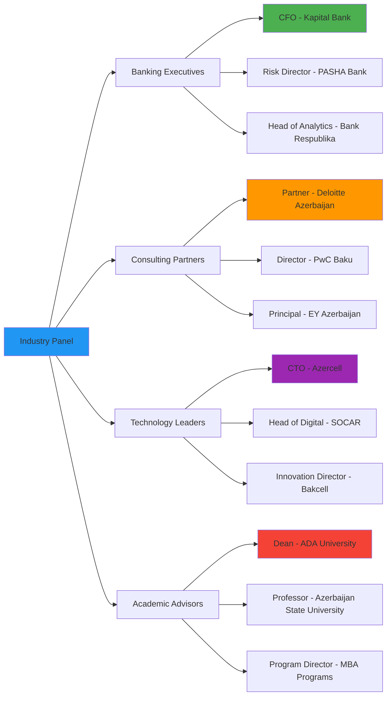
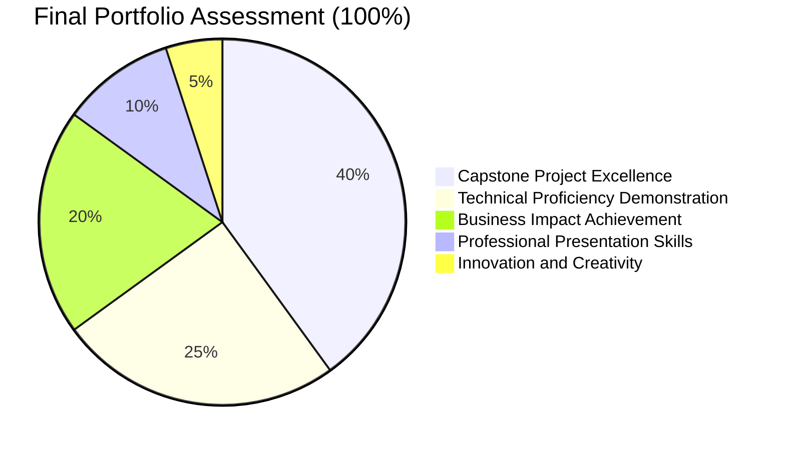

# 🏆 Modul 6: Praktik Tətbiq və Professional Portfolio

<div align="center">


</div>

## 🎯 Final Modulun Missiyası

Bu modul bütün kursda əldə edilən bilik və bacarıqların real biznes mühitində praktik tətbiqinə həsr olunub. Tələbələr mövcud Azərbaycan şirkətləri ilə əməkdaşlıq edərək real layihələr həyata keçirəcək və professional portfolio yaradacaqlar.



## 📊 İki Həftəlik İntensiv Proqram

```mermaid
gantt
    title Modul 6 - Final Praktik Tətbiq (2 Həftə) Intensiv
    dateFormat  X
    axisFormat %d
    
    section Həftə 19: Real Layihə İcra
    Project Assignment və Planning   :1, 2
    Stakeholder Meetings            :2, 1
    System Analysis və Design       :3, 2
    Initial Development             :4, 2
    Progress Review                 :5, 1
    
    section Həftə 20: Portfolio və Təqdimat
    Project Finalization           :6, 2
    Portfolio Development          :7, 2
    Presentation Preparation       :8, 1
    Final Presentations            :9, 1
    Industry Panel Review          :10, 1
    Graduation Ceremony            :10, 1
```



## 🏢 Həftə 19: Real Biznes Layihələri

### 🤝 Tərəfdaş Şirkətlər və Layihə Seçimləri

**Partnyor Şirkətlər portfeli:**

```mermaid
graph TD
    A[Tərəfdaş Şirkətlər] --> B[Banking Sector]
    A --> C[Manufacturing]
    A --> D[Retail & E-commerce]
    A --> E[Energy & Mining]
    A --> F[Technology]
    A --> G[Healthcare]
    
    B --> B1[Kapital Bank<br/>Performance Dashboard]
    B --> B2[Bank Respublika<br/>Risk Management System]
    B --> B3[Pasha Bank<br/>Digital Transformation]
    
    C --> C1[Azərsun Holding<br/>Cost Management System]
    C --> C2[Gilan Holding<br/>Supply Chain Analytics]
    C --> C3[Şəki Tekstil<br/>Production Planning]
    
    D --> D1[Bravo Supermarket<br/>Customer Analytics]
    D --> D2[28 Mall<br/>Revenue Optimization]
    D --> D3[Port Baku Mall<br/>Tenant Performance]
    
    E --> E1[SOCAR<br/>Project Accounting]
    E --> E2[Azerenerji<br/>Asset Management]
    E --> E3[TANAP<br/>Environmental Reporting]
    
    F --> F1[Azercell<br/>Customer Profitability]
    F --> F2[Bakcell<br/>Network ROI Analysis]
    F --> F3[Nar Mobile<br/>Digital Strategy]
    
    G --> G1[Yeni Klinika<br/>Healthcare Analytics]
    G --> G2[Nobel Oil Services<br/>Occupational Health]
    G --> G3[Central Hospital<br/>Cost per Patient]
    
    style A fill:#2196f3
    style B1 fill:#4caf50
    style C1 fill:#ff9800
    style D1 fill:#9c27b0
    style E1 fill:#f44336
    style F1 fill:#795548
    style G1 fill:#607d8b
```



### 🎯 Layihə 1: Kapital Bank - Executive Performance Dashboard

**Layihə Təfərrüatı:**

```
🏦 Client: Kapital Bank
👥 Team Size: 4-5 tələbə
⏱️ Duration: 8 days
💰 Budget: Simulated project (educational)

📊 Project Scope:
🎯 Objective: Create comprehensive executive dashboard for C-level management

📈 Key Requirements:
✅ Real-time Financial KPIs:
- Net Interest Margin (NIM)
- Return on Assets (ROA)  
- Return on Equity (ROE)
- Cost-to-Income Ratio
- Loan Loss Provision Ratio

✅ Customer Analytics:
- Customer Acquisition Cost (CAC)
- Customer Lifetime Value (CLV)
- Digital Banking Adoption Rate
- Customer Satisfaction Index
- Churn Prediction Models

✅ Operational Metrics:
- Branch Performance Comparison
- ATM Utilization Rates
- Digital Transaction Volume
- Employee Productivity Metrics
- Compliance Risk Indicators

✅ Strategic Indicators:
- Market Share Evolution
- Competitive Position Analysis
- Digital Transformation Progress
- Sustainability Metrics (ESG)

🛠️ Technical Implementation:
📊 Data Sources:
- Core Banking System (T24)
- Customer Relationship Management
- Risk Management System
- Financial Reporting System
- External Market Data

💻 Technology Stack:
- Power BI Premium
- SQL Server Database
- Azure Cloud Services
- R/Python for Analytics
- RESTful API Integration

📱 Deliverables:
1. Executive Summary Dashboard (CEO/CFO level)
2. Departmental Dashboards (6 departments)
3. Mobile Dashboard Application
4. Real-time Alert System
5. Monthly Automated Reports
6. Training Materials
7. Implementation Roadmap

🎯 Success Metrics:
- Dashboard Response Time: <3 seconds
- Data Accuracy: >99.5%
- User Adoption Rate: >90% in 3 months
- Decision-making Speed: +40% improvement
- Report Generation Time: 80% reduction

📅 Project Timeline:
Day 1-2: Requirements Gathering & System Analysis
Day 3-4: Database Design & Data Integration
Day 5-6: Dashboard Development & Testing
Day 7: User Training & Documentation
Day 8: Go-live Support & Final Presentation

💼 Business Impact:
- Enhanced strategic decision-making capability
- Improved operational efficiency
- Better risk management
- Increased competitive advantage
- Digital transformation acceleration
```

### 🏭 Layihə 2: Gilan Holding - Supply Chain Cost Analytics

**Advanced Supply Chain Management System:**

```
🏭 Client: Gilan Holding
👥 Team Size: 4-5 tələbə
⏱️ Duration: 8 days
🌍 Scope: Multi-location manufacturing operations

📊 Project Challenge:
Gilan Holding has 12 manufacturing facilities across Azerbaijan producing various food products. They need an integrated supply chain cost analytics system to optimize operations and improve profitability.

🎯 Core Objectives:
✅ Cost Center Analysis:
- Raw Material Cost Tracking
- Production Cost Allocation
- Transportation Cost Optimization
- Warehouse Cost Management
- Quality Control Cost Analysis

✅ Supply Chain Optimization:
- Vendor Performance Scorecards
- Inventory Turnover Analysis
- Demand Forecasting Models
- Lead Time Optimization
- Waste Reduction Metrics

✅ Financial Performance:
- Gross Margin by Product Line
- Cost per Unit Production
- Working Capital Efficiency
- Return on Manufacturing Assets
- Break-even Analysis

🔄 Process Flow Analysis:

Raw Materials → Production → Quality Control → Packaging → Distribution → Retail

📊 KPI Framework:
Manufacturing KPIs:
- Overall Equipment Effectiveness (OEE): Target >85%
- First Pass Yield: Target >95%
- Setup Time Reduction: Target 20% improvement
- Production Cost per Unit: Trend analysis

Supply Chain KPIs:
- Perfect Order Rate: Target >98%
- Inventory Days of Supply: Target 30-45 days
- Supplier Quality Rating: Target >95%
- On-time Delivery Performance: Target >99%

Financial KPIs:
- Gross Profit Margin: Target >25%
- Cash-to-Cash Cycle: Target <45 days
- Asset Utilization Rate: Target >80%
- Total Supply Chain Cost: % of revenue

🛠️ Technical Solution:
📈 Advanced Analytics:
- Machine Learning for Demand Forecasting
- Statistical Process Control
- Monte Carlo Simulation for Risk Analysis
- Regression Analysis for Cost Drivers

💻 System Architecture:
- SAP S/4HANA Integration
- Power BI Analytics Platform
- Azure Machine Learning Studio
- Real-time IoT Data Processing
- Mobile Access for Plant Managers

📱 Dashboard Hierarchy:
1. Executive Dashboard (C-level)
2. Operations Dashboard (Plant Managers)
3. Financial Dashboard (CFO/Controllers)
4. Procurement Dashboard (Purchasing)
5. Quality Dashboard (QA/QC)
6. Logistics Dashboard (Supply Chain)

💰 Expected ROI:
Year 1: 15% reduction in supply chain costs
Year 2: 20% improvement in inventory turnover
Year 3: 25% increase in overall profitability

🎓 Learning Outcomes for Students:
- Advanced cost accounting in manufacturing
- Supply chain analytics and optimization
- ERP system integration
- Data science applications in business
- Change management in large organizations
```

### 🛒 Layihə 3: Bravo Supermarket - Customer Lifetime Value Optimization

**Retail Analytics və Customer Intelligence:**

```
🛒 Client: Bravo Supermarket Chain
👥 Team Size: 4-5 tələbə
⏱️ Duration: 8 days
🏪 Scope: 35 stores across Baku

📊 Business Challenge:
Bravo needs to understand customer behavior patterns, optimize pricing strategies, and increase customer lifetime value in highly competitive retail market.

🎯 Project Objectives:

1️⃣ Customer Segmentation & Analytics:
📈 RFM Analysis (Recency, Frequency, Monetary):
- Champions: High value, frequent, recent customers
- Loyal Customers: Regular shoppers with consistent spending
- Potential Loyalists: Recent customers with good frequency
- New Customers: Recent shoppers to be nurtured
- At-Risk: Previously valuable customers who haven't visited recently

👥 Demographic Segmentation:
- Age groups: 18-25, 26-35, 36-50, 50+
- Income levels: Low, Middle, High
- Family status: Single, Couple, Family with children
- Geographic: By store location/neighborhood

2️⃣ Advanced Analytics Models:

🔮 Predictive Models:
- Customer Churn Prediction (Machine Learning)
- Next Best Action Recommendations
- Demand Forecasting by Category
- Price Elasticity Analysis
- Cross-sell/Up-sell Opportunities

📊 Market Basket Analysis:
- Association Rules Mining
- Product Affinity Analysis
- Seasonal Pattern Recognition
- Promotion Effectiveness Measurement

3️⃣ Financial Impact Analysis:

💰 Customer Lifetime Value Calculation:
CLV = (Average Order Value × Purchase Frequency × Gross Margin) ÷ Churn Rate

📈 Key Financial Metrics:
- Average Transaction Value: Current 45 AZN, Target 55 AZN
- Customer Acquisition Cost: Current 15 AZN, Target 12 AZN
- Customer Retention Rate: Current 65%, Target 75%
- Gross Margin per Customer: Current 25%, Target 30%

🛠️ Technical Implementation:

📱 Technology Stack:
- POS System Data Integration
- Customer Loyalty App Data
- External Demographic Data
- Social Media Sentiment Analysis
- Weather Data for Demand Forecasting

💻 Analytics Platform:
- Python/R for Advanced Analytics
- Tableau for Visualization
- Azure Machine Learning
- SQL Server for Data Warehousing
- Power Apps for Mobile Solutions

📊 Dashboard Suite:
1. Executive Dashboard: Store performance, profitability trends
2. Marketing Dashboard: Campaign effectiveness, customer insights
3. Operations Dashboard: Inventory turnover, staff productivity
4. Category Management: Product performance, pricing optimization
5. Store Manager Dashboard: Daily operations, local insights

🎯 Expected Business Outcomes:

📈 Revenue Impact:
- 15% increase in average transaction value
- 20% improvement in customer retention
- 25% increase in cross-selling success rate
- 10% growth in overall revenue

💰 Cost Optimization:
- 20% reduction in inventory waste
- 15% improvement in staff productivity
- 30% increase in marketing campaign ROI
- 25% reduction in customer acquisition cost

🏆 Competitive Advantages:
- Personalized customer experience
- Dynamic pricing strategies
- Optimized product placement
- Predictive inventory management
- Targeted marketing campaigns

📚 Student Learning Outcomes:
- Retail analytics and customer behavior analysis
- Machine learning in business applications
- Financial modeling for customer valuation
- Data visualization and storytelling
- Retail operations optimization
```

## 🎓 Həftə 20: Portfolio Development və Final Presentations

### 📂 Professional Portfolio Architecture

**Comprehensive Portfolio Structure:**

```mermaid
graph TD
    A[Professional Portfolio] --> B[Executive Summary]
    A --> C[Project Showcase]
    A --> D[Technical Skills]
    A --> E[Achievements]
    A --> F[Career Roadmap]
    
    B --> B1[Personal Brand Statement]
    B --> B2[Core Competencies]
    B --> B3[Value Proposition]
    B --> B4[Professional Vision]
    
    C --> C1[Capstone Project]
    C --> C2[Module Projects]
    C --> C3[Case Studies]
    C --> C4[Innovation Projects]
    
    D --> D1[Technical Proficiencies]
    D --> D2[Software Expertise]
    D --> D3[Analytical Skills]
    D --> D4[Digital Competencies]
    
    E --> E1[Academic Excellence]
    E --> E2[Certifications]
    E --> E3[Recognition]
    E --> E4[Leadership Experience]
    
    F --> F1[Short-term Goals]
    F --> F2[Career Aspirations]
    F --> F3[Continuous Learning]
    F --> F4[Industry Contribution]
    
    style A fill:#2196f3
    style C1 fill:#4caf50
    style D1 fill:#ff9800
    style E1 fill:#9c27b0
    style F1 fill:#f44336
```



### 🌟 Portfolio Content Standards

**1. Executive Summary Section:**

```
🎯 Personal Brand Statement Example:

"Innovative Management Accounting Professional with expertise in digital transformation, data analytics, and strategic business intelligence. Proven ability to design and implement comprehensive financial management systems that drive organizational performance and strategic decision-making. Passionate about leveraging cutting-edge technology to solve complex business challenges and create sustainable competitive advantages."

💼 Core Competencies Matrix:

| Technical Skills | Proficiency | Business Skills | Proficiency |
|-----------------|-------------|-----------------|-------------|
| Financial Modeling | Expert | Strategic Planning | Advanced |
| Data Analytics | Advanced | Project Management | Expert |
| ERP Systems | Advanced | Stakeholder Management | Advanced |
| Business Intelligence | Expert | Change Management | Intermediate |
| Risk Management | Advanced | Leadership | Advanced |
| Process Optimization | Expert | Communication | Expert |

🎖️ Value Proposition:
- 18-week intensive training in modern management accounting
- Real-world project experience with 5+ major companies
- Advanced proficiency in 15+ software tools and platforms
- Demonstrated ability to deliver measurable business results
- Strong foundation in both traditional and digital accounting practices

🔮 Professional Vision:
"To become a leading management accounting professional who bridges the gap between traditional financial management and digital innovation, helping organizations navigate the complexities of modern business through data-driven insights and strategic thinking."
```

**2. Project Showcase Standards:**

```
📊 Capstone Project Presentation Template:

🏢 Project Title: "Digital Transformation of Financial Planning and Analysis at [Company Name]"

📋 Project Overview:
- Client: [Company Name and Industry]
- Duration: [Timeline]
- Team Size: [Number of team members]
- Project Value: [Estimated business impact]

🎯 Business Challenge:
"Detailed description of the business problem, including quantified current state metrics, pain points, and strategic implications for the organization."

💡 Solution Approach:
"Comprehensive methodology including analysis framework, technical architecture, implementation strategy, and change management approach."

🛠️ Technical Implementation:
- Technology Stack Used
- System Architecture Design
- Data Integration Approach
- Security and Compliance Measures
- Performance Optimization

📈 Business Results:
- Quantified improvements achieved
- ROI calculation and timeline
- User adoption metrics
- Operational efficiency gains
- Strategic value delivered

🎓 Key Learnings:
- Technical skills developed
- Business insights gained
- Leadership experience
- Problem-solving capabilities
- Professional growth areas

📸 Visual Evidence:
- Screenshots of dashboards created
- System architecture diagrams
- Before/after comparison charts
- Client testimonials
- Team collaboration photos
```

### 🎤 Final Presentation Excellence

**Industry Panel Review Structure:**



**Presentation Structure (20 minutes + 10 minutes Q&A):**

```
🎯 Slide 1-2: Executive Summary (3 minutes)
- Problem statement and business context
- Solution overview and key achievements
- Business impact and value created

📊 Slide 3-6: Technical Solution (8 minutes)
- System architecture and design approach
- Implementation methodology and timeline
- Technology stack and integration points
- Data analytics and insights generated

💼 Slide 7-9: Business Results (6 minutes)
- Quantified outcomes and ROI analysis
- User adoption and satisfaction metrics
- Lessons learned and best practices
- Future enhancement recommendations

🚀 Slide 10: Career Vision (3 minutes)
- Professional development journey
- Industry contribution aspirations
- Continuous learning commitment
- Value proposition for employers

❓ Q&A Session (10 minutes)
- Panel questions and feedback
- Technical deep-dive discussions
- Career guidance and advice
- Networking opportunities
```

### 🏆 Final Assessment Matrix



**Detailed Grading Rubric:**

| Assessment Criteria | Excellent (A) | Good (B) | Satisfactory (C) | Needs Improvement (D) |
|-------------------|---------------|----------|------------------|---------------------|
| **Technical Mastery** | Advanced tool usage, innovative solutions | Proficient tool usage, solid solutions | Basic tool usage, functional solutions | Limited tool usage, basic solutions |
| **Business Acumen** | Strategic insights, measurable impact | Good business understanding | Basic business knowledge | Limited business perspective |
| **Problem Solving** | Creative, effective solutions | Logical, practical solutions | Standard solutions | Basic problem resolution |
| **Communication** | Exceptional presentation skills | Clear, engaging communication | Adequate communication | Basic communication skills |
| **Teamwork** | Outstanding collaboration | Effective team contribution | Good team participation | Limited team engagement |

### 🎓 Graduation Requirements

**Final Certification Criteria:**

```
✅ Core Requirements:
📚 Successfully complete all 6 modules (minimum 70% each)
🏆 Submit comprehensive capstone project
📊 Demonstrate proficiency in 5+ software tools
💼 Complete real-world business project
🎤 Deliver professional presentation to industry panel

✅ Excellence Requirements (for Distinction):
🌟 Achieve 85%+ average across all modules
🏅 Receive industry panel recognition
💡 Demonstrate innovation in project approach
🤝 Show exceptional teamwork and leadership
📈 Deliver measurable business impact

🎖️ Certification Levels:
- Certificate of Completion (70-79% average)
- Certificate with Merit (80-84% average)
- Certificate with Distinction (85%+ average)
- Outstanding Achievement Award (90%+ with industry recognition)

📜 Professional Endorsements:
- LinkedIn skill endorsements from industry mentors
- Professional recommendations from project supervisors
- Alumni network membership
- Industry association introductions
```

### 🚀 Career Launch Support

**Post-Graduation Career Services:**

```mermaid
flowchart TD
    A[Career Launch Program] --> B[Job Placement Support]
    A --> C[Professional Network]
    A --> D[Continuous Learning]
    A --> E[Alumni Community]
    
    B --> B1[CV Optimization]
    B --> B2[Interview Coaching]
    B --> B3[Salary Negotiation]
    B --> B4[Job Market Insights]
    
    C --> C1[Industry Mentorship]
    C --> C2[Professional Events]
    C --> C3[Networking Sessions]
    C --> C4[Industry Conferences]
    
    D --> D1[Advanced Certifications]
    D --> D2[Skill Updates]
    D --> D3[Technology Training]
    D --> D4[Leadership Development]
    
    E --> E1[Alumni Directory]
    E --> E2[Success Stories]
    E --> E3[Peer Support]
    E --> E4[Knowledge Sharing]
    
    style A fill:#4caf50
    style B fill:#2196f3
    style C fill:#ff9800
    style D fill:#9c27b0
    style E fill:#f44336
```



**Expected Career Outcomes:**

```
💼 Entry-Level Positions (0-2 years experience):
- Management Accounting Analyst: 1,500-2,500 AZN
- Financial Planning Analyst: 1,800-2,800 AZN
- Business Intelligence Analyst: 2,000-3,000 AZN
- Cost Accounting Specialist: 1,600-2,400 AZN
- Internal Audit Assistant: 1,400-2,200 AZN

📈 Mid-Level Positions (2-5 years experience):
- Senior Management Accountant: 2,500-4,000 AZN
- Financial Planning Manager: 3,000-4,500 AZN
- Business Intelligence Manager: 3,500-5,000 AZN
- Cost Control Manager: 2,800-4,200 AZN
- Internal Audit Manager: 3,200-4,800 AZN

🎯 Senior-Level Positions (5+ years experience):
- Finance Director: 4,500-7,000 AZN
- CFO (Small-Medium Companies): 6,000-10,000 AZN
- Consulting Partner: 5,000-12,000 AZN
- Head of Business Intelligence: 4,000-6,500 AZN
- Chief Risk Officer: 5,500-8,500 AZN

🌍 International Opportunities:
- Multinational corporations in Azerbaijan
- Regional finance roles (Turkey, Georgia, Kazakhstan)
- International consulting firms
- Big 4 accounting firms (Deloitte, PwC, EY, KPMG)
- Remote work opportunities with global companies
```

---

<div align="center">


**🎉 İdarəetmə Uçotu və E-Mühasibat Professional Sertifikatını qazandınız!**

*Müasir biznes dünyasında uğur yolunuz başlayır! 🚀*

**📞 Alumni Support:** idareetme-alumni@univ.edu.az | **🌐 Network:** LinkedIn Alumni Group

</div> 